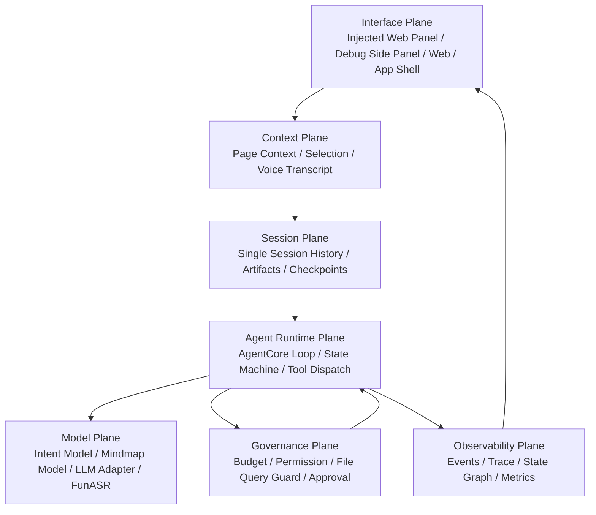
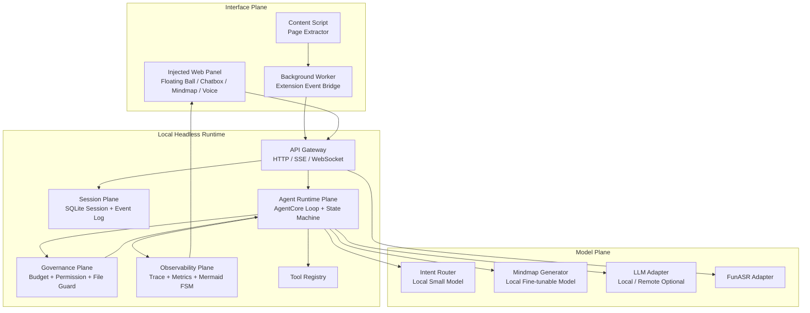
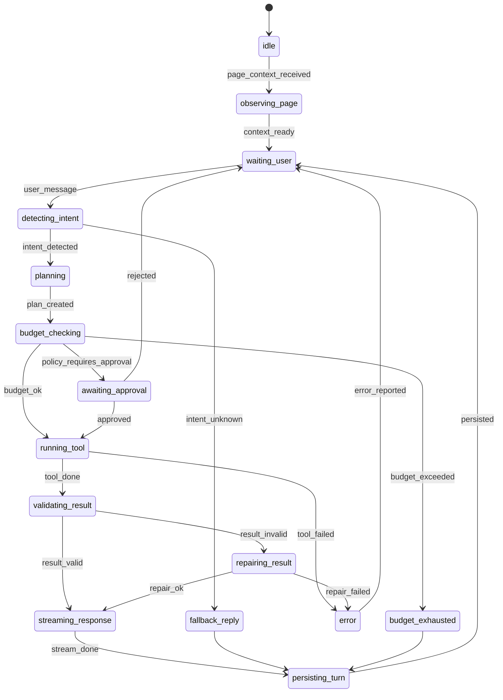

# Navia / 伴航 V1 架构设计文档

版本：V1.0 Architecture Baseline
日期：2026-05-31

---

## 1. 架构目标

Navia V1 架构的目标是搭建一个可以长期演进的本地 Headless AI Runtime，而不是一次性网页插件。

V1 架构必须支持：

- Chrome 插件通过 Content Script 注入网页内悬浮球与 AI 双轨面板，作为 V1 优先前端。
- Web / App 未来复用同一 Runtime API。
- 本地小参数模型做意图识别。
- 已部署 FunASR 做语音转写。
- 本地可微调模型生成 Mermaid mindmap。
- AgentCore 借鉴 openHarness / PiAgent 的源码结构，但收缩到单 Session、无 MCP、无 Skill、无长期记忆。
- 状态机可视化、可验证、可观测。
- 工具调用、上下文读取、token 使用、本地文件访问受监督。

### 1.1 V1 实现基线

V1 规划阶段已决定：

- Local Runtime 使用 Python 快速原型实现，建议采用 FastAPI 风格的 HTTP / SSE / WebSocket API Gateway。
- AgentCore、Session、Governance、Observability、ModelAdapter 必须保持清晰模块边界，便于后端团队按子系统分工。
- Chrome 插件采用 WXT + React + TypeScript；插件通过 Content Script 注入页面内交互层，只作为 Interface Plane，通过 Runtime API 访问后端能力。
- V1.0-0/A/B/C 不实现 Chrome UI，只先冻结合同并打通 Runtime、AgentCore、状态机、事件追踪和治理底座。
- V1 结束后进入 V2 研讨时，必须重新评估 Python Runtime 是否继续作为长期主栈，或是否需要引入 TypeScript / sidecar / 服务拆分。

### 1.2 Contract-first 决策

审计后 V1 采用 `Go, but contract-first` 策略。任何 AgentCore 实现前必须先冻结：

- API response envelope。
- ErrorCode enum。
- State enum 与 Transition table schema。
- AgentEvent envelope。
- Session / Turn / Message / ToolCall / ToolResult / Artifact / Budget schema。
- ID 生成和关联规则。
- `/v1/chat/stream` SSE 协议。
- EventStore 与 EventStream 接口边界。

V1.0-A 不能先写 ad-hoc AgentLoop、ad-hoc events 或直接工具执行。每个 turn 必须有 `session_id` / `turn_id`，每个工具调用必须经过 governance hooks，每个状态迁移必须被验证并持久化。

---

## 2. 架构原则

```text
1. UI 是壳，Runtime 是核心。
2. AgentCore 是状态机，不是散乱 prompt。
3. 本地模型是 Adapter，不进入业务层。
4. V1 做单 Session，不做长期记忆。
5. 所有工具调用必须被监督。
6. 所有状态变化必须可观测。
7. 所有 Artifact 必须可追踪来源。
8. 所有预算消耗必须可计量。
9. 默认不读取本地文件。
10. 默认不自动保存所有网页。
11. 合同先于实现，禁止临时 loop / 临时事件 / 自由形态工具返回。
12. EventStore 负责持久化，EventStream 负责实时推送，二者必须分离。
```

---

## 3. 设计平面

V1 按设计平面拆分，而不是按 UI 功能堆模块。



### 3.1 Interface Plane

职责：

- 网页内贴边悬浮球。
- hover 小长条。
- 网页内 AI 双轨聊天面板。
- Chatbox。
- 当前网页信息展示。
- 摘要 / Mindmap Artifact 展示。
- 语音输入按钮。
- Agent 状态展示。
- Trace / Debug 面板。

V1 必须支持的页面内交互：

- 悬浮球默认态。
- 悬浮球 hover 预展开态。
- 窄距展开态：默认约 `440px`，挤压网页。
- 半屏展开态：约 `50vw`，继续挤压网页。
- 宽工作区覆盖态：超过 `52vw` 覆盖网页，最大 `80vw`。
- 收起态：点击悬浮球或收起按钮后恢复网页布局。
- resize handle。
- 小视口 `<900px` 时禁用挤压式，降级为覆盖式或全屏侧栏。

说明：上述交互来自当前 active 文档 `docs/active/project/interaction-prd/窗口交互_PRD.md`，该文件是 V1 前端页面体验的 P0 权威来源。Chrome Side Panel 可保留为调试入口或兼容承载，但不得替代 V1 页面内交互验收。

禁止：

- 不直接调用模型。
- 不保存 Agent 核心状态。
- 不直接读取本地文件。

#### V1.1 前端高保真目标架构

V1.0 的页面内实现以 `Content Script -> Shadow DOM injectedPanel -> Runtime API -> AgentCore` 为主线，优先证明交互骨架和功能闭环。V1.1 在不改变 Runtime / AgentCore / API 合同的前提下，把 Interface Plane 细化为可设计验收的前端体验架构：

```text
Figma Prototype Semantics
  MainLayout / MockPage / FloatingBall / Sidebar / ChatArea
        |
        v
Injected Interface Plane
  Floating Entry
  Panel Shell
  Left Rail
  Chat Workspace
  Tool Dock
  Artifact Viewer
  Visual Tokens
        |
        v
Runtime API / PageContext / SSE / Session Restore
```

V1.1 当前架构与目标架构差异：

| 维度 | V1.0 当前架构 | V1.1 目标架构 |
|---|---|---|
| 实现形态 | Shadow DOM 字符串模板与内联 CSS | 组件语义清晰的注入面板结构，可映射到 Figma `MainLayout / FloatingBall / Sidebar / ChatArea` |
| 视觉系统 | 工程可用样式，token 分散 | 集中化视觉 token：颜色、阴影、圆角、间距、轨道宽度、动画 |
| 原型语义 | 主要按功能区域命名 | 按 Figma 原型语义拆解并保留测试锚点 |
| 验收方式 | DOM 状态、真实 Chrome 交互、E2E 功能 | 增加 Playwright 截图基线、Figma 对照、状态截图矩阵 |
| Side Panel | 调试 / 兼容入口 | 仍为调试入口，不参与 V1.1 高保真验收 |

V1.1 不新增设计平面，不改变 Runtime 依赖方向。所有模型、工具、治理、Session 与 Trace 仍由 Runtime 负责，前端只呈现状态并消费合同化事件。

### 3.2 Context Plane

职责：

- 页面 title / url / domain。
- DOM headings。
- cleaned text。
- visible text。
- selected text。
- content hash。
- voice transcript。

约束：

- 只处理当前网页上下文。
- 不做全局本地文件索引。
- 长页面必须 chunk，不得无脑整页塞入模型。

#### A-V1.2 高质量网页感知层目标架构

A 模块在 V1.2 中是 `Page Perception / AgentCore Eyes`，属于 Context Plane 的感知子系统。A-V1.2 的目标不是生成学习产物，而是把真实复杂网页转换成高密度、可验证、可反跳的结构化页面事实。

目标流水线：

```text
Chrome PageContext / HTML snapshot
  -> PageReadingInput
  -> DOM baseline candidate
  -> optional candidate extractor ensemble
  -> A-owned block graph
  -> noise filter and density ranking
  -> StructuredPageContext
  -> HighSignalPageContext
  -> PerceptionDigest
  -> SourceMap / SourceRef
  -> PagePerceptionQualityReport
  -> DebugEvidenceBundle
```

A-V1.2 组合路线的架构职责：

- `DOM baseline` 是永远可用的保底候选，不依赖第三方包。
- `candidate extractor ensemble` 只提供候选抽取结果，必须通过依赖审计后才可启用。
- `A-owned schema normalization` 负责把所有候选结果映射回 Navia 自有 block graph，禁止第三方 raw field 泄漏。
- `SourceMap / jumpback` 负责让每个摘要项、关键事实和高信号块具备 `textQuote` 或 `fallbackText`。
- `Quality Evaluator` 负责用可计算指标决定 `pass / degraded / fail`，不得写死通过。
- `DebugEvidenceBundle` 负责把 raw signals、候选比较、过滤证据、source map 和质量报告合并成可审计 JSON。
- `100-page corpus gate` 是 A-V1.2 出门门槛，不是可选展示材料。

模块调用关系：

```text
A -> D：仅输出 quality-ready 页面上下文，供连续对话和工具编排使用
A -> C：仅输出 source-grounded 结构化上下文，供 Mindmap 生成和节点反跳使用
A -> B：仅输出 Debug JSON、source fallback 和质量状态，供前端展示
```

公共合同消费门槛：

- A 的 `StructuredPageContext` 始终是基础事实源。
- `HighSignalPageContext`、`PerceptionDigest`、`SourceMap / SourceRef` 和 `PagePerceptionQualityReport` 是 A-V1.2 公共合同。
- D/C 只有在 `PagePerceptionQualityReport.downstreamReadiness = "pass"` 时才能把 high-signal 输出作为主上下文。
- `degraded` 输出只能进入 fallback 或 Debug evidence；`fail` 输出不得作为 D/C 主输入。
- B 只能渲染 A 的 Debug JSON、source fallback 和 quality state，不拥有 AgentCore state，也不直接调用 A/C/D 服务。

A-V1.2 目标架构与当前架构差异：

| 维度 | 当前基线 | A-V1.2 目标 |
|---|---|---|
| 内容抽取 | DOM baseline 与有限 fixture | DOM baseline + 审计后的 candidate extractor ensemble |
| 数据模型 | StructuredPageContext / high-signal 合同雏形 | A-owned block graph 归一化后输出公共 high-signal / digest / source map / quality 合同 |
| 质量判断 | 小规模 fixture 与人工判断 | 100-page corpus、gold review、可计算 metric、DebugEvidenceBundle |
| 来源反跳 | paragraph/sourceRange fallback | SourceRef 必须包含 textQuote 或 fallbackText，selector/domPath 仅为增强 |
| 下游消费 | D/C/B 容易依赖临时 shape | 只通过公共合同和 readiness gate 消费 |

A-V1.2 的关键体验路径：

```text
读取网页
  -> A 生成 DebugEvidenceBundle
  -> B Debug 页展示结构化 JSON、过滤证据和质量状态

用户提问
  -> D 只在 quality pass 时使用 HighSignalPageContext / PerceptionDigest
  -> degraded/fail 时回退或返回 PAGE_CONTEXT_REQUIRED

用户生成 Mindmap
  -> C 使用 SourceMap / SourceRef 生成 nodeSourceMap
  -> B 点击节点时优先 DOM jumpback，失败则展示 textQuote/fallbackText 证据卡
```

A-V1.2 边界：

- A 不生成最终 assistant answer。
- A 不生成 Mindmap、Flashcards、Quiz、Podcast 或 Notebook 产物。
- A 不创建 `ArtifactRecord`。
- A 不发 SSE。
- A 不写 EventStore、Trace 或 Session state。
- A 不直接调用 D/C/B、MCP、Skill、外部 API、OCR、VLM、ASR、视频或直播 engine。
- 第三方正文抽取库只允许作为 candidate extractor，输出必须映射回 A-owned block graph 后才能进入 Navia 公共合同。

#### 当前阶段目标架构：A 高信号主链路与 C 补强

当前代码基线中，`/v1/page/context` 已接入 A 的 `StructuredPageContext`，C 的 `mindmap.generate` 已通过 Runtime adapter 接入；但 A 的 `HighSignalPageContext / PerceptionDigest / SourceMap / QualityReport` 还没有成为 Runtime 主链路的稳定消费事实，C 的节点选择也还没有优先使用 A 的高信号 digest。

本阶段目标架构：

```text
Chrome / Side Panel
  -> /v1/page/context
  -> A Page Perception
       StructuredPageContext
       HighSignalPageContext
       PerceptionDigest
       SourceMap / SourceRef
       PagePerceptionQualityReport
  -> Session.activePage.perception
  -> D Adapter Layer
       readiness gate
       ToolResult / Artifact / Event mapping
  -> C Mindmap
       digest-first node selection
       SourceRef-backed nodeSourceMap
       Mermaid validation / repair <= 1
  -> B Debug / Artifact renderer
       A JSON
       quality state
       Mermaid visual
       source fallback / evidence card
```

当前架构与目标差异：

| 维度 | 当前实现 | 本阶段目标 |
|---|---|---|
| A 主链路 | Runtime 主要持久化 `StructuredPageContext` | Runtime 同步保存或返回 high-signal perception bundle，并保留旧字段兼容 |
| D 消费 | 工具基于 `activePage` 里的基础段落和 summaryDraft | D 在 quality pass 时优先使用 `PerceptionDigest`，degraded/fail 时回退或阻断 |
| C 输入 | C 主要从 headingTree / paragraph fallback 选节点 | C 优先从 digest item / sourceRefs 选节点，headingTree 仅 fallback |
| 来源反跳 | nodeSourceMap 可回到 paragraph/chunk | nodeSourceMap 直接绑定 A SourceRef，必须有 textQuote/fallbackText |
| Debug 验收 | 结构化 JSON 可见性有限 | Debug 可同时查看 A quality、digest、source map 和 C mindmap source map |

调用边界：

- A 仍是纯感知层，不创建 artifact、不发 SSE、不写 EventStore。
- C 不读取 DOM，不重新抽取页面正文，不绕过 A 做感知。
- D 是唯一 ToolResult / Artifact / Event / Trace 映射出口。
- B 只渲染 Runtime 返回的数据，不拥有 AgentCore 状态，不直接调用 A/C 服务。

关键质量门槛：

- `PagePerceptionQualityReport.downstreamReadiness = "pass"` 时，D/C 才能将 high-signal 输出作为主输入。
- `degraded` 只能进入 fallback 或 Debug 提示。
- `fail` 不得触发基于高信号内容的 summary / answer / mindmap。
- C 的每个主要 mindmap 节点必须至少关联一个 A SourceRef 或明确 fallback reason。

### 3.3 Session Plane

职责：

- 单 Session message history。
- active page。
- tool call records。
- artifacts。
- checkpoints。
- budget ledger。
- event log reference。

目标：

- 单 Session 可恢复。
- 单 Turn 可回放。
- Artifact 可追踪。

### 3.4 Agent Runtime Plane

职责：

- Agentic Loop。
- 状态机。
- Intent routing。
- One-step planning。
- Tool dispatch。
- Result validation。
- Response streaming。
- Persist turn。

V1 约束：

- 单 Agent。
- 单 Session。
- 每轮有限工具调用。
- 不做自主跨页面任务。
- 最小状态机从 V1.0-A 开始接入。
- Agent loop 必须通过 `StateMachine.transition()` 推进状态。
- ToolExecutor 必须从 V1.0-A 起经过 `PreToolUse` / `PostToolUse` hook。

### 3.5 Model Plane

职责：

- IntentModelAdapter。
- MindmapModelAdapter。
- LLMAdapter。
- ASRAdapter / FunASRAdapter。

约束：

- AgentCore 不感知具体模型实现。
- 所有模型调用通过 Adapter。
- 每次模型调用记录 model.started / model.done event。

### 3.6 Governance Plane

职责：

- Budget Supervisor。
- Tool Permission Supervisor。
- Context Supervisor。
- File Query Supervisor。
- Approval Gate。

目标：

- 防止 Agent 对本地文件进行过量查询。
- 防止 token 意外消耗。
- 防止失败重试失控。
- 高风险工具必须审批。

### 3.7 Observability Plane

职责：

- AgentEvent。
- State transition log。
- Session trace。
- State machine Mermaid rendering。
- Budget metrics。
- Tool call metrics。

---

## 4. 总体组件架构



---

## 5. 推荐目录结构

```text
navia/
  apps/
    chrome-extension/
      src/
        sidepanel/
        content-script/
        background/
        shared/
    web-demo/
      src/

  services/
    local-runtime/
      app/
        api/
        agent_core/
          runtime/
          state_machine/
          event_bus/
          planning/
          execution/
        session/
        governance/
        tools/
        models/
        page_context/
        mindmap/
        asr/
        observability/
        storage/
      tests/

  packages/
    contracts/
      events/
      session/
      tools/
      artifacts/
    shared-types/
    prompts/

  docs/
    prd/
    architecture/
    acceptance/
    adr/
```

V1.0-0/A/B/C 的首轮文档级实现边界：

- 先规划 `services/local-runtime`，不在首轮规划中创建 Chrome 插件工程。
- Runtime 内部模块按 API、AgentCore、Session、Governance、Observability、ToolRegistry、ModelAdapter 拆分。
- 存储接口先面向 SQLite / JSONL EventLog 设计，但允许首轮原型使用内存实现验证合同。
- 所有模型、FunASR、Mindmap 生成能力都通过 Adapter 边界接入，不写死到 AgentCore。

---

## 6. AgentCore 架构

### 6.1 AgentCore 实现策略

V1 建议使用 openHarness / PiAgent 的源码思想进行裁剪：

保留：

- Agent loop。
- Tool registry。
- Message history。
- State management。
- Event stream。
- PreToolUse / PostToolUse hook。
- Budget / permission gate。
- Trace。

删除 / 暂不接入：

- MCP。
- Skill。
- Long-term memory。
- Multi-agent。
- Shell execution。
- Full workspace search。
- Browser automation。

### 6.2 Agentic Loop

```text
Observe
  -> Detect Intent
  -> Plan One Step
  -> Budget Check
  -> Policy Check
  -> Execute Tool
  -> Validate Result
  -> Stream Response
  -> Persist Turn
  -> Wait
```

### 6.3 AgentCore 内部模块

```text
agent_core/
  runtime/
    AgentRuntime
    AgentLoop
    TurnRunner
  state_machine/
    StateMachine
    TransitionTable
    StateRenderer
  event_bus/
    EventBus
    EventSchema
    EventStore
  planning/
    IntentRouter
    OneStepPlanner
  execution/
    ToolExecutor
    ResultValidator
    ResponseStreamer
  supervision/
    BudgetSupervisor
    PermissionSupervisor
    ContextSupervisor
    FileQuerySupervisor
    ApprovalGate
```

---

## 7. Agent 状态机

状态机必须作为代码中的正式 contract，不得只存在于文档。



工程要求：

- Transition table 是唯一真实来源。
- Mermaid 图由 transition table 自动生成。
- 非法 transition 直接拒绝。
- 每次 transition 产生 `state.transition` event。
- 测试验证状态图和 transition table 一致。
- 每个状态必须定义 allowed_events。
- 每个 recoverable error 必须定义恢复路径。

---

## 8. Governance 设计

### 8.1 Budget Supervisor

默认 TurnBudget：

```ts
type TurnBudget = {
  maxModelCalls: number
  maxToolCalls: number
  maxInputTokens: number
  maxOutputTokens: number
  maxContextBytes: number
  maxRuntimeMs: number
  maxRetries: number
}
```

建议默认：

```text
maxModelCalls = 3
maxToolCalls = 5
maxInputTokens = 12000
maxOutputTokens = 3000
maxContextBytes = 256KB
maxRuntimeMs = 60000
maxRetries = 1
```

预算耗尽行为：

- 停止继续工具调用。
- 写入 `budget_exhausted` event。
- 返回基于已读取上下文的部分结果。
- 提示用户手动确认是否继续。

### 8.2 Permission Supervisor

| 工具 | 默认权限 | 是否需要审批 |
|---|---:|---:|
| read_current_page | allow | 否 |
| summarize_page | allow | 否 |
| answer_from_page | allow | 否 |
| explain_selection | allow | 否 |
| generate_mindmap | allow | 否 |
| asr_transcribe | allow | 否 |
| read_local_file | deny | 是 |
| search_local_workspace | deny | 是 |
| shell | deny | 是 |
| browser_click | deny | 是 |
| browser_automation | deny | 是 |

### 8.3 Context Supervisor

策略：

- 不把整篇网页默认塞入模型。
- 先做正文清洗和结构提取。
- 长页面按 heading / paragraph chunk。
- 根据 intent 选择相关上下文。
- 每次模型调用记录 context bytes 和 token estimate。
- 超过上下文预算时先压缩再调用模型。

### 8.4 File Query Supervisor

V1 默认关闭本地文件查询。

```ts
type FileQueryPolicy = {
  enabled: boolean
  allowedRoots: string[]
  deniedGlobs: string[]
  maxFilesPerTurn: number
  maxBytesPerFile: number
  maxTotalBytesPerTurn: number
  requireUserApproval: boolean
}
```

默认：

```text
enabled = false
allowedRoots = []
maxFilesPerTurn = 0
requireUserApproval = true
```

### 8.5 Approval Gate

V1 是轻量 Approval Gate，不做复杂 Workflow Approval。

触发场景：

- 访问本地文件。
- 查询本地目录。
- 调用高成本模型。
- 超过当前 turn budget。
- 重试次数超过限制。
- 未来执行浏览器操作。

设计原则：

- 审批前不执行 side effect。
- 审批结果必须幂等。
- 审批状态必须可观测。
- 审批取消后 late approval 不得继续执行。
- 审批事件必须进入 EventLog。
- 对 side effect marker 使用 CAS / lock 防止并发重复执行。

---

## 9. Observability 设计

### 9.1 AgentEvent

```ts
type AgentEvent = {
  eventId: string
  sessionId: string
  turnId?: string
  type:
    | "state.transition"
    | "page.context.received"
    | "intent.detected"
    | "budget.checked"
    | "approval.required"
    | "approval.approved"
    | "approval.rejected"
    | "tool.requested"
    | "tool.started"
    | "tool.done"
    | "tool.failed"
    | "model.started"
    | "model.done"
    | "response.delta"
    | "response.done"
    | "artifact.created"
    | "error"
  timestamp: string
  data: Record<string, unknown>
}
```

### 9.2 EventStore 与 EventStream 分离

必须区分：

- `EventStore`：持久化事件，用于 trace、replay、审计和 V2 异步蒸馏。
- `EventStream`：实时推送事件，用于网页内 AI 面板、Debug 面板和 streaming response。

约束：

- 不允许只有实时事件而没有持久化事件。
- `GET /v1/sessions/{session_id}/trace` 必须从 EventStore 读取。
- `/v1/chat/stream` 可以复用 AgentEvent envelope，但不能替代 EventStore。
- 每次 `state.transition` 必须同时进入 EventStore，并可被 trace API 查询。

### 9.3 必须提供的观测接口

```text
GET /v1/agent/state
GET /v1/sessions/{session_id}/trace
GET /v1/agent/state-machine/mermaid
SSE /v1/chat/stream
SSE /v1/agent/events 或后续 WS /v1/agent/events
```

前端状态展示：

- 当前状态。
- 当前工具。
- 本轮 token 使用。
- 本轮工具调用次数。
- 最近事件。
- 预算是否接近上限。

---

## 10. 数据存储建议

### 10.1 SQLite

用于：

- Session。
- Messages。
- PageContext metadata。
- ToolCallRecord。
- ArtifactRecord。
- BudgetLedger。

### 10.2 JSONL EventLog

用于：

- AgentEvent。
- State transition。
- Debug trace。
- Session replay。

### 10.3 Cache

用于：

- 页面抽取结果。
- chunk 结果。
- mindmap 中间结果。

---

## 11. API 网关

本地 Runtime 只监听 `127.0.0.1`：

```text
http://127.0.0.1:17861
ws://127.0.0.1:17861
```

所有 UI 必须通过 API Gateway 访问 Runtime，不得绕过 API 直接写存储或调用模型。

### 11.1 本地 Runtime 安全约束

localhost Runtime 仍然是攻击面，V1 必须具备最小安全边界：

- 默认只绑定 `127.0.0.1`，不得监听 `0.0.0.0`。
- CORS / Origin allowlist 只允许 Chrome extension origin 和明确配置的 localhost dev origin。
- 高风险 API 不允许任意网页调用。
- 可选 dev pairing token，用于本地调试阶段降低误调用风险。
- 普通日志不得打印完整网页正文、选区全文或音频 transcript 全文。
- 外部模型调用必须显式配置，UI 必须展示当前模型模式。

---

## 12. V1.2-AC-Native 目标架构

V1.2-AC 已证明 A/C/D/B 功能链路可以在 direct extension page 中跑通，但这不能替代 Chrome 原生 Side Panel 用户体验。V1.2-AC-Native 的目标架构是在不改变 Runtime / A / C / D 公共合同的前提下，把 B 的展示壳稳定运行在 Chrome 原生 Side Panel 容器内。

目标调用路径：

```text
Chrome tab 当前网页
  -> Chrome action / keyboard command
  -> Chrome native Side Panel container
  -> B SidePanel Shell
  -> background runtime proxy
  -> Runtime API Gateway
  -> D Adapter Layer
  -> A Page Perception / C Mindmap
  -> ToolResult / Artifact / Event / Trace
  -> B Chat / Debug / Mermaid / Source Fallback
```

当前实现差异：

| 维度 | 当前状态 | V1.2-AC-Native 目标 |
|---|---|---|
| 入口形态 | direct extension page 功能冒烟已通过；原生 Side Panel 打开不稳定 | action / keyboard command 必须稳定打开右侧 Side Panel |
| 截图证据 | 曾有全屏扩展页截图；最新原生 probe 未稳定出现 Navia 侧栏 | 每张体验截图必须同时包含真实网页和右侧 Navia Side Panel |
| 侧栏宽度 | 快捷按钮在窄宽度下可达性不足，Mindmap 容易不可见 | 主要动作可见、可滚动、可操作，文字不溢出 |
| 自动化方式 | 坐标点击不可靠，可能误截无关窗口 | 使用可定位 test id、可访问 page target 或明确 structured blocker |
| 验收声明 | direct page 只能算 smoke test | 原生 Side Panel 内完整流程通过后才可声明 UX 通过 |

职责边界保持不变：

- B 只负责 Side Panel shell、聊天渲染、Debug、Artifact、Mermaid 和 source fallback 展示。
- B 不直接调用 A/C/D 服务，不拥有 AgentCore 状态。
- A 不创建 Artifact、不发 SSE、不写 EventStore。
- C 不读取 DOM。
- D 仍是 ToolResult / Artifact / Event / Trace 唯一映射出口。
- 原生 Side Panel 体验修复不得引入 RAG、长期记忆、多 Agent、浏览器自动操作或外部搜索。

自动化架构要求：

- `e2e:chrome:native-probe` 只用于判断原生侧栏是否可被打开，不得声明完整流程通过。
- 完整 UX E2E 必须能稳定定位 Side Panel 内按钮、输入框、Debug 状态和 artifact。
- 每张计入体验通过的截图必须有同名 metadata JSON，记录页面、扩展、native panel 判定、viewport、panel 宽度、Runtime 状态和结论。
- 如果 Chrome 原生 Side Panel DOM target 不可被自动化访问，必须生成 structured blocker，并由人工体验验收补位。
- structured blocker 必须包含 blockerId、stage、pageUrl、browser、reason、evidencePaths、attemptedActions、nextAction、blocksCompletion；`blocksCompletion=true` 时不得声明阶段完成。
- direct extension page E2E 可继续作为功能回归 smoke test，但不能作为用户体验验收的替代品。

---

## 13. V1.2-AC-Quality 目标架构

V1.2-AC-Quality 承接 V1.2-AC-Native 的原生 Side Panel 稳定化成果，进一步强化 A/C 主链路质量。目标不是新增产品形态，而是让 A 高质量网页感知和 C digest-first Mindmap 在更多真实网页上稳定、可解释、可反跳。

目标调用路径：

```text
Chrome 原生 Side Panel
  -> B 触发读取 / Debug / Mindmap
  -> Runtime /v1/page/context
  -> A Page Reading Pipeline
      -> StructuredPage
      -> HighSignalPage
      -> PerceptionDigest
      -> SourceMap / SourceRef
      -> PagePerceptionQualityReport
  -> D Adapter Layer
      -> ToolResult envelope
      -> ArtifactRecord / AgentEvent / Trace mapping
  -> C Mindmap Generator
      -> digest-first Mermaid
      -> MindmapNodeSourceMap
      -> source fallback
  -> B Debug / Mermaid / Source Evidence
```

本阶段目标数据包：

```text
ACQualityEvidenceBundle
  pageEvidence[]
    pageUrl | snapshotPath
    category
    expectedRisk
    structuredPage
    highSignalPage
    perceptionDigest
    sourceMap
    qualityReport
    mindmapArtifact
    nodeSourceMap
    screenshots[]
    screenshotMetadata[]
    runtimeTraceRef
    conclusion
  aggregateReport
  falseGreenAudit
  prdReview
```

质量指标必须至少覆盖：

- `sourceCoverage`：A 高信号块或 digest item 中具备 sourceRef 的比例。
- `groundingCompleteness`：进入 C 主要节点的 digest item 是否可追溯到 sourceRef 或 fallbackText。
- `jumpbackCoverage`：Mindmap 主要节点中具备 sourceRefId、textQuote 或 fallbackText 的比例。
- `lowSignalCorrectness`：低信号 / 空内容页必须 degraded 或 fail，不得 pass。
- `digestFirstUsage`：`downstreamReadiness=pass` 时 C 的主要节点必须优先来自 `PerceptionDigest.items + SourceRef`。

当前架构差异：

| 维度 | 当前状态 | V1.2-AC-Quality 目标 |
|---|---|---|
| A 输出质量 | 已有 high-signal perception 与 low-signal degraded 基线 | 扩展真实网页覆盖，提升噪声过滤、digest 密度和 quality 可解释性 |
| C 输入策略 | 已支持 digest-first，但仍需防止 heading-only 误声明 | readiness pass 时必须优先消费 digest/sourceRef；fallback 必须显式标注原因 |
| SourceMap | 已有 SourceRef 与 nodeSourceMap | 主要 mindmap 节点必须关联 sourceRefId 或明确 fallbackText |
| Debug | 可展示基础状态和 JSON | 必须展示 quality state、digest item、sourceRef、mindmap source map 和失败原因 |
| 验收 | Native UX 5 页通过 | 扩展到更强真实网页矩阵，并产出 HTML 报告 / false-green audit |

模块边界：

- A 只负责网页感知、结构化事实、digest、source map 和 quality report。
- A 不生成最终回答、不生成 Mindmap、不创建 Artifact、不发 SSE、不写 EventStore / Trace。
- C 只负责从 A/Runtime 提供的结构化输入生成 Mermaid 与 nodeSourceMap。
- C 不读取 DOM、不调用 Chrome、不绕过 D 写 Artifact / Event。
- D 是 ToolResult / Artifact / Event / Trace 唯一映射出口。
- B 只渲染 Chat、Debug、Mindmap、source fallback 和验收可见状态。

信息流验收路径：

```text
真实网页
-> 读取当前页面
-> Debug 显示 A quality / digest / sourceRefs
-> 生成 Mindmap
-> C 输出 Mermaid + nodeSourceMap
-> B 展示 Mermaid 或 fallback
-> HTML 报告记录截图、URL、quality、source coverage、结论
```

降级路径：

```text
qualityReport.downstreamReadiness = pass
  -> C 必须 digest-first

qualityReport.downstreamReadiness = degraded
  -> C 可以 fallback 到 heading / paragraph，但必须写入 fallbackReason

qualityReport.downstreamReadiness = fail
  -> 不得生成假 high-signal mindmap；B 必须展示失败原因和 source fallback
```

本阶段不得改变公共 API 或数据合同；如需要新增字段、事件类型或 artifact 类型，必须回到 V1.2-0 合同冻结。

---

## 14. V1.2-AC-Jumpback MVP 目标架构

V1.2-AC-Jumpback MVP 承接 V1.2-AC-Quality 的 source-grounded mindmap 输出，目标是把“可反跳证据”推进到“用户可点击、可查看证据、可尝试定位”的最小产品闭环。它不改变 A/C/D/B 的核心职责，只在既有 `nodeSourceMap` 和 `jumpback` payload 之上补齐交互 wiring。

目标调用路径：

```text
真实网页
  -> A SourceMap / SourceRef
  -> C Mindmap Generator
      -> stable Mermaid node ids
      -> MindmapNodeSourceMap
      -> jumpback payload
  -> D Adapter Layer
      -> ArtifactRecord.metadata.nodeSourceMap
      -> Event / Trace ownership
  -> B Mindmap Renderer
      -> node click
      -> source evidence card
      -> content-script jumpback request
  -> Content Script
      -> selector / domPath / textQuote 定位
      -> scroll + highlight
      -> structured failure reason
```

目标数据包：

```text
JumpbackEvidenceBundle
  pageUrl
  artifactId
  nodeId
  nodeLabel
  sourceRefIds[]
  textQuote optional
  fallbackText
  jumpback.mode = dom | fallback
  attemptedStrategies[]
  result = highlighted | fallback_shown | blocked
  failureReason optional
  screenshots[]
  screenshotMetadata[]
```

当前架构差异：

| 维度 | 当前状态 | V1.2-AC-Jumpback MVP 目标 |
|---|---|---|
| C 输出 | 已有 `nodeSourceMap` 和 source fallback | Mermaid node id 与 `nodeSourceMap` key 稳定映射 |
| B 渲染 | 可展示 Mindmap / source fallback | 点击节点后展示来源证据卡片 |
| 反跳执行 | 缺少产品级 click -> scroll/highlight | content script 尝试 selector / domPath / textQuote 定位 |
| 降级 | 有 fallback 文本 | DOM 失败时返回 structured reason 并展示 fallback evidence |
| 验收 | AC-Quality 验证 source coverage | 新增点击路径、截图、定位结果和 false-green audit |

边界：

- C 不读取 DOM，不调用 content script，不创建 Artifact / Event / Trace。
- B 不直接调用 A/C/D 服务，只消费 Artifact metadata 和前端 state。
- Content script 不做非用户触发的浏览器自动操作。
- D 仍是 ToolResult / Artifact / Event / Trace 唯一映射出口。
- 如需新增公共字段或事件，必须回到 V1.2-0。

---

## 15. V1.2-Closeout 收关目标架构

V1.2-Closeout 承接 V1.2-AC-Jumpback MVP。目标不是新增模块，而是把 A/C/D/B 的既有链路补齐到可声明 V1.2 完成的证据强度：真实 Chrome 截图级 Jumpback、SourceRef 质量、更多真实网页覆盖、Mindmap 交互细化和最终出门审计。

目标架构仍保持四层分工：

```text
A Page Perception
  -> 输出更稳定 SourceRef
  -> selector / domPath optional
  -> textQuote / fallbackText required
  -> qualityReport.jumpbackCoverage 可解释

C Mindmap
  -> digest-first nodes
  -> stable nodeBindings
  -> SourceRef-backed nodeSourceMap
  -> duplicate label disambiguation

D Adapter Layer
  -> ToolResult / Artifact / Event / Trace 唯一出口
  -> 不被 A/C/B 绕过
  -> trace 可还原 read -> mindmap -> jumpback-ready artifact

B Side Panel Renderer + Content Script
  -> Mermaid / source card / selected state
  -> 用户触发 jumpback
  -> content script scroll/highlight
  -> failure fallback evidence
```

目标调用路径：

```text
真实网页
-> content script extract PageContext
-> Runtime session.activePage
-> A high-signal bundle + SourceMap
-> C Mindmap artifact metadata
-> D Artifact / Event / Trace mapping
-> B render Mermaid + source cards
-> 用户点击节点 / source card
-> content script selector/domPath/textQuote 定位
-> screenshot evidence + metadata + report
```

当前架构差异：

| 维度 | 当前 V1.2-AC-Jumpback MVP | V1.2-Closeout 目标 |
|---|---|---|
| Jumpback 证据 | 组件测试 + content script DOM 测试 + native UX 主路径 | 真实 Chrome 截图级证明点击后正文高亮或 fallback |
| SourceRef 质量 | 有 textQuote / fallbackText，selector 质量依赖 A | 至少 20 页样本中 selector/textQuote/fallback 可解释并可统计 |
| Mindmap 交互 | SVG 文本点击 + 来源证据卡片 | 节点选中态、hover/selected 反馈、证据面板折叠和失败提示 |
| 页面覆盖 | AC native 5 页，Jumpback MVP 最小链路 | 至少 20 个真实网页 / snapshot，含复杂中文、技术文档、GitHub、长文、低信号 |
| 完成声明 | 可声明 AC-Jumpback MVP | 可声明 V1.2 mock-first product path complete |

边界：

- 不新增公共 API、Artifact type 或 AgentEvent type；如必须新增，回到 V1.2-0。
- A/C 不调用 Chrome、content script、CoreProvider、MCP 或 Skill。
- B 不生成摘要、回答、Mindmap 或 Artifact。
- Content script 只执行用户触发的当前页定位，不做浏览器自动操作任务。
- D 仍是 ToolResult / Artifact / Event / Trace 唯一映射出口。

---

## 16. V1.3 Evidence Card Mindmap 目标架构

V1.3 在 V1.2-Closeout 已打通的 A/C/D/B 主链路上，增强 B Mindmap Renderer 的主体验。目标不是更换 C 的生成逻辑，也不是新增 Canvas 或知识库，而是把 `ArtifactRecord(type="mindmap")` 渲染为可读、可验证、可交互的 Evidence Card Mindmap。

当前架构基线：

```text
Chrome native Side Panel
  -> B renderer renders Chat / Debug / Mindmap
  -> Mindmap artifact carries Mermaid source and source metadata
  -> Source evidence and jumpback fallback are available
  -> Runtime remains the only producer of ToolResult / Artifact / Event / Trace
```

当前主要差异不在事实链路，而在体验表达和验收闭环：

- Mermaid / source fallback 已能作为技术证明，但还不能代表高质量 Mindmap 主体验。
- Evidence Card 基线已存在，但需要用统一 view model、可读布局、交互状态和真实 Side Panel 截图完成出门验收。
- C 输出的 digest / node label 需要更强语义压缩和主题归并，避免长句平铺。
- 真实 Chrome 原生 Side Panel 自动化和截图证据仍是 V1.3 出门硬门槛。

目标架构：

```text
A Page Reading
  -> HighSignalPageContext / PerceptionDigest / SourceMap / QualityReport
        |
        v
C Mindmap
  -> digest-first mindmap tree
  -> Mermaid source
  -> nodeSourceMap / nodeBindings
        |
        v
D Adapter Layer
  -> ToolResult
  -> ArtifactRecord(type="mindmap")
  -> Event / Trace
        |
        v
B Mindmap Renderer
  -> EvidenceCardViewModel
  -> Evidence Card Mindmap
  -> source evidence panel
  -> selected / hover / neighbor highlight
        |
        v
Content Script
  -> user-triggered selector / domPath / textQuote jumpback
```

V1.3 可执行合同：

```text
docs/active/project/contracts/v1_3_evidence_card_mindmap.schema.json
```

该合同只冻结 B-local `EvidenceCardViewModel`、V1.3 验收 `report.json`、截图证据 metadata 的机器可校验结构。它不是新的 Runtime public contract，A/C/D 不得依赖 `EvidenceCardViewModel` 的 exact shape。

当前架构差异：

| 维度 | V1.2-Closeout 当前状态 | V1.3 目标 |
|---|---|---|
| 主渲染 | Mermaid visual / source fallback | Evidence Card Mindmap 主视图，Mermaid 降级 |
| 节点模型 | Mermaid 节点 + nodeSourceMap | EvidenceCardViewModel 派生自 Artifact + nodeSourceMap |
| 节点形态 | 普通图节点 | 标题、摘要、source count、confidence、tag、缺失原因 |
| 交互状态 | source card / jumpback 可用 | hover、selected、neighbor highlight、source panel、locating / success / failure |
| 体验证据 | Jumpback 截图级报告 | 视觉截图基线 + 真实 Chrome Side Panel 用户路径报告 |
| 长期路线 | 单页 artifact | 可演进到双栏阅读地图和 Canvas Knowledge Map |

### 16.1 V1.3 目标组件关系

```text
Mindmap Artifact
  content.mermaid
  content.tree
  metadata.nodeSourceMap
  metadata.nodeBindings
        |
        v
B-local EvidenceCardViewModel
  root / themes / child nodes
  source count / confidence / degraded reason
  selected / hover / neighbor state
  jumpback status
        |
        v
Evidence Card Mindmap UI
  card tree
  edge / adjacency layer
  source evidence panel
  Mermaid fallback / debug source
        |
        v
User-triggered Content Script Jumpback
  selector / domPath / textQuote
  highlighted | fallback_shown | blocked
```

`EvidenceCardViewModel` 是 B-local 渲染模型。它可以被 schema 和 fixture 验证，但不得升级为 A/C/D 的公共输出要求。

V1.3-1 的 fixture 验证必须直接使用 `contracts/v1_3_evidence_card_mindmap.schema.json#/$defs/EvidenceCardViewModel`。最终 `V13EvidenceCardAcceptanceReport` schema validation 不能替代 ViewModel 派生验证。

V1.3 模块边界：

- B 只能从 Artifact 和 metadata 派生前端 view model，不拥有事实源。
- C 不输出 React / SVG / CSS 专用组件结构。
- A/C/B 不写 Artifact、Event、Trace。
- Content script 只处理用户触发的定位和高亮。
- 如需新增公共 Artifact metadata 字段，必须回到合同审计；优先复用已有 `metadata.nodeSourceMap`、`sourceRefIds`、`textQuote`、`fallbackText`。

### 16.2 V1.3 开发里程碑和架构验收

| 子阶段 | 架构关注点 | 验收证据 |
|---|---|---|
| `V1.3-0` | PRD、目标架构、schema、gap 图、验收口径冻结 | stage gate、gap companion、schema、文档一致性审计结论 |
| `V1.3-1` | Artifact -> EvidenceCardViewModel 派生路径 | fixture、schema validation、B 不调用 A/C/D 服务的边界检查 |
| `V1.3-2` | Card tree layout、visual token、responsive constraints | Side Panel 宽度截图、文本溢出检查、视觉回归证据 |
| `V1.3-3` | UI state graph：hover / focus / selected / neighbor | component tests、截图、source panel interaction 证据 |
| `V1.3-4` | Jumpback state bridge：success / fallback / blocked | UI 状态、content script result、report.json 一致性 |
| `V1.3-5` | 真实网页矩阵和出门报告 | 8 页矩阵、3 个 native Side Panel 截图样本、HTML 报告、false-green audit |

架构出门条件：

- Runtime public contract 不因 V1.3 变更。
- A/C/D 边界不被 B 的 Evidence Card 实现反向污染。
- C 可以改善节点标签和主题结构，但不能输出 React / SVG / CSS 组件结构。
- B 可以派生 view model 和交互状态，但不能生成事实内容、Mindmap 或 Artifact。
- DOM jumpback 只由用户动作触发，且结果必须保留 `highlighted`、`fallback_shown` 或 `blocked` 语义。
- V1.3 report 必须同时通过 JSON Schema 和 semantic validation；native visual sample 不得由 `visualEvidenceStatus="not_sampled"` 的页面计入。

V1.3 证据包固定为：

```text
docs/active/project/evidence/v1_3_evidence_card_mindmap/report.json
docs/active/project/evidence/v1_3_evidence_card_mindmap/acceptance-report.html
docs/active/project/evidence/v1_3_evidence_card_mindmap/prd-review.md
docs/active/project/evidence/v1_3_evidence_card_mindmap/false-green-audit.md
docs/active/project/evidence/v1_3_evidence_card_mindmap/screenshots/
```

V1.3-1+ 只能在 V1.3-0 文档一致性审计无 fatal / major 后启动。

V1.3 长期预留：

```text
Evidence Card Mindmap
  -> 双栏阅读地图
  -> Canvas Knowledge Map
  -> 多网页 Source Graph / Memory Plane
```

长期 Canvas Knowledge Map 需要 Memory Plane、持久化知识对象、跨网页 source graph、权限治理和独立 PRD，不属于 V1.3 实现范围。

### 16.3 V1 Gemini Style Pass 目标架构

V1 Gemini Style Pass 不改变 Runtime、Artifact、A/C/D、content script 合同。它只在当前 B frontend renderer / sidepanel shell 内做视觉系统和现有交互状态表达升级。

目标架构：

```text
Chrome content script
  -> current right-side iframe sidebar
        |
        v
sidepanel.html React app
  -> existing Chat / Agent / Debug / Settings views
  -> Gemini visual tokens and button system
  -> current page context card
  -> runtime status badge
  -> polished right rail states
        |
        v
Chat artifacts
  -> Evidence Card Mindmap
  -> Reading Map
  -> Source Evidence located / fallback_shown / blocked visual states
```

当前架构与目标架构差异：

| 维度 | 当前架构 | V1 Gemini Style Pass 目标 |
|---|---|---|
| Product surface | 右侧 iframe sidepanel | 保持不变 |
| Top-level views | Chat / Agent / Debug / Settings | 保持不变 |
| Header | 会话选择和新会话为主 | 增加品牌、Runtime 状态、当前网页上下文清晰度 |
| Button system | 功能可用但视觉层级较弱 | 主按钮、次级按钮、禁用、hover、focus、active 状态统一 |
| Visual language | 默认浅色工具 UI | Gemini 方向的深绿品牌、玻璃面板、柔和边框、低噪声阴影 |
| Mindmap | Evidence Card / Reading Map 已在 artifact 中 | 保持位置，统一视觉语言 |
| Source state | 语义存在 | located / fallback_shown / blocked 更清晰可见 |
| Content script | 注入右侧 iframe，页面 margin compensation | 保持不变 |
| Contracts | Runtime / Artifact / ViewModel 合同 | 保持不变 |

架构边界：

- B frontend 可以渲染更好的视觉状态，但不能生成事实内容。
- B frontend 不直接调用 A/C/D 服务。
- A/C/D 不为本阶段新增公共合同字段。
- 在 `V1 Gemini Style Pass` 阶段，Gemini sandbox 中的 launcher、折叠、resize、viewport control 只作为审查材料，不进入该阶段真实产品架构；后续用户已在 `V1 Launcher / Collapse / Resize` 阶段单独接受 launcher / collapse / resize 进入真实 content script 架构。

出门架构条件：

- `SideView` 未扩大为新的产品页面集合。
- `data-testid` 和 E2E 可观测字段不被破坏。
- Source Evidence fallback 不被误标为 DOM highlight success。
- Typecheck、focused frontend tests、build 全部通过。

### 16.4 V1 Launcher / Collapse / Resize 交互架构

本阶段新增的状态机位于 Chrome content script，不改变 sidepanel React app、Runtime、Artifact 或 A/C/D 合同。

```text
Content Script
  SidebarInteractionState
    mode: expanded | collapsed
    layoutMode: push | overlay
    width
    launcherTopRatio
    launcherSide: left | right
        |
        v
  Floating Launcher + Resize Handle
        |
        v
  iframe sidepanel.html
    existing Chat / Agent / Debug / Settings
```

状态规则：

- `collapsed + docked launcher`：默认状态只显示贴边 launcher，sidebar 移出视口，页面 body margin 恢复。
- `launcher hover / focus`：launcher 从边缘弹出为完整悬浮球，但不自动展开 sidebar。
- `expanded + push`：右侧 sidebar 展开，页面 body margin 预留 sidebar 宽度。
- `expanded + overlay`：sidebar 展开但覆盖页面，不继续挤压正文。
- `collapsed`：sidebar 收起，body margin 恢复，floating launcher 保留。
- `resize`：拖拽左边界更新宽度，并重新计算 push / overlay。
- `launcher drag`：更新 launcher 垂直位置和左右贴边。

### 16.5 V1 Mainline Closeout Candidate 目标架构

V1 主线收口阶段把 V1.3、V1.4、复杂站点读取 hardening、Gemini 样式和 Launcher / Collapse / Resize 统一为一个可审计的当前网页伴读体验。它不是新的 Runtime 架构，不改变 A/C/D/B 公共合同；新增的总架构重点是把 content script 外层交互壳、iframe sidepanel、Runtime 和 source jumpback 的责任边界固定下来。

目标架构：

```text
Chrome Web Page
  -> Content Script Interaction Shell
       -> Floating Launcher
       -> SidebarInteractionState
       -> Resize Handle
       -> Push / Overlay layout
       -> iframe sidepanel.html
            -> Chat / Agent / Debug / Settings
            -> Current Page Actions
            -> Evidence Card Mindmap
            -> Reading Map
            -> Source Evidence states
  -> Content Script Source Jumpback
       -> DOM highlight | fallback shown | blocked

Local Runtime 127.0.0.1
  -> A Page Reading
  -> D Adapter / Artifact / Event / Trace boundary
  -> C Mindmap
  -> B Renderer consumes artifacts only
```

目标架构中的关联关系：

| 层级 | 当前职责 | 与目标体验的关系 |
|---|---|---|
| Chrome Web Page | 承载用户正在阅读的真实网页 | 默认不被挤压；在 Navia 展开、折叠、resize、overlay / push 后仍保持可阅读 |
| Content Script Interaction Shell | 管理 launcher、sidebar 容器、resize、drag、push / overlay | 负责 Monica-like 插件伴随形态，但不生成阅读事实 |
| iframe `sidepanel.html` | 承载现有 React app 的 Chat / Agent / Debug / Settings | 复用当前主体验，不新建未验收的顶层页面 |
| B Renderer | 渲染 Artifact、Evidence Card Mindmap、Reading Map、source evidence 状态 | 只消费 Runtime / Artifact 输出，不直接调用 A/C/D |
| Local Runtime A/C/D | 页面读取、Adapter / Artifact / Event / Trace、Mindmap 生成 | 不因 V1 主线收口新增公共合同字段 |
| Content Script Source Jumpback | 执行用户触发的 DOM highlight、fallback shown、blocked 反馈 | 只能响应用户动作，不做自动浏览器任务 |

当前实现实体映射：

| 分层 | 实体 / 文件 | 当前职责 | 本阶段约束 |
|---|---|---|---|
| 内容脚本入口 | `apps/chrome-extension/entrypoints/content/index.ts` | 在普通网页上调用 `initializeContentBridge(document, window.location.href)` | 只负责初始化伴随 UI 和页面消息桥，不读取本地文件，不启动浏览器自动操作产品能力 |
| 网页内交互壳 | `apps/chrome-extension/src/contentBridge.ts` | 注入 `aside#navia-inpage-sidebar`、`iframe sidepanel.html?naviaInPage=1`、`button#navia-floating-launcher` 和 resize handle | `SidebarInteractionState` 只属于 content script，不能成为 Runtime / A / C / D 公共合同 |
| 交互状态 | `SidebarInteractionState` | 管理 `collapsed / expanded`、`push / overlay`、宽度、launcher 左右贴边和垂直位置 | 默认贴边 launcher、hover / focus 弹出、点击展开 / 收起、drag、resize 必须由真实 Chrome 行为验收覆盖 |
| iframe React App | `apps/chrome-extension/entrypoints/sidepanel/main.tsx` | 承载 Chat / Agent / Debug / Settings、当前页读取、会话、输入框和 artifact 展示 | 不新增未验收的新顶层页面，不丢失现有主体验 |
| B Renderer | `apps/chrome-extension/src/modules/chat_renderer/`、`apps/chrome-extension/src/modules/mindmap_renderer/` | 渲染 SSE、ArtifactInlineCard、Evidence Card Mindmap、Reading Map、Source Evidence UI | 只消费 Runtime / Artifact 输出，不生成网页事实，不直接调用 A/C/D |
| Runtime Client | `apps/chrome-extension/src/runtimeClient.ts` | 调用 `/v1/health`、session、page context、`/v1/chat/stream`；in-page 场景通过 Chrome runtime proxy | 不改变 Runtime public API；HTTP / SSE 失败必须进入可审计错误态 |
| 扩展桥接 | `apps/chrome-extension/entrypoints/background/index.ts` | 动态注入 content script，保留 Chrome 原生 Side Panel 过渡入口，代理 `navia.runtimeFetch` / `navia.runtimeStream` | native Side Panel、in-page iframe、visual probe 必须在报告里分层标注 |
| 本地 Runtime | `http://127.0.0.1:17861` | 提供页面读取、会话、流式问答、Artifact / Event / Trace | V1 主线收口不新增 Runtime public contract |
| A Page Reading | `services/local-runtime/navia_runtime/modules/page_reading/` | 当前页结构化感知、`PerceptionDigest`、`SourceRef`、quality | 不生成 Mindmap，不写 Artifact / Event / Trace |
| D Adapter Boundary | `services/local-runtime/navia_runtime/modules/agent_loop/`、`services/local-runtime/navia_runtime/modules/adapters/` | ToolResult / Artifact / Event / Trace 的治理映射边界 | 仍是唯一公共治理出口，B / A / C 不绕过 D |
| C Mindmap | `services/local-runtime/navia_runtime/modules/mindmap/` | digest-first 主题、节点、Mermaid、`nodeSourceMap` | 不渲染 UI，不读取 DOM，不调用 content script |
| Source Jumpback | `contentBridge.ts` 中 `navia.jumpToSource` 处理 | 响应用户触发的 selector / domPath / textQuote 定位，输出 highlighted / fallback shown | fallback、blocked 不得被合并成 success |

当前架构与目标架构差异：

| 维度 | 当前状态 | V1 主线收口目标 |
|---|---|---|
| 外层入口 | in-page iframe sidebar 和 launcher baseline 已存在，formal closeout 不完整 | launcher、collapse、resize、push / overlay 都有正式截图级验收 |
| 主阅读体验 | Chat / Debug / Mindmap / Reading Map 分阶段通过 | 统一为一条用户路径，不用单阶段证据冒充完整 V1 |
| 复杂站点 | scoped public matrix 通过 | public no-login、登录态和 degraded 边界在报告中清晰区分 |
| 导图体验 | V1.3 / V1.4 已有独立证据 | Evidence Card 和 Reading Map 作为 V1 artifact 主体验进入总验收 |
| Source evidence | jumpback / fallback path 已存在 | located、fallback shown、blocked 在 UI、截图 metadata、report 中一致 |
| 旧证据 | 部分旧 closeout 报告仍可为 failed 或 superseded | 总报告必须解释、废止或重新生成冲突证据 |
| 公共合同 | Runtime / Artifact / ViewModel 已冻结 | 本阶段不新增 Runtime public API，不反向污染 A/C/D |

架构出门条件：

- `SidebarInteractionState` 只属于 content script，不进入 Runtime。
- `sidepanel.html` 继续承载现有 `Chat / Agent / Debug / Settings`，不得拆成未验收的新顶层产品页。
- B Renderer 只消费 Runtime / Artifact 结果，不生成事实内容，不直接调用 A/C/D。
- A/C/D 不因 launcher、Gemini 样式或 Reading Map 新增公共合同字段。
- 自动化报告必须把 native Side Panel、in-page iframe sidebar、visual probe、real acceptance 分层标注。
- public no-login、logged-in、fallback、blocked 必须在 evidence report 中保留原始语义，不得为了通过率合并为 success。
- 完整 V1 complete 候选审计必须在人工产品体验核查之后进行。

---

## 17. V1 架构结论

Navia V1 的架构不是“插件 + 模型调用”，而是：

```text
Chrome Extension = Companion UI
Local Runtime = Headless AI OS
AgentCore = 单 Session 可观测状态机
Model Plane = 本地模型能力插件
Governance Plane = 预算、权限、上下文和文件访问监督
Observability Plane = 事件流、Trace、状态图
```

最重要的架构边界：

```text
V1 先做可控 Agent。
V2 再做长期记忆。
V3 再做伴随式直播/观影。
V4 再做任务执行和个人秘书。
V5 再做多端、云化和桌宠。
```
