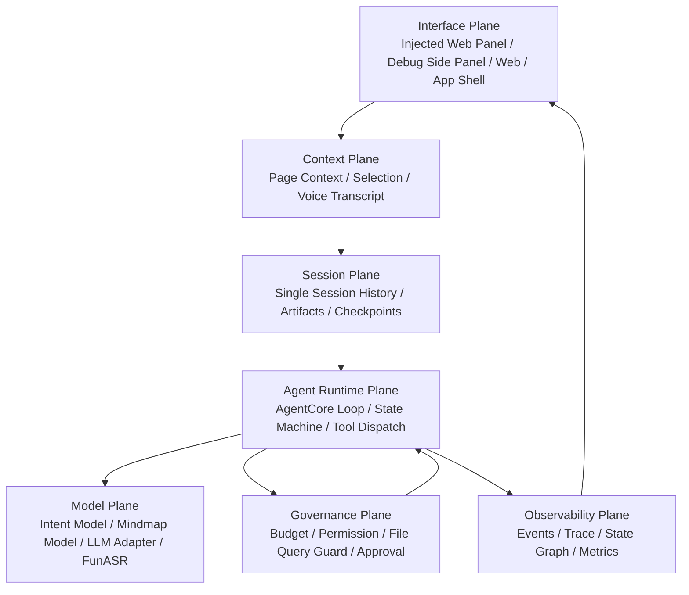
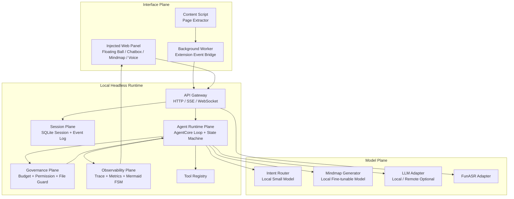
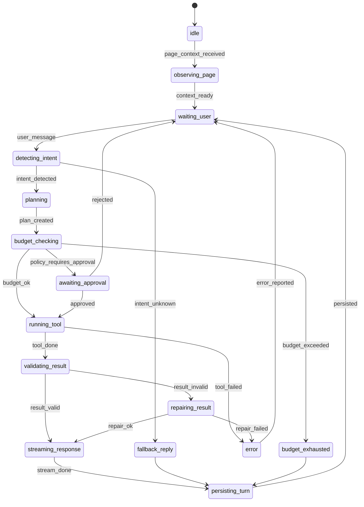

# Navia / 伴航 V1 架构设计文档

版本：V1.0 Architecture Baseline
日期：2026-05-31

---

## 1. 架构目标

Navia V1 架构的目标是搭建一个可以长期演进的本地 Headless AI Runtime，而不是一次性网页插件。

V1 架构必须支持：

- Chrome 插件通过 Content Script 注入网页内悬浮球与 AI 双轨面板，作为 V1 优先前端。
- Web / App 未来复用同一 Runtime API。
- 本地小参数模型做意图识别。
- 已部署 FunASR 做语音转写。
- 本地可微调模型生成 Mermaid mindmap。
- AgentCore 借鉴 openHarness / PiAgent 的源码结构，但收缩到单 Session、无 MCP、无 Skill、无长期记忆。
- 状态机可视化、可验证、可观测。
- 工具调用、上下文读取、token 使用、本地文件访问受监督。

### 1.1 V1 实现基线

V1 规划阶段已决定：

- Local Runtime 使用 Python 快速原型实现，建议采用 FastAPI 风格的 HTTP / SSE / WebSocket API Gateway。
- AgentCore、Session、Governance、Observability、ModelAdapter 必须保持清晰模块边界，便于后端团队按子系统分工。
- Chrome 插件采用 WXT + React + TypeScript；插件通过 Content Script 注入页面内交互层，只作为 Interface Plane，通过 Runtime API 访问后端能力。
- V1.0-0/A/B/C 不实现 Chrome UI，只先冻结合同并打通 Runtime、AgentCore、状态机、事件追踪和治理底座。
- V1 结束后进入 V2 研讨时，必须重新评估 Python Runtime 是否继续作为长期主栈，或是否需要引入 TypeScript / sidecar / 服务拆分。

### 1.2 Contract-first 决策

审计后 V1 采用 `Go, but contract-first` 策略。任何 AgentCore 实现前必须先冻结：

- API response envelope。
- ErrorCode enum。
- State enum 与 Transition table schema。
- AgentEvent envelope。
- Session / Turn / Message / ToolCall / ToolResult / Artifact / Budget schema。
- ID 生成和关联规则。
- `/v1/chat/stream` SSE 协议。
- EventStore 与 EventStream 接口边界。

V1.0-A 不能先写 ad-hoc AgentLoop、ad-hoc events 或直接工具执行。每个 turn 必须有 `session_id` / `turn_id`，每个工具调用必须经过 governance hooks，每个状态迁移必须被验证并持久化。

---

## 2. 架构原则

```text
1. UI 是壳，Runtime 是核心。
2. AgentCore 是状态机，不是散乱 prompt。
3. 本地模型是 Adapter，不进入业务层。
4. V1 做单 Session，不做长期记忆。
5. 所有工具调用必须被监督。
6. 所有状态变化必须可观测。
7. 所有 Artifact 必须可追踪来源。
8. 所有预算消耗必须可计量。
9. 默认不读取本地文件。
10. 默认不自动保存所有网页。
11. 合同先于实现，禁止临时 loop / 临时事件 / 自由形态工具返回。
12. EventStore 负责持久化，EventStream 负责实时推送，二者必须分离。
```

---

## 3. 设计平面

V1 按设计平面拆分，而不是按 UI 功能堆模块。



### 3.1 Interface Plane

职责：

- 网页内贴边悬浮球。
- hover 小长条。
- 网页内 AI 双轨聊天面板。
- Chatbox。
- 当前网页信息展示。
- 摘要 / Mindmap Artifact 展示。
- 语音输入按钮。
- Agent 状态展示。
- Trace / Debug 面板。

V1 必须支持的页面内交互：

- 悬浮球默认态。
- 悬浮球 hover 预展开态。
- 窄距展开态：默认约 `440px`，挤压网页。
- 半屏展开态：约 `50vw`，继续挤压网页。
- 宽工作区覆盖态：超过 `52vw` 覆盖网页，最大 `80vw`。
- 收起态：点击悬浮球或收起按钮后恢复网页布局。
- resize handle。
- 小视口 `<900px` 时禁用挤压式，降级为覆盖式或全屏侧栏。

说明：上述交互来自当前 active 文档 `docs/active/project/interaction-prd/窗口交互_PRD.md`，该文件是 V1 前端页面体验的 P0 权威来源。Chrome Side Panel 可保留为调试入口或兼容承载，但不得替代 V1 页面内交互验收。

禁止：

- 不直接调用模型。
- 不保存 Agent 核心状态。
- 不直接读取本地文件。

#### V1.1 前端高保真目标架构

V1.0 的页面内实现以 `Content Script -> Shadow DOM injectedPanel -> Runtime API -> AgentCore` 为主线，优先证明交互骨架和功能闭环。V1.1 在不改变 Runtime / AgentCore / API 合同的前提下，把 Interface Plane 细化为可设计验收的前端体验架构：

```text
Figma Prototype Semantics
  MainLayout / MockPage / FloatingBall / Sidebar / ChatArea
        |
        v
Injected Interface Plane
  Floating Entry
  Panel Shell
  Left Rail
  Chat Workspace
  Tool Dock
  Artifact Viewer
  Visual Tokens
        |
        v
Runtime API / PageContext / SSE / Session Restore
```

V1.1 当前架构与目标架构差异：

| 维度 | V1.0 当前架构 | V1.1 目标架构 |
|---|---|---|
| 实现形态 | Shadow DOM 字符串模板与内联 CSS | 组件语义清晰的注入面板结构，可映射到 Figma `MainLayout / FloatingBall / Sidebar / ChatArea` |
| 视觉系统 | 工程可用样式，token 分散 | 集中化视觉 token：颜色、阴影、圆角、间距、轨道宽度、动画 |
| 原型语义 | 主要按功能区域命名 | 按 Figma 原型语义拆解并保留测试锚点 |
| 验收方式 | DOM 状态、真实 Chrome 交互、E2E 功能 | 增加 Playwright 截图基线、Figma 对照、状态截图矩阵 |
| Side Panel | 调试 / 兼容入口 | 仍为调试入口，不参与 V1.1 高保真验收 |

V1.1 不新增设计平面，不改变 Runtime 依赖方向。所有模型、工具、治理、Session 与 Trace 仍由 Runtime 负责，前端只呈现状态并消费合同化事件。

### 3.2 Context Plane

职责：

- 页面 title / url / domain。
- DOM headings。
- cleaned text。
- visible text。
- selected text。
- content hash。
- voice transcript。

约束：

- 只处理当前网页上下文。
- 不做全局本地文件索引。
- 长页面必须 chunk，不得无脑整页塞入模型。

#### A-V1.2 高质量网页感知层目标架构

A 模块在 V1.2 中是 `Page Perception / AgentCore Eyes`，属于 Context Plane 的感知子系统。A-V1.2 的目标不是生成学习产物，而是把真实复杂网页转换成高密度、可验证、可反跳的结构化页面事实。

目标流水线：

```text
Chrome PageContext / HTML snapshot
  -> PageReadingInput
  -> DOM baseline candidate
  -> optional candidate extractor ensemble
  -> A-owned block graph
  -> noise filter and density ranking
  -> StructuredPageContext
  -> HighSignalPageContext
  -> PerceptionDigest
  -> SourceMap / SourceRef
  -> PagePerceptionQualityReport
  -> DebugEvidenceBundle
```

A-V1.2 组合路线的架构职责：

- `DOM baseline` 是永远可用的保底候选，不依赖第三方包。
- `candidate extractor ensemble` 只提供候选抽取结果，必须通过依赖审计后才可启用。
- `A-owned schema normalization` 负责把所有候选结果映射回 Navia 自有 block graph，禁止第三方 raw field 泄漏。
- `SourceMap / jumpback` 负责让每个摘要项、关键事实和高信号块具备 `textQuote` 或 `fallbackText`。
- `Quality Evaluator` 负责用可计算指标决定 `pass / degraded / fail`，不得写死通过。
- `DebugEvidenceBundle` 负责把 raw signals、候选比较、过滤证据、source map 和质量报告合并成可审计 JSON。
- `100-page corpus gate` 是 A-V1.2 出门门槛，不是可选展示材料。

模块调用关系：

```text
A -> D：仅输出 quality-ready 页面上下文，供连续对话和工具编排使用
A -> C：仅输出 source-grounded 结构化上下文，供 Mindmap 生成和节点反跳使用
A -> B：仅输出 Debug JSON、source fallback 和质量状态，供前端展示
```

公共合同消费门槛：

- A 的 `StructuredPageContext` 始终是基础事实源。
- `HighSignalPageContext`、`PerceptionDigest`、`SourceMap / SourceRef` 和 `PagePerceptionQualityReport` 是 A-V1.2 公共合同。
- D/C 只有在 `PagePerceptionQualityReport.downstreamReadiness = "pass"` 时才能把 high-signal 输出作为主上下文。
- `degraded` 输出只能进入 fallback 或 Debug evidence；`fail` 输出不得作为 D/C 主输入。
- B 只能渲染 A 的 Debug JSON、source fallback 和 quality state，不拥有 AgentCore state，也不直接调用 A/C/D 服务。

A-V1.2 目标架构与当前架构差异：

| 维度 | 当前基线 | A-V1.2 目标 |
|---|---|---|
| 内容抽取 | DOM baseline 与有限 fixture | DOM baseline + 审计后的 candidate extractor ensemble |
| 数据模型 | StructuredPageContext / high-signal 合同雏形 | A-owned block graph 归一化后输出公共 high-signal / digest / source map / quality 合同 |
| 质量判断 | 小规模 fixture 与人工判断 | 100-page corpus、gold review、可计算 metric、DebugEvidenceBundle |
| 来源反跳 | paragraph/sourceRange fallback | SourceRef 必须包含 textQuote 或 fallbackText，selector/domPath 仅为增强 |
| 下游消费 | D/C/B 容易依赖临时 shape | 只通过公共合同和 readiness gate 消费 |

A-V1.2 的关键体验路径：

```text
读取网页
  -> A 生成 DebugEvidenceBundle
  -> B Debug 页展示结构化 JSON、过滤证据和质量状态

用户提问
  -> D 只在 quality pass 时使用 HighSignalPageContext / PerceptionDigest
  -> degraded/fail 时回退或返回 PAGE_CONTEXT_REQUIRED

用户生成 Mindmap
  -> C 使用 SourceMap / SourceRef 生成 nodeSourceMap
  -> B 点击节点时优先 DOM jumpback，失败则展示 textQuote/fallbackText 证据卡
```

A-V1.2 边界：

- A 不生成最终 assistant answer。
- A 不生成 Mindmap、Flashcards、Quiz、Podcast 或 Notebook 产物。
- A 不创建 `ArtifactRecord`。
- A 不发 SSE。
- A 不写 EventStore、Trace 或 Session state。
- A 不直接调用 D/C/B、MCP、Skill、外部 API、OCR、VLM、ASR、视频或直播 engine。
- 第三方正文抽取库只允许作为 candidate extractor，输出必须映射回 A-owned block graph 后才能进入 Navia 公共合同。

#### 当前阶段目标架构：A 高信号主链路与 C 补强

当前代码基线中，`/v1/page/context` 已接入 A 的 `StructuredPageContext`，C 的 `mindmap.generate` 已通过 Runtime adapter 接入；但 A 的 `HighSignalPageContext / PerceptionDigest / SourceMap / QualityReport` 还没有成为 Runtime 主链路的稳定消费事实，C 的节点选择也还没有优先使用 A 的高信号 digest。

本阶段目标架构：

```text
Chrome / Side Panel
  -> /v1/page/context
  -> A Page Perception
       StructuredPageContext
       HighSignalPageContext
       PerceptionDigest
       SourceMap / SourceRef
       PagePerceptionQualityReport
  -> Session.activePage.perception
  -> D Adapter Layer
       readiness gate
       ToolResult / Artifact / Event mapping
  -> C Mindmap
       digest-first node selection
       SourceRef-backed nodeSourceMap
       Mermaid validation / repair <= 1
  -> B Debug / Artifact renderer
       A JSON
       quality state
       Mermaid visual
       source fallback / evidence card
```

当前架构与目标差异：

| 维度 | 当前实现 | 本阶段目标 |
|---|---|---|
| A 主链路 | Runtime 主要持久化 `StructuredPageContext` | Runtime 同步保存或返回 high-signal perception bundle，并保留旧字段兼容 |
| D 消费 | 工具基于 `activePage` 里的基础段落和 summaryDraft | D 在 quality pass 时优先使用 `PerceptionDigest`，degraded/fail 时回退或阻断 |
| C 输入 | C 主要从 headingTree / paragraph fallback 选节点 | C 优先从 digest item / sourceRefs 选节点，headingTree 仅 fallback |
| 来源反跳 | nodeSourceMap 可回到 paragraph/chunk | nodeSourceMap 直接绑定 A SourceRef，必须有 textQuote/fallbackText |
| Debug 验收 | 结构化 JSON 可见性有限 | Debug 可同时查看 A quality、digest、source map 和 C mindmap source map |

调用边界：

- A 仍是纯感知层，不创建 artifact、不发 SSE、不写 EventStore。
- C 不读取 DOM，不重新抽取页面正文，不绕过 A 做感知。
- D 是唯一 ToolResult / Artifact / Event / Trace 映射出口。
- B 只渲染 Runtime 返回的数据，不拥有 AgentCore 状态，不直接调用 A/C 服务。

关键质量门槛：

- `PagePerceptionQualityReport.downstreamReadiness = "pass"` 时，D/C 才能将 high-signal 输出作为主输入。
- `degraded` 只能进入 fallback 或 Debug 提示。
- `fail` 不得触发基于高信号内容的 summary / answer / mindmap。
- C 的每个主要 mindmap 节点必须至少关联一个 A SourceRef 或明确 fallback reason。

### 3.3 Session Plane

职责：

- 单 Session message history。
- active page。
- tool call records。
- artifacts。
- checkpoints。
- budget ledger。
- event log reference。

目标：

- 单 Session 可恢复。
- 单 Turn 可回放。
- Artifact 可追踪。

### 3.4 Agent Runtime Plane

职责：

- Agentic Loop。
- 状态机。
- Intent routing。
- One-step planning。
- Tool dispatch。
- Result validation。
- Response streaming。
- Persist turn。

V1 约束：

- 单 Agent。
- 单 Session。
- 每轮有限工具调用。
- 不做自主跨页面任务。
- 最小状态机从 V1.0-A 开始接入。
- Agent loop 必须通过 `StateMachine.transition()` 推进状态。
- ToolExecutor 必须从 V1.0-A 起经过 `PreToolUse` / `PostToolUse` hook。

### 3.5 Model Plane

职责：

- IntentModelAdapter。
- MindmapModelAdapter。
- LLMAdapter。
- ASRAdapter / FunASRAdapter。

约束：

- AgentCore 不感知具体模型实现。
- 所有模型调用通过 Adapter。
- 每次模型调用记录 model.started / model.done event。

### 3.6 Governance Plane

职责：

- Budget Supervisor。
- Tool Permission Supervisor。
- Context Supervisor。
- File Query Supervisor。
- Approval Gate。

目标：

- 防止 Agent 对本地文件进行过量查询。
- 防止 token 意外消耗。
- 防止失败重试失控。
- 高风险工具必须审批。

### 3.7 Observability Plane

职责：

- AgentEvent。
- State transition log。
- Session trace。
- State machine Mermaid rendering。
- Budget metrics。
- Tool call metrics。

---

## 4. 总体组件架构



---

## 5. 推荐目录结构

```text
navia/
  apps/
    chrome-extension/
      src/
        sidepanel/
        content-script/
        background/
        shared/
    web-demo/
      src/

  services/
    local-runtime/
      app/
        api/
        agent_core/
          runtime/
          state_machine/
          event_bus/
          planning/
          execution/
        session/
        governance/
        tools/
        models/
        page_context/
        mindmap/
        asr/
        observability/
        storage/
      tests/

  packages/
    contracts/
      events/
      session/
      tools/
      artifacts/
    shared-types/
    prompts/

  docs/
    prd/
    architecture/
    acceptance/
    adr/
```

V1.0-0/A/B/C 的首轮文档级实现边界：

- 先规划 `services/local-runtime`，不在首轮规划中创建 Chrome 插件工程。
- Runtime 内部模块按 API、AgentCore、Session、Governance、Observability、ToolRegistry、ModelAdapter 拆分。
- 存储接口先面向 SQLite / JSONL EventLog 设计，但允许首轮原型使用内存实现验证合同。
- 所有模型、FunASR、Mindmap 生成能力都通过 Adapter 边界接入，不写死到 AgentCore。

---

## 6. AgentCore 架构

### 6.1 AgentCore 实现策略

V1 建议使用 openHarness / PiAgent 的源码思想进行裁剪：

保留：

- Agent loop。
- Tool registry。
- Message history。
- State management。
- Event stream。
- PreToolUse / PostToolUse hook。
- Budget / permission gate。
- Trace。

删除 / 暂不接入：

- MCP。
- Skill。
- Long-term memory。
- Multi-agent。
- Shell execution。
- Full workspace search。
- Browser automation。

### 6.2 Agentic Loop

```text
Observe
  -> Detect Intent
  -> Plan One Step
  -> Budget Check
  -> Policy Check
  -> Execute Tool
  -> Validate Result
  -> Stream Response
  -> Persist Turn
  -> Wait
```

### 6.3 AgentCore 内部模块

```text
agent_core/
  runtime/
    AgentRuntime
    AgentLoop
    TurnRunner
  state_machine/
    StateMachine
    TransitionTable
    StateRenderer
  event_bus/
    EventBus
    EventSchema
    EventStore
  planning/
    IntentRouter
    OneStepPlanner
  execution/
    ToolExecutor
    ResultValidator
    ResponseStreamer
  supervision/
    BudgetSupervisor
    PermissionSupervisor
    ContextSupervisor
    FileQuerySupervisor
    ApprovalGate
```

---

## 7. Agent 状态机

状态机必须作为代码中的正式 contract，不得只存在于文档。



工程要求：

- Transition table 是唯一真实来源。
- Mermaid 图由 transition table 自动生成。
- 非法 transition 直接拒绝。
- 每次 transition 产生 `state.transition` event。
- 测试验证状态图和 transition table 一致。
- 每个状态必须定义 allowed_events。
- 每个 recoverable error 必须定义恢复路径。

---

## 8. Governance 设计

### 8.1 Budget Supervisor

默认 TurnBudget：

```ts
type TurnBudget = {
  maxModelCalls: number
  maxToolCalls: number
  maxInputTokens: number
  maxOutputTokens: number
  maxContextBytes: number
  maxRuntimeMs: number
  maxRetries: number
}
```

建议默认：

```text
maxModelCalls = 3
maxToolCalls = 5
maxInputTokens = 12000
maxOutputTokens = 3000
maxContextBytes = 256KB
maxRuntimeMs = 60000
maxRetries = 1
```

预算耗尽行为：

- 停止继续工具调用。
- 写入 `budget_exhausted` event。
- 返回基于已读取上下文的部分结果。
- 提示用户手动确认是否继续。

### 8.2 Permission Supervisor

| 工具 | 默认权限 | 是否需要审批 |
|---|---:|---:|
| read_current_page | allow | 否 |
| summarize_page | allow | 否 |
| answer_from_page | allow | 否 |
| explain_selection | allow | 否 |
| generate_mindmap | allow | 否 |
| asr_transcribe | allow | 否 |
| read_local_file | deny | 是 |
| search_local_workspace | deny | 是 |
| shell | deny | 是 |
| browser_click | deny | 是 |
| browser_automation | deny | 是 |

### 8.3 Context Supervisor

策略：

- 不把整篇网页默认塞入模型。
- 先做正文清洗和结构提取。
- 长页面按 heading / paragraph chunk。
- 根据 intent 选择相关上下文。
- 每次模型调用记录 context bytes 和 token estimate。
- 超过上下文预算时先压缩再调用模型。

### 8.4 File Query Supervisor

V1 默认关闭本地文件查询。

```ts
type FileQueryPolicy = {
  enabled: boolean
  allowedRoots: string[]
  deniedGlobs: string[]
  maxFilesPerTurn: number
  maxBytesPerFile: number
  maxTotalBytesPerTurn: number
  requireUserApproval: boolean
}
```

默认：

```text
enabled = false
allowedRoots = []
maxFilesPerTurn = 0
requireUserApproval = true
```

### 8.5 Approval Gate

V1 是轻量 Approval Gate，不做复杂 Workflow Approval。

触发场景：

- 访问本地文件。
- 查询本地目录。
- 调用高成本模型。
- 超过当前 turn budget。
- 重试次数超过限制。
- 未来执行浏览器操作。

设计原则：

- 审批前不执行 side effect。
- 审批结果必须幂等。
- 审批状态必须可观测。
- 审批取消后 late approval 不得继续执行。
- 审批事件必须进入 EventLog。
- 对 side effect marker 使用 CAS / lock 防止并发重复执行。

---

## 9. Observability 设计

### 9.1 AgentEvent

```ts
type AgentEvent = {
  eventId: string
  sessionId: string
  turnId?: string
  type:
    | "state.transition"
    | "page.context.received"
    | "intent.detected"
    | "budget.checked"
    | "approval.required"
    | "approval.approved"
    | "approval.rejected"
    | "tool.requested"
    | "tool.started"
    | "tool.done"
    | "tool.failed"
    | "model.started"
    | "model.done"
    | "response.delta"
    | "response.done"
    | "artifact.created"
    | "error"
  timestamp: string
  data: Record<string, unknown>
}
```

### 9.2 EventStore 与 EventStream 分离

必须区分：

- `EventStore`：持久化事件，用于 trace、replay、审计和 V2 异步蒸馏。
- `EventStream`：实时推送事件，用于网页内 AI 面板、Debug 面板和 streaming response。

约束：

- 不允许只有实时事件而没有持久化事件。
- `GET /v1/sessions/{session_id}/trace` 必须从 EventStore 读取。
- `/v1/chat/stream` 可以复用 AgentEvent envelope，但不能替代 EventStore。
- 每次 `state.transition` 必须同时进入 EventStore，并可被 trace API 查询。

### 9.3 必须提供的观测接口

```text
GET /v1/agent/state
GET /v1/sessions/{session_id}/trace
GET /v1/agent/state-machine/mermaid
SSE /v1/chat/stream
SSE /v1/agent/events 或后续 WS /v1/agent/events
```

前端状态展示：

- 当前状态。
- 当前工具。
- 本轮 token 使用。
- 本轮工具调用次数。
- 最近事件。
- 预算是否接近上限。

---

## 10. 数据存储建议

### 10.1 SQLite

用于：

- Session。
- Messages。
- PageContext metadata。
- ToolCallRecord。
- ArtifactRecord。
- BudgetLedger。

### 10.2 JSONL EventLog

用于：

- AgentEvent。
- State transition。
- Debug trace。
- Session replay。

### 10.3 Cache

用于：

- 页面抽取结果。
- chunk 结果。
- mindmap 中间结果。

---

## 11. API 网关

本地 Runtime 只监听 `127.0.0.1`：

```text
http://127.0.0.1:17861
ws://127.0.0.1:17861
```

所有 UI 必须通过 API Gateway 访问 Runtime，不得绕过 API 直接写存储或调用模型。

### 11.1 本地 Runtime 安全约束

localhost Runtime 仍然是攻击面，V1 必须具备最小安全边界：

- 默认只绑定 `127.0.0.1`，不得监听 `0.0.0.0`。
- CORS / Origin allowlist 只允许 Chrome extension origin 和明确配置的 localhost dev origin。
- 高风险 API 不允许任意网页调用。
- 可选 dev pairing token，用于本地调试阶段降低误调用风险。
- 普通日志不得打印完整网页正文、选区全文或音频 transcript 全文。
- 外部模型调用必须显式配置，UI 必须展示当前模型模式。

---

## 12. V1.2-AC-Native 目标架构

V1.2-AC 已证明 A/C/D/B 功能链路可以在 direct extension page 中跑通，但这不能替代 Chrome 原生 Side Panel 用户体验。V1.2-AC-Native 的目标架构是在不改变 Runtime / A / C / D 公共合同的前提下，把 B 的展示壳稳定运行在 Chrome 原生 Side Panel 容器内。

目标调用路径：

```text
Chrome tab 当前网页
  -> Chrome action / keyboard command
  -> Chrome native Side Panel container
  -> B SidePanel Shell
  -> background runtime proxy
  -> Runtime API Gateway
  -> D Adapter Layer
  -> A Page Perception / C Mindmap
  -> ToolResult / Artifact / Event / Trace
  -> B Chat / Debug / Mermaid / Source Fallback
```

当前实现差异：

| 维度 | 当前状态 | V1.2-AC-Native 目标 |
|---|---|---|
| 入口形态 | direct extension page 功能冒烟已通过；原生 Side Panel 打开不稳定 | action / keyboard command 必须稳定打开右侧 Side Panel |
| 截图证据 | 曾有全屏扩展页截图；最新原生 probe 未稳定出现 Navia 侧栏 | 每张体验截图必须同时包含真实网页和右侧 Navia Side Panel |
| 侧栏宽度 | 快捷按钮在窄宽度下可达性不足，Mindmap 容易不可见 | 主要动作可见、可滚动、可操作，文字不溢出 |
| 自动化方式 | 坐标点击不可靠，可能误截无关窗口 | 使用可定位 test id、可访问 page target 或明确 structured blocker |
| 验收声明 | direct page 只能算 smoke test | 原生 Side Panel 内完整流程通过后才可声明 UX 通过 |

职责边界保持不变：

- B 只负责 Side Panel shell、聊天渲染、Debug、Artifact、Mermaid 和 source fallback 展示。
- B 不直接调用 A/C/D 服务，不拥有 AgentCore 状态。
- A 不创建 Artifact、不发 SSE、不写 EventStore。
- C 不读取 DOM。
- D 仍是 ToolResult / Artifact / Event / Trace 唯一映射出口。
- 原生 Side Panel 体验修复不得引入 RAG、长期记忆、多 Agent、浏览器自动操作或外部搜索。

自动化架构要求：

- `e2e:chrome:native-probe` 只用于判断原生侧栏是否可被打开，不得声明完整流程通过。
- 完整 UX E2E 必须能稳定定位 Side Panel 内按钮、输入框、Debug 状态和 artifact。
- 每张计入体验通过的截图必须有同名 metadata JSON，记录页面、扩展、native panel 判定、viewport、panel 宽度、Runtime 状态和结论。
- 如果 Chrome 原生 Side Panel DOM target 不可被自动化访问，必须生成 structured blocker，并由人工体验验收补位。
- structured blocker 必须包含 blockerId、stage、pageUrl、browser、reason、evidencePaths、attemptedActions、nextAction、blocksCompletion；`blocksCompletion=true` 时不得声明阶段完成。
- direct extension page E2E 可继续作为功能回归 smoke test，但不能作为用户体验验收的替代品。

---

## 13. V1.2-AC-Quality 目标架构

V1.2-AC-Quality 承接 V1.2-AC-Native 的原生 Side Panel 稳定化成果，进一步强化 A/C 主链路质量。目标不是新增产品形态，而是让 A 高质量网页感知和 C digest-first Mindmap 在更多真实网页上稳定、可解释、可反跳。

目标调用路径：

```text
Chrome 原生 Side Panel
  -> B 触发读取 / Debug / Mindmap
  -> Runtime /v1/page/context
  -> A Page Reading Pipeline
      -> StructuredPage
      -> HighSignalPage
      -> PerceptionDigest
      -> SourceMap / SourceRef
      -> PagePerceptionQualityReport
  -> D Adapter Layer
      -> ToolResult envelope
      -> ArtifactRecord / AgentEvent / Trace mapping
  -> C Mindmap Generator
      -> digest-first Mermaid
      -> MindmapNodeSourceMap
      -> source fallback
  -> B Debug / Mermaid / Source Evidence
```

本阶段目标数据包：

```text
ACQualityEvidenceBundle
  pageEvidence[]
    pageUrl | snapshotPath
    category
    expectedRisk
    structuredPage
    highSignalPage
    perceptionDigest
    sourceMap
    qualityReport
    mindmapArtifact
    nodeSourceMap
    screenshots[]
    screenshotMetadata[]
    runtimeTraceRef
    conclusion
  aggregateReport
  falseGreenAudit
  prdReview
```

质量指标必须至少覆盖：

- `sourceCoverage`：A 高信号块或 digest item 中具备 sourceRef 的比例。
- `groundingCompleteness`：进入 C 主要节点的 digest item 是否可追溯到 sourceRef 或 fallbackText。
- `jumpbackCoverage`：Mindmap 主要节点中具备 sourceRefId、textQuote 或 fallbackText 的比例。
- `lowSignalCorrectness`：低信号 / 空内容页必须 degraded 或 fail，不得 pass。
- `digestFirstUsage`：`downstreamReadiness=pass` 时 C 的主要节点必须优先来自 `PerceptionDigest.items + SourceRef`。

当前架构差异：

| 维度 | 当前状态 | V1.2-AC-Quality 目标 |
|---|---|---|
| A 输出质量 | 已有 high-signal perception 与 low-signal degraded 基线 | 扩展真实网页覆盖，提升噪声过滤、digest 密度和 quality 可解释性 |
| C 输入策略 | 已支持 digest-first，但仍需防止 heading-only 误声明 | readiness pass 时必须优先消费 digest/sourceRef；fallback 必须显式标注原因 |
| SourceMap | 已有 SourceRef 与 nodeSourceMap | 主要 mindmap 节点必须关联 sourceRefId 或明确 fallbackText |
| Debug | 可展示基础状态和 JSON | 必须展示 quality state、digest item、sourceRef、mindmap source map 和失败原因 |
| 验收 | Native UX 5 页通过 | 扩展到更强真实网页矩阵，并产出 HTML 报告 / false-green audit |

模块边界：

- A 只负责网页感知、结构化事实、digest、source map 和 quality report。
- A 不生成最终回答、不生成 Mindmap、不创建 Artifact、不发 SSE、不写 EventStore / Trace。
- C 只负责从 A/Runtime 提供的结构化输入生成 Mermaid 与 nodeSourceMap。
- C 不读取 DOM、不调用 Chrome、不绕过 D 写 Artifact / Event。
- D 是 ToolResult / Artifact / Event / Trace 唯一映射出口。
- B 只渲染 Chat、Debug、Mindmap、source fallback 和验收可见状态。

信息流验收路径：

```text
真实网页
-> 读取当前页面
-> Debug 显示 A quality / digest / sourceRefs
-> 生成 Mindmap
-> C 输出 Mermaid + nodeSourceMap
-> B 展示 Mermaid 或 fallback
-> HTML 报告记录截图、URL、quality、source coverage、结论
```

降级路径：

```text
qualityReport.downstreamReadiness = pass
  -> C 必须 digest-first

qualityReport.downstreamReadiness = degraded
  -> C 可以 fallback 到 heading / paragraph，但必须写入 fallbackReason

qualityReport.downstreamReadiness = fail
  -> 不得生成假 high-signal mindmap；B 必须展示失败原因和 source fallback
```

本阶段不得改变公共 API 或数据合同；如需要新增字段、事件类型或 artifact 类型，必须回到 V1.2-0 合同冻结。

---

## 14. V1.2-AC-Jumpback MVP 目标架构

V1.2-AC-Jumpback MVP 承接 V1.2-AC-Quality 的 source-grounded mindmap 输出，目标是把“可反跳证据”推进到“用户可点击、可查看证据、可尝试定位”的最小产品闭环。它不改变 A/C/D/B 的核心职责，只在既有 `nodeSourceMap` 和 `jumpback` payload 之上补齐交互 wiring。

目标调用路径：

```text
真实网页
  -> A SourceMap / SourceRef
  -> C Mindmap Generator
      -> stable Mermaid node ids
      -> MindmapNodeSourceMap
      -> jumpback payload
  -> D Adapter Layer
      -> ArtifactRecord.metadata.nodeSourceMap
      -> Event / Trace ownership
  -> B Mindmap Renderer
      -> node click
      -> source evidence card
      -> content-script jumpback request
  -> Content Script
      -> selector / domPath / textQuote 定位
      -> scroll + highlight
      -> structured failure reason
```

目标数据包：

```text
JumpbackEvidenceBundle
  pageUrl
  artifactId
  nodeId
  nodeLabel
  sourceRefIds[]
  textQuote optional
  fallbackText
  jumpback.mode = dom | fallback
  attemptedStrategies[]
  result = highlighted | fallback_shown | blocked
  failureReason optional
  screenshots[]
  screenshotMetadata[]
```

当前架构差异：

| 维度 | 当前状态 | V1.2-AC-Jumpback MVP 目标 |
|---|---|---|
| C 输出 | 已有 `nodeSourceMap` 和 source fallback | Mermaid node id 与 `nodeSourceMap` key 稳定映射 |
| B 渲染 | 可展示 Mindmap / source fallback | 点击节点后展示来源证据卡片 |
| 反跳执行 | 缺少产品级 click -> scroll/highlight | content script 尝试 selector / domPath / textQuote 定位 |
| 降级 | 有 fallback 文本 | DOM 失败时返回 structured reason 并展示 fallback evidence |
| 验收 | AC-Quality 验证 source coverage | 新增点击路径、截图、定位结果和 false-green audit |

边界：

- C 不读取 DOM，不调用 content script，不创建 Artifact / Event / Trace。
- B 不直接调用 A/C/D 服务，只消费 Artifact metadata 和前端 state。
- Content script 不做非用户触发的浏览器自动操作。
- D 仍是 ToolResult / Artifact / Event / Trace 唯一映射出口。
- 如需新增公共字段或事件，必须回到 V1.2-0。

---

## 15. V1.2-Closeout 收关目标架构

V1.2-Closeout 承接 V1.2-AC-Jumpback MVP。目标不是新增模块，而是把 A/C/D/B 的既有链路补齐到可声明 V1.2 完成的证据强度：真实 Chrome 截图级 Jumpback、SourceRef 质量、更多真实网页覆盖、Mindmap 交互细化和最终出门审计。

目标架构仍保持四层分工：

```text
A Page Perception
  -> 输出更稳定 SourceRef
  -> selector / domPath optional
  -> textQuote / fallbackText required
  -> qualityReport.jumpbackCoverage 可解释

C Mindmap
  -> digest-first nodes
  -> stable nodeBindings
  -> SourceRef-backed nodeSourceMap
  -> duplicate label disambiguation

D Adapter Layer
  -> ToolResult / Artifact / Event / Trace 唯一出口
  -> 不被 A/C/B 绕过
  -> trace 可还原 read -> mindmap -> jumpback-ready artifact

B Side Panel Renderer + Content Script
  -> Mermaid / source card / selected state
  -> 用户触发 jumpback
  -> content script scroll/highlight
  -> failure fallback evidence
```

目标调用路径：

```text
真实网页
-> content script extract PageContext
-> Runtime session.activePage
-> A high-signal bundle + SourceMap
-> C Mindmap artifact metadata
-> D Artifact / Event / Trace mapping
-> B render Mermaid + source cards
-> 用户点击节点 / source card
-> content script selector/domPath/textQuote 定位
-> screenshot evidence + metadata + report
```

当前架构差异：

| 维度 | 当前 V1.2-AC-Jumpback MVP | V1.2-Closeout 目标 |
|---|---|---|
| Jumpback 证据 | 组件测试 + content script DOM 测试 + native UX 主路径 | 真实 Chrome 截图级证明点击后正文高亮或 fallback |
| SourceRef 质量 | 有 textQuote / fallbackText，selector 质量依赖 A | 至少 20 页样本中 selector/textQuote/fallback 可解释并可统计 |
| Mindmap 交互 | SVG 文本点击 + 来源证据卡片 | 节点选中态、hover/selected 反馈、证据面板折叠和失败提示 |
| 页面覆盖 | AC native 5 页，Jumpback MVP 最小链路 | 至少 20 个真实网页 / snapshot，含复杂中文、技术文档、GitHub、长文、低信号 |
| 完成声明 | 可声明 AC-Jumpback MVP | 可声明 V1.2 mock-first product path complete |

边界：

- 不新增公共 API、Artifact type 或 AgentEvent type；如必须新增，回到 V1.2-0。
- A/C 不调用 Chrome、content script、CoreProvider、MCP 或 Skill。
- B 不生成摘要、回答、Mindmap 或 Artifact。
- Content script 只执行用户触发的当前页定位，不做浏览器自动操作任务。
- D 仍是 ToolResult / Artifact / Event / Trace 唯一映射出口。

---

## 16. V1.3 Evidence Card Mindmap 目标架构

V1.3 在 V1.2-Closeout 已打通的 A/C/D/B 主链路上，增强 B Mindmap Renderer 的主体验。目标不是更换 C 的生成逻辑，也不是新增 Canvas 或知识库，而是把 `ArtifactRecord(type="mindmap")` 渲染为可读、可验证、可交互的 Evidence Card Mindmap。

当前架构基线：

```text
Chrome native Side Panel
  -> B renderer renders Chat / Debug / Mindmap
  -> Mindmap artifact carries Mermaid source and source metadata
  -> Source evidence and jumpback fallback are available
  -> Runtime remains the only producer of ToolResult / Artifact / Event / Trace
```

当前主要差异不在事实链路，而在体验表达和验收闭环：

- Mermaid / source fallback 已能作为技术证明，但还不能代表高质量 Mindmap 主体验。
- Evidence Card 基线已存在，但需要用统一 view model、可读布局、交互状态和真实 Side Panel 截图完成出门验收。
- C 输出的 digest / node label 需要更强语义压缩和主题归并，避免长句平铺。
- 真实 Chrome 原生 Side Panel 自动化和截图证据仍是 V1.3 出门硬门槛。

目标架构：

```text
A Page Reading
  -> HighSignalPageContext / PerceptionDigest / SourceMap / QualityReport
        |
        v
C Mindmap
  -> digest-first mindmap tree
  -> Mermaid source
  -> nodeSourceMap / nodeBindings
        |
        v
D Adapter Layer
  -> ToolResult
  -> ArtifactRecord(type="mindmap")
  -> Event / Trace
        |
        v
B Mindmap Renderer
  -> EvidenceCardViewModel
  -> Evidence Card Mindmap
  -> source evidence panel
  -> selected / hover / neighbor highlight
        |
        v
Content Script
  -> user-triggered selector / domPath / textQuote jumpback
```

V1.3 可执行合同：

```text
docs/active/project/contracts/v1_3_evidence_card_mindmap.schema.json
```

该合同只冻结 B-local `EvidenceCardViewModel`、V1.3 验收 `report.json`、截图证据 metadata 的机器可校验结构。它不是新的 Runtime public contract，A/C/D 不得依赖 `EvidenceCardViewModel` 的 exact shape。

当前架构差异：

| 维度 | V1.2-Closeout 当前状态 | V1.3 目标 |
|---|---|---|
| 主渲染 | Mermaid visual / source fallback | Evidence Card Mindmap 主视图，Mermaid 降级 |
| 节点模型 | Mermaid 节点 + nodeSourceMap | EvidenceCardViewModel 派生自 Artifact + nodeSourceMap |
| 节点形态 | 普通图节点 | 标题、摘要、source count、confidence、tag、缺失原因 |
| 交互状态 | source card / jumpback 可用 | hover、selected、neighbor highlight、source panel、locating / success / failure |
| 体验证据 | Jumpback 截图级报告 | 视觉截图基线 + 真实 Chrome Side Panel 用户路径报告 |
| 长期路线 | 单页 artifact | 可演进到双栏阅读地图和 Canvas Knowledge Map |

### 16.1 V1.3 目标组件关系

```text
Mindmap Artifact
  content.mermaid
  content.tree
  metadata.nodeSourceMap
  metadata.nodeBindings
        |
        v
B-local EvidenceCardViewModel
  root / themes / child nodes
  source count / confidence / degraded reason
  selected / hover / neighbor state
  jumpback status
        |
        v
Evidence Card Mindmap UI
  card tree
  edge / adjacency layer
  source evidence panel
  Mermaid fallback / debug source
        |
        v
User-triggered Content Script Jumpback
  selector / domPath / textQuote
  highlighted | fallback_shown | blocked
```

`EvidenceCardViewModel` 是 B-local 渲染模型。它可以被 schema 和 fixture 验证，但不得升级为 A/C/D 的公共输出要求。

V1.3-1 的 fixture 验证必须直接使用 `contracts/v1_3_evidence_card_mindmap.schema.json#/$defs/EvidenceCardViewModel`。最终 `V13EvidenceCardAcceptanceReport` schema validation 不能替代 ViewModel 派生验证。

V1.3 模块边界：

- B 只能从 Artifact 和 metadata 派生前端 view model，不拥有事实源。
- C 不输出 React / SVG / CSS 专用组件结构。
- A/C/B 不写 Artifact、Event、Trace。
- Content script 只处理用户触发的定位和高亮。
- 如需新增公共 Artifact metadata 字段，必须回到合同审计；优先复用已有 `metadata.nodeSourceMap`、`sourceRefIds`、`textQuote`、`fallbackText`。

### 16.2 V1.3 开发里程碑和架构验收

| 子阶段 | 架构关注点 | 验收证据 |
|---|---|---|
| `V1.3-0` | PRD、目标架构、schema、gap 图、验收口径冻结 | stage gate、gap companion、schema、文档一致性审计结论 |
| `V1.3-1` | Artifact -> EvidenceCardViewModel 派生路径 | fixture、schema validation、B 不调用 A/C/D 服务的边界检查 |
| `V1.3-2` | Card tree layout、visual token、responsive constraints | Side Panel 宽度截图、文本溢出检查、视觉回归证据 |
| `V1.3-3` | UI state graph：hover / focus / selected / neighbor | component tests、截图、source panel interaction 证据 |
| `V1.3-4` | Jumpback state bridge：success / fallback / blocked | UI 状态、content script result、report.json 一致性 |
| `V1.3-5` | 真实网页矩阵和出门报告 | 8 页矩阵、3 个 native Side Panel 截图样本、HTML 报告、false-green audit |

架构出门条件：

- Runtime public contract 不因 V1.3 变更。
- A/C/D 边界不被 B 的 Evidence Card 实现反向污染。
- C 可以改善节点标签和主题结构，但不能输出 React / SVG / CSS 组件结构。
- B 可以派生 view model 和交互状态，但不能生成事实内容、Mindmap 或 Artifact。
- DOM jumpback 只由用户动作触发，且结果必须保留 `highlighted`、`fallback_shown` 或 `blocked` 语义。
- V1.3 report 必须同时通过 JSON Schema 和 semantic validation；native visual sample 不得由 `visualEvidenceStatus="not_sampled"` 的页面计入。

V1.3 证据包固定为：

```text
docs/active/project/evidence/v1_3_evidence_card_mindmap/report.json
docs/active/project/evidence/v1_3_evidence_card_mindmap/acceptance-report.html
docs/active/project/evidence/v1_3_evidence_card_mindmap/prd-review.md
docs/active/project/evidence/v1_3_evidence_card_mindmap/false-green-audit.md
docs/active/project/evidence/v1_3_evidence_card_mindmap/screenshots/
```

V1.3-1+ 只能在 V1.3-0 文档一致性审计无 fatal / major 后启动。

V1.3 长期预留：

```text
Evidence Card Mindmap
  -> 双栏阅读地图
  -> Canvas Knowledge Map
  -> 多网页 Source Graph / Memory Plane
```

长期 Canvas Knowledge Map 需要 Memory Plane、持久化知识对象、跨网页 source graph、权限治理和独立 PRD，不属于 V1.3 实现范围。

### 16.3 V1 Gemini Style Pass 目标架构

V1 Gemini Style Pass 不改变 Runtime、Artifact、A/C/D、content script 合同。它只在当前 B frontend renderer / sidepanel shell 内做视觉系统和现有交互状态表达升级。

目标架构：

```text
Chrome content script
  -> current right-side iframe sidebar
        |
        v
sidepanel.html React app
  -> existing Chat / Agent / Debug / Settings views
  -> Gemini visual tokens and button system
  -> current page context card
  -> runtime status badge
  -> polished right rail states
        |
        v
Chat artifacts
  -> Evidence Card Mindmap
  -> Reading Map
  -> Source Evidence located / fallback_shown / blocked visual states
```

当前架构与目标架构差异：

| 维度 | 当前架构 | V1 Gemini Style Pass 目标 |
|---|---|---|
| Product surface | 右侧 iframe sidepanel | 保持不变 |
| Top-level views | Chat / Agent / Debug / Settings | 保持不变 |
| Header | 会话选择和新会话为主 | 增加品牌、Runtime 状态、当前网页上下文清晰度 |
| Button system | 功能可用但视觉层级较弱 | 主按钮、次级按钮、禁用、hover、focus、active 状态统一 |
| Visual language | 默认浅色工具 UI | Gemini 方向的深绿品牌、玻璃面板、柔和边框、低噪声阴影 |
| Mindmap | Evidence Card / Reading Map 已在 artifact 中 | 保持位置，统一视觉语言 |
| Source state | 语义存在 | located / fallback_shown / blocked 更清晰可见 |
| Content script | 注入右侧 iframe，页面 margin compensation | 保持不变 |
| Contracts | Runtime / Artifact / ViewModel 合同 | 保持不变 |

架构边界：

- B frontend 可以渲染更好的视觉状态，但不能生成事实内容。
- B frontend 不直接调用 A/C/D 服务。
- A/C/D 不为本阶段新增公共合同字段。
- 在 `V1 Gemini Style Pass` 阶段，Gemini sandbox 中的 launcher、折叠、resize、viewport control 只作为审查材料，不进入该阶段真实产品架构；后续用户已在 `V1 Launcher / Collapse / Resize` 阶段单独接受 launcher / collapse / resize 进入真实 content script 架构。

出门架构条件：

- `SideView` 未扩大为新的产品页面集合。
- `data-testid` 和 E2E 可观测字段不被破坏。
- Source Evidence fallback 不被误标为 DOM highlight success。
- Typecheck、focused frontend tests、build 全部通过。

### 16.4 V1 Launcher / Collapse / Resize 交互架构

本阶段新增的状态机位于 Chrome content script，不改变 sidepanel React app、Runtime、Artifact 或 A/C/D 合同。

```text
Content Script
  SidebarInteractionState
    mode: expanded | collapsed
    layoutMode: push | overlay
    width
    launcherTopRatio
    launcherSide: left | right
        |
        v
  Floating Launcher + Resize Handle
        |
        v
  iframe sidepanel.html
    existing Chat / Agent / Debug / Settings
```

状态规则：

- `collapsed + docked launcher`：默认状态只显示贴边 launcher，sidebar 移出视口，页面 body margin 恢复。
- `launcher hover / focus`：launcher 从边缘弹出为完整悬浮球，但不自动展开 sidebar。
- `expanded + push`：右侧 sidebar 展开，页面 body margin 预留 sidebar 宽度。
- `expanded + overlay`：sidebar 展开但覆盖页面，不继续挤压正文。
- `collapsed`：sidebar 收起，body margin 恢复，floating launcher 保留。
- `resize`：拖拽左边界更新宽度，并重新计算 push / overlay。
- `launcher drag`：更新 launcher 垂直位置和左右贴边。

### 16.5 V1 Mainline Closeout Candidate 目标架构

V1 主线收口阶段把 V1.3、V1.4、复杂站点读取 hardening、Gemini 样式和 Launcher / Collapse / Resize 统一为一个可审计的当前网页伴读体验。它不是新的 Runtime 架构，不改变 A/C/D/B 公共合同；新增的总架构重点是把 content script 外层交互壳、iframe sidepanel、Runtime 和 source jumpback 的责任边界固定下来。

目标架构：

```text
Chrome Web Page
  -> Content Script Interaction Shell
       -> Floating Launcher
       -> SidebarInteractionState
       -> Resize Handle
       -> Push / Overlay layout
       -> iframe sidepanel.html
            -> Chat / Agent / Debug / Settings
            -> Current Page Actions
            -> Evidence Card Mindmap
            -> Reading Map
            -> Source Evidence states
  -> Content Script Source Jumpback
       -> DOM highlight | fallback shown | blocked

Local Runtime 127.0.0.1
  -> A Page Reading
  -> D Adapter / Artifact / Event / Trace boundary
  -> C Mindmap
  -> B Renderer consumes artifacts only
```

目标架构中的关联关系：

| 层级 | 当前职责 | 与目标体验的关系 |
|---|---|---|
| Chrome Web Page | 承载用户正在阅读的真实网页 | 默认不被挤压；在 Navia 展开、折叠、resize、overlay / push 后仍保持可阅读 |
| Content Script Interaction Shell | 管理 launcher、sidebar 容器、resize、drag、push / overlay | 负责 Monica-like 插件伴随形态，但不生成阅读事实 |
| iframe `sidepanel.html` | 承载现有 React app 的 Chat / Agent / Debug / Settings | 复用当前主体验，不新建未验收的顶层页面 |
| B Renderer | 渲染 Artifact、Evidence Card Mindmap、Reading Map、source evidence 状态 | 只消费 Runtime / Artifact 输出，不直接调用 A/C/D |
| Local Runtime A/C/D | 页面读取、Adapter / Artifact / Event / Trace、Mindmap 生成 | 不因 V1 主线收口新增公共合同字段 |
| Content Script Source Jumpback | 执行用户触发的 DOM highlight、fallback shown、blocked 反馈 | 只能响应用户动作，不做自动浏览器任务 |

当前实现实体映射：

| 分层 | 实体 / 文件 | 当前职责 | 本阶段约束 |
|---|---|---|---|
| 内容脚本入口 | `apps/chrome-extension/entrypoints/content/index.ts` | 在普通网页上调用 `initializeContentBridge(document, window.location.href)` | 只负责初始化伴随 UI 和页面消息桥，不读取本地文件，不启动浏览器自动操作产品能力 |
| 网页内交互壳 | `apps/chrome-extension/src/contentBridge.ts` | 注入 `aside#navia-inpage-sidebar`、`iframe sidepanel.html?naviaInPage=1`、`button#navia-floating-launcher` 和 resize handle | `SidebarInteractionState` 只属于 content script，不能成为 Runtime / A / C / D 公共合同 |
| 交互状态 | `SidebarInteractionState` | 管理 `collapsed / expanded`、`push / overlay`、宽度、launcher 左右贴边和垂直位置 | 默认贴边 launcher、hover / focus 弹出、点击展开 / 收起、drag、resize 必须由真实 Chrome 行为验收覆盖 |
| iframe React App | `apps/chrome-extension/entrypoints/sidepanel/main.tsx` | 承载 Chat / Agent / Debug / Settings、当前页读取、会话、输入框和 artifact 展示 | 不新增未验收的新顶层页面，不丢失现有主体验 |
| B Renderer | `apps/chrome-extension/src/modules/chat_renderer/`、`apps/chrome-extension/src/modules/mindmap_renderer/` | 渲染 SSE、ArtifactInlineCard、Evidence Card Mindmap、Reading Map、Source Evidence UI | 只消费 Runtime / Artifact 输出，不生成网页事实，不直接调用 A/C/D |
| Runtime Client | `apps/chrome-extension/src/runtimeClient.ts` | 调用 `/v1/health`、session、page context、`/v1/chat/stream`；in-page 场景通过 Chrome runtime proxy | 不改变 Runtime public API；HTTP / SSE 失败必须进入可审计错误态 |
| 扩展桥接 | `apps/chrome-extension/entrypoints/background/index.ts` | 动态注入 content script，保留 Chrome 原生 Side Panel 过渡入口，代理 `navia.runtimeFetch` / `navia.runtimeStream` | native Side Panel、in-page iframe、visual probe 必须在报告里分层标注 |
| 本地 Runtime | `http://127.0.0.1:17861` | 提供页面读取、会话、流式问答、Artifact / Event / Trace | V1 主线收口不新增 Runtime public contract |
| A Page Reading | `services/local-runtime/navia_runtime/modules/page_reading/` | 当前页结构化感知、`PerceptionDigest`、`SourceRef`、quality | 不生成 Mindmap，不写 Artifact / Event / Trace |
| D Adapter Boundary | `services/local-runtime/navia_runtime/modules/agent_loop/`、`services/local-runtime/navia_runtime/modules/adapters/` | ToolResult / Artifact / Event / Trace 的治理映射边界 | 仍是唯一公共治理出口，B / A / C 不绕过 D |
| C Mindmap | `services/local-runtime/navia_runtime/modules/mindmap/` | digest-first 主题、节点、Mermaid、`nodeSourceMap` | 不渲染 UI，不读取 DOM，不调用 content script |
| Source Jumpback | `contentBridge.ts` 中 `navia.jumpToSource` 处理 | 响应用户触发的 selector / domPath / textQuote 定位，输出 highlighted / fallback shown | fallback、blocked 不得被合并成 success |

当前架构与目标架构差异：

| 维度 | 当前状态 | V1 主线收口目标 |
|---|---|---|
| 外层入口 | in-page iframe sidebar 和 launcher baseline 已存在，formal closeout 不完整 | launcher、collapse、resize、push / overlay 都有正式截图级验收 |
| 主阅读体验 | Chat / Debug / Mindmap / Reading Map 分阶段通过 | 统一为一条用户路径，不用单阶段证据冒充完整 V1 |
| 复杂站点 | scoped public matrix 通过 | public no-login、登录态和 degraded 边界在报告中清晰区分 |
| 导图体验 | V1.3 / V1.4 已有独立证据 | Evidence Card 和 Reading Map 作为 V1 artifact 主体验进入总验收 |
| Source evidence | jumpback / fallback path 已存在 | located、fallback shown、blocked 在 UI、截图 metadata、report 中一致 |
| 旧证据 | 部分旧 closeout 报告仍可为 failed 或 superseded | 总报告必须解释、废止或重新生成冲突证据 |
| 公共合同 | Runtime / Artifact / ViewModel 已冻结 | 本阶段不新增 Runtime public API，不反向污染 A/C/D |

当前剩余目标的具体实现实体和状态：

| 状态 | 实体 / 证据 | 当前判断 | 目标闭环 |
|---|---|---|---|
| 已实现并需 fresh evidence | `apps/chrome-extension/src/pageContext.ts` | 已有当前页 context、复杂站点 DOM signal、B站详情页 focused extraction 方向 | B站详情页只把标题、简介、UP主 / 发布信息、播放 / 弹幕等主内容作为高信号输入 |
| 已实现并需 fresh evidence | `services/local-runtime/navia_runtime/modules/page_reading/` | A 能生成 `StructuredPageContext`、`PerceptionDigest`、`SourceRef`、quality | 复杂站点噪声过滤不得让推荐、弹幕设置、活动广告主导摘要 |
| 已实现并需 fresh evidence | `services/local-runtime/navia_runtime/modules/mindmap/` | C digest-first Mindmap 与 `nodeSourceMap` 已存在 | Mindmap 主题归并、节点文本和 source 绑定在真实复杂站点上可读、可追踪 |
| 已实现并需视觉复核 | `apps/chrome-extension/src/modules/chat_renderer/` 和 `mindmap_renderer/` | Evidence Card Mindmap、Reading Map、Source Evidence 已进入 Chat artifact | 截图证明无文本虚影、无卡片重叠、无输入框遮挡、状态卡不截断 |
| 已实现并需行为复核 | `contentBridge.ts` 中 `navia.jumpToSource` | DOM highlight / fallback / blocked 语义存在 | 真实网页点击 source 后能清楚看到 located、fallback_shown 或 blocked |
| 已实现并需持续复验 | Chrome 自动化环境与 `e2e/chrome-real-site-diagnostics.mjs` | 当前 active evidence 显示 real-site 6/6 pass、0 degraded、0 blocked、6 highlighted；V1 mainline closeout 已恢复自动化候选通过；本轮使用临时 Chrome profile 注入授权 cookie，未使用用户主 profile CDP | 后续 fresh validation 必须继续把 login profile locked、extension not loaded、public no-login fallback 记录为 blocked / degraded，不得写成 logged-in profile 通过；cookie-injected evidence 不得冒充完整登录态全站质量 |
| 待人工确认 | `human-review-checklist.md` | `reviewStatus: pending` | 人工产品体验核查完成后才能进入完整 V1 complete 候选审计 |

V1-MC-SJ Source Jumpback Hardening 目标链路：

```text
Host Page DOM / Page Context
  -> apps/chrome-extension/src/pageContext.ts
  -> A Page Reading: high-signal blocks + SourceRef quality
  -> C Mindmap: digest-first node + nodeSourceMap
  -> B Renderer: Evidence Card / Reading Map / source card ordering
  -> sidepanel/main.tsx: user-triggered source card action
  -> contentBridge.ts: selector / domPath / textQuote / href-card matching
  -> highlighted | fallback_shown | blocked
  -> report.json / acceptance-report.html / screenshots
```

复杂站点 fresh validation 风险实体：

| 风险样本 | 可能失败点 | 目标架构修复点 | 不允许的捷径 |
|---|---|---|---|
| `xiaohongshu-homepage` | 当前自动化证据已恢复 `highlighted`；仍需防止信息流拼接文本、登录态 / public no-login / 虚拟列表导致 DOM 定位回归 | A 生成 feed card 级 sourceRef；B/C 优先展示可定位卡片；content script 用 card text / href / textQuote 多线索定位 | 把未来 blocked 或 fallback 写成 highlighted；把 cookie-injected 临时 profile 写成用户主 profile 全量登录验证 |
| `xiaohongshu-detail` | 当前自动化证据已恢复 `highlighted`；详情页仍可能被登录态、风控、动态渲染或卡片 DOM 变化阻断 | A 绑定标题、作者、正文段落、图片说明和稳定链接；B/C 把详情正文 source card 前置；content script 多线索定位 | 用首页或外部 visual pass 覆盖详情页回归；把 blocked 冒充通过 |
| `guancha-detail` | source card 可能指向评论、推荐、最新视频或头条侧栏；第 0 张卡可能不是稳定正文来源 | A/C 对 article 正文、标题、作者、发布时间、正文段落提权；B source card 排序把正文置前；E2E 记录选择原因 | 继续固定点击第 0 张卡；推荐/评论主导仍声明高质量 |

责任边界：

- A 可以改善主内容识别、噪声降权、sourceRef selector / textQuote / fallbackText 质量。
- C 可以改善主题归并和 nodeSourceMap 绑定，但不得输出 React / SVG / CSS 组件结构。
- B 可以派生和排序 Evidence Card / Reading Map / source card view model，但不得生成事实内容。
- Content Script 只执行用户触发的定位，不做自动浏览器任务，不读取本地文件。
- E2E 可以选择“主内容且可定位概率最高”的 source card，但必须在报告里记录选择原因，不能用选择策略掩盖产品 UI 里的错误排序。

架构出门条件：

- `SidebarInteractionState` 只属于 content script，不进入 Runtime。
- `sidepanel.html` 继续承载现有 `Chat / Agent / Debug / Settings`，不得拆成未验收的新顶层产品页。
- B Renderer 只消费 Runtime / Artifact 结果，不生成事实内容，不直接调用 A/C/D。
- A/C/D 不因 launcher、Gemini 样式或 Reading Map 新增公共合同字段。
- 自动化报告必须把 native Side Panel、in-page iframe sidebar、visual probe、real acceptance 分层标注。
- public no-login、logged-in、fallback、blocked 必须在 evidence report 中保留原始语义，不得为了通过率合并为 success。
- 完整 V1 complete 候选审计必须在人工产品体验核查之后进行。

---

## 17. V1-HR/CC 人工产品核查与 Complete Candidate 目标架构

本阶段不新增运行时代码实体，只把当前已实现实体、目标体验、验收证据和人工核查材料整理成可审计架构。目标架构必须让审查者看出“用户看到什么、代码实体如何协作、证据如何证明、哪些声明仍被禁止”。

目标链路：

```text
Host Page DOM
  -> contentBridge.ts
     -> button#navia-floating-launcher
     -> aside#navia-inpage-sidebar
     -> iframe sidepanel.html?naviaInPage=1
     -> SidebarInteractionState / resize / drag / push / overlay
  -> sidepanel/main.tsx React App
     -> Chat / Agent / Debug / Settings
     -> B Renderer
     -> Evidence Card Mindmap / Reading Map / Source Evidence
  -> runtimeClient.ts / background runtime proxy
  -> Local Runtime A Page Reading / D Adapter Boundary / C Mindmap
  -> user-triggered contentBridge.ts source jumpback
  -> located | fallback_shown | blocked
  -> report.json / acceptance-report.html / human-review-checklist.md
```

当前实现与目标核查关系：

| 状态 | 代码或证据实体 | 当前职责 | 人工核查目标 |
|---|---|---|---|
| 已实现 | `apps/chrome-extension/src/contentBridge.ts` | 注入 launcher、sidebar、iframe、resize、source jumpback | 默认贴边、hover/focus、展开、折叠、拖拽、resize、source marker 清晰 |
| 已实现 | `apps/chrome-extension/entrypoints/sidepanel/main.tsx` | 承载 Chat / Agent / Debug / Settings | 入口可发现，不被样式或布局遮挡 |
| 已实现 | `apps/chrome-extension/src/modules/chat_renderer/` 与 `mindmap_renderer/` | 渲染 Artifact、Evidence Card Mindmap、Reading Map、Source Evidence | 导图无虚影、无重叠、窄屏可读，source 三态可理解 |
| 已实现 | `apps/chrome-extension/src/runtimeClient.ts` 与 background proxy | in-page iframe 到 Local Runtime 的请求桥接 | Runtime offline / failure 可诊断，不改变 public API |
| 已实现 | `services/local-runtime/navia_runtime/modules/page_reading/` | A Page Reading、SourceRef、质量判断 | 复杂站点主内容优先，噪声不主导摘要和导图 |
| 已实现 | `services/local-runtime/navia_runtime/modules/mindmap/` | C Mindmap、主题节点、`nodeSourceMap` | 节点来源可追踪，主题归并可读 |
| 已实现 | `docs/active/project/evidence/v1_mainline_closeout/report.json` | 自动化候选验收总报告 | 只能支持人工核查准备，不能支持完整 V1 complete |
| 待人工确认 | `human-review-checklist.md` | 人工体验核查状态 | `reviewStatus` 必须由人类从 pending 改为 passed / failed |

架构边界：

- `SidebarInteractionState`、launcher、resize、drag、push / overlay 只属于 content script 外层交互壳。
- B Renderer 只消费 Runtime / Artifact / SSE，不生成网页事实，不直接调用 A/C/D。
- A/C/D 不因人工核查、drawio 或视觉收口新增公共合同字段。
- 自动化测试中的 Chrome 控制只属于验收工具，不是产品浏览器自动操作能力。
- Cookie-injected evidence 只能说明临时测试 profile 覆盖过指定页面，不能冒充用户主 Profile 登录态全站质量。
- 完整 V1 complete 候选审计必须发生在人工产品体验核查通过之后。

---

## 17.1 V1-MVP-QH 质量硬化目标架构

`V1-MVP-QH` 承接人工确认的基础 MVP 体验。目标不是重做交互壳，也不是新增 V2 能力，而是在现有架构内提升复杂站点、国内外主流图文网页和门户网站的主内容抽取、Mindmap 可读性和 Source Jumpback 准确性。

`V1-MVP-QH-CU/MQ` 是本阶段内部子目标，含义是 content understanding and mindmap quality hardening。它不改变 V1 架构分层，不新增 Runtime public contract，也不引入 RAG、OCR/VLM/ASR、Web Research 或媒体流理解。当前 6 样本 QH evidence 只能作为复杂中文站点基础基线；目标架构的出门证据必须升级到 48 页国内外主流图文网页 / 门户网站矩阵。

目标架构链路：

```text
Host Page DOM
  -> apps/chrome-extension/src/pageContext.ts
     -> main content signals / selection / metadata / site-specific hints
     -> domestic / international article, portal, feed, blog, wiki signals
     -> sample manifest classification: region / pageType / contentCategory / loginStatePolicy
  -> services/local-runtime/navia_runtime/modules/page_reading/
     -> PerceptionDigest / SourceRef / QualityReport
     -> noise filtering: nav / recommendation / comment / ad / footer / repeated text / cookie banner / subscription wall
  -> services/local-runtime/navia_runtime/modules/mindmap/
     -> digest-first theme merge
     -> compact node labels
     -> nodeSourceMap bound to SourceRef or fallback reason
  -> apps/chrome-extension/src/modules/chat_renderer/
     -> summary / Q&A / explain selection / source evidence cards
  -> apps/chrome-extension/src/modules/mindmap_renderer/
     -> Evidence Card Mindmap / Reading Map readable in narrow sidebar
  -> apps/chrome-extension/src/contentBridge.ts
     -> user-triggered jumpback using selector / domPath / textQuote / href-card hints
     -> located | fallback_shown | blocked
  -> evidence reports
     -> screenshots / report.json / prd-review.md / false-green-audit.md
```

当前实现与目标差异：

| 状态 | 实体 | 当前实现 | V1-MVP-QH 目标 |
|---|---|---|---|
| 已实现需强化 | `apps/chrome-extension/src/pageContext.ts` | 能读取当前页并提供 DOM / metadata 信号 | 对国内外新闻门户首页、图文详情页、图文社区、百科 / 博客 / 文档页提供稳定主内容信号；避免低价值站点壳、cookie banner、订阅提示主导 |
| 已实现需强化 | `services/local-runtime/navia_runtime/modules/page_reading/` | 生成 `PerceptionDigest`、`SourceRef`、quality | 提升正文、作者 / 来源、发布时间、简介、图片 caption / alt、可见评论 / 互动文本权重，降低推荐、评论噪声、弹幕设置、活动广告、版权提示、重复文本权重 |
| 已实现需强化 | `services/local-runtime/navia_runtime/modules/mindmap/` | digest-first Mindmap 与 `nodeSourceMap` 已存在 | 主题归并更稳定，节点标签更短，主要节点必须绑定 sourceRef 或明确 fallback reason |
| 已实现需强化 | `apps/chrome-extension/src/modules/mindmap_renderer/` | Evidence Card Mindmap / Reading Map 可见 | 窄屏可读，无文本虚影、节点重叠、卡片截断或输入框遮挡 |
| 已实现需强化 | `apps/chrome-extension/src/modules/chat_renderer/` | Source Evidence 可展示 located / fallback / blocked | source card 排序优先主内容，并清晰呈现三态结果和失败原因 |
| 已实现需强化 | `apps/chrome-extension/src/contentBridge.ts` | 用户触发 DOM highlight / fallback / blocked | 多 sourceRef、多 textQuote、href/card 线索定位；成功必须有明确 marker，失败不得伪装 success |
| 待新增证据 | `docs/active/project/evidence/v1_mvp_quality_hardening/sample-manifest.json` | 当前仅有 6 样本复杂站点基础 evidence | 冻结 48 页 URL、类别、地区、登录态策略、替代样本规则和同站点计数 |
| 待新增证据 | `docs/active/project/evidence/v1_mvp_quality_hardening/report.json` | 当前已有 6 样本 report | 扩展为 48 页样本矩阵，记录主内容信号、噪声发现、quality metrics、Mindmap top nodes、source card 顺序、jumpback 结果和截图 |
| 待新增合同 | `docs/active/project/contracts/v1_mvp_quality_hardening_sample_manifest.schema.json` | 文字结构已在验收计划中定义 | QH-1 manifest 必须通过 schema validation，防止样本字段漂移 |
| 待新增合同 | `docs/active/project/contracts/v1_mvp_quality_hardening_report.schema.json` | 文字结构已在验收计划中定义 | QH-6 独立 report 必须通过 schema validation，且 summary / fallbackCoverage / samples / testCommands 可机器审计 |
| 不变 | `runtimeClient.ts`、background proxy、A/C/D public contract | 现有请求和 Artifact 流 | 不为质量硬化新增 Runtime public API 或 Artifact schema |

责任边界：

- A Page Reading 可以改善主内容识别、噪声降权、SourceRef selector / textQuote / fallbackText 质量。
- C Mindmap 可以改善主题归并、节点压缩和 source binding，但不得输出 React / SVG / CSS 前端组件结构。
- B Renderer 可以派生 view model、排序 source card、优化导图与 evidence 展示，但不得生成网页事实内容。
- Content Script 只响应用户触发的 jumpback，不做自动浏览器任务，不读取默认本地文件。
- E2E 可以选择主内容 source card 进行验收，但必须记录选择原因，不能用测试选择策略掩盖 UI 排序错误。
- `解释选中内容` 只能消费用户选区、当前页 page context、A 输出的 SourceRef / Digest 和页面已有媒体 metadata；不得新增 OCR/VLM、Web Research 或默认本地文件读取能力。
- 视频 / 直播 / 音频页面在本架构内只消费 DOM 可见文本、简介、字幕文本、评论、弹幕统计或 metadata；不接入 ASR、VLM、OCR 或媒体流分析，不得把标题级 DOM 抽取写成视频内容理解。
- V1-MVP-QH expanded evidence 首选 `docs/active/project/evidence/v1_mvp_quality_hardening/`；当前 6 样本 report 只能作为基础基线，扩展验收必须重新生成 48 页证据；`v1_mainline_closeout` 只做聚合报告和候选态引用。

架构出门条件：

- 国内外主流图文网页 / 门户网站 48 页矩阵能证明主内容进入摘要、Mindmap 和 source evidence；B站 / 小红书 / 观察者网只作为其中的复杂中文样本，不再构成完整 V1 内容理解门槛。
- 国内不少于 24 页，国外不少于 24 页；至少覆盖新闻 / 门户首页、新闻 / 图文详情页、图文社区 / 内容平台、百科 / 博客 / 文档型图文页。
- 每个类别至少覆盖 4 个不同站点；同一站点在同一类别最多计入 2 页，避免验收样本集中在少数易通过站点。
- 当前 6 样本复杂站点 QH 报告不得被解释为 48 页矩阵通过；报告必须显式标注 prior baseline / expanded matrix 两类证据的差异。
- 若页面因登录、地区、付费墙、cookie wall 或反爬导致低信号，报告必须标记 degraded / blocked 并补同类别替代样本。
- `sample-manifest.json` 是 QH-1 出门产物；没有冻结 manifest 时不得进入 A/C/B/Content Script 实质开发。
- `report.json.passed=true` 时必须同时满足：`samplesTotal >= 48`、`domesticSamples >= 24`、`internationalSamples >= 24`、6 类各 `samples >= 8`、总 `passedSamples >= 44`、每类 `passedSamples >= 7`、`fatalIssues=[]`、`majorIssues=[]`。
- 页面级 `qualityMetrics` 至少包含 `groundedClaimRate`、`topNodeGroundingRate`、`noisyTopNodeRate`、`duplicateTopNodeRate`、`overlongTopNodeRate`、`jumpbackSemanticConsistency`，并记录 numerator / denominator / threshold / passed。
- `located`、`fallback_shown`、`blocked` 在 UI、JSON、HTML 报告和截图证据中一致。
- 当前 `freshFallbackSamples = 0` 时，报告必须继续引用上游 fallback evidence，并单独记录 `referencedFallbackSamples`、`blockedSamples`、`locatedSamples` 和 `referencedFallbackEvidencePaths`；不得声称本轮 fresh fallback 已覆盖。
- 通过 48 页扩展矩阵后只能声明 expanded quality hardening passed，不能声明完整 V1 complete。

---

## 17.2 V1-MVP-CQ 内容理解质量增强目标架构

`V1-MVP-CQ` 承接 `V1-MVP-QH` passed 的自动化事实，但目标更严格：不是证明矩阵数量达标，而是证明摘要、问答、解释选区、Mindmap 和 Source Evidence 对主内容有用户可感知的理解质量。它不改变 V1 架构分层，不新增 Runtime public API，不把验收自动化中的浏览器控制升级为产品浏览器自动操作能力。

目标架构链路：

```text
Host Page DOM / metadata / selection / visible media metadata
  -> apps/chrome-extension/src/pageContext.ts
     -> ContentRoleSignals: title / lead / body / caption / author / time / comment / recommendation / nav / ad / cookie wall
     -> SelectionContext / visibleTextBlocks / mediaAltCaption
  -> services/local-runtime/navia_runtime/modules/page_reading/
     -> PerceptionDigest / SourceRef / QualityReport
     -> content-density scoring / noise penalty / interaction-as-supplement / low-signal degraded
  -> services/local-runtime/navia_runtime/modules/agent_loop/ and adapters/
     -> summary / qa / explain-selection grounding through existing ToolResult / Artifact boundary
  -> services/local-runtime/navia_runtime/modules/mindmap/
     -> semantic theme merge: topic / claim / fact / step / conclusion / evidence
     -> compact labels / nodeSourceMap / degraded reason
  -> apps/chrome-extension/src/modules/chat_renderer/
     -> grounded summary / answer / explain-selection / source card explanation
  -> apps/chrome-extension/src/modules/mindmap_renderer/
     -> readable Evidence Card Mindmap / Reading Map / evidence relationship
  -> apps/chrome-extension/src/contentBridge.ts
     -> user-triggered jumpback with selector / domPath / textQuote / nearby heading / href-card hints
     -> located marker | fallback_shown | blocked
  -> docs/active/project/evidence/v1_mvp_content_quality/
     -> gold notes / report.json / acceptance-report.html / screenshots / false-green audit
```

当前实现与目标差异：

| 状态 | 实体 | 当前实现 | V1-MVP-CQ 目标 |
|---|---|---|---|
| 已实现需强化 | `apps/chrome-extension/src/pageContext.ts` | 可读取 DOM、metadata 和页面文本 | 输出更稳定的内容角色信号，区分正文、简介、图文说明、互动补充、推荐、导航、广告、cookie wall |
| 已实现需强化 | A Page Reading `services/local-runtime/navia_runtime/modules/page_reading/` | 已有 digest、SourceRef、quality | 增加正文密度、角色权重、噪声惩罚和 low-signal degraded 语义，防止标题级理解冒充正文理解 |
| 已实现需强化 | D Adapter / Agent Loop | 已通过既有 ToolResult / Artifact 边界承载总结 / 问答 | 不新增 public contract；要求总结、问答、解释选区输出能被 SourceRef / fallbackText 支撑 |
| 已实现需强化 | C Mindmap `services/local-runtime/navia_runtime/modules/mindmap/` | 已有主题归并和 nodeSourceMap | 高层节点表达主题、论点、事实、步骤、结论；重复、过长、噪声节点被压缩或降级 |
| 已实现需强化 | B Renderer `apps/chrome-extension/src/modules/chat_renderer/` / `mindmap_renderer/` | 可展示总结、问答、Evidence Card、Reading Map、Source Evidence | 展示证据为何支撑节点 / 答案；窄侧栏无虚影、重叠、截断；degraded 理由清晰 |
| 已实现需强化 | `apps/chrome-extension/src/contentBridge.ts` | 支持用户触发 located / fallback / blocked | jumpback 结果必须语义匹配被点击节点或 source card；marker 文案说明证据关系 |
| 待新增证据 | `docs/active/project/evidence/v1_mvp_content_quality/` | 当前不存在独立 CQ 证据包 | 保存 36+ strict 样本、gold notes、截图、HTML 报告、PRD review、false-green audit |
| 已新增合同 | `docs/active/project/contracts/v1_mvp_content_quality_sample_manifest.schema.json` | CQ manifest schema 已落盘 | 约束 36+ strict 样本、QH 回归 / 高风险来源、gold note 路径、主内容信号和禁止噪声 |
| 已新增合同 | `docs/active/project/contracts/v1_mvp_content_quality_gold_notes.schema.json` | CQ gold notes schema 已落盘 | 约束人工 / 半自动 gold notes 中的 expected claims、Mindmap themes、禁止噪声和证据目标 |
| 已新增合同 | `docs/active/project/contracts/v1_mvp_content_quality_report.schema.json` | CQ report schema 已落盘 | 约束 strict report summary、categoryResults、metric operator、页面级指标、jumpback 三态、截图路径和 testCommands |

责任边界：

- A 可以改进主内容角色识别、正文密度评分、噪声降权、SourceRef / fallbackText 质量。
- D / Adapter 只能复用现有 ToolResult / Artifact / Event / Trace 边界，不新增完整 AgentCore 或新的 Runtime public contract。
- C 可以改进主题归并、节点压缩、语义节点类型和 nodeSourceMap 绑定，不输出前端组件结构。
- B 可以优化展示、source card 解释和 degraded 体验，不生成网页事实内容。
- Content Script 只响应用户触发的 jumpback，不自动浏览网页、不读取默认本地文件。
- 视频 / 音频 / 图片内容理解仍不进入 V1-MVP-CQ；只能使用页面可见文本、alt、caption、metadata、字幕文本或评论。

架构出门条件：

- CQ 独立证据包不少于 36 页 strict 样本，包含 24 页 QH 核心回归和 12 页高风险真实样本。
- 每页都有 gold notes：`expectedMainClaims`、`expectedMindmapThemes`、`prohibitedNoiseThemes`、`requiredEvidenceTargets`。
- `sample-manifest.json`、每个 `gold-notes/*.json` 和独立 `report.json` 必须分别通过 CQ 三个 schema；没有 schema validation 不能进入 CQ-7 出门验收。
- 独立 CQ report 必须记录每类 `categoryResults`、每个 metric 的 `operator`，且只有 `finalStrictEligible=true` 的 gold notes 可以计入最终 strict pass。
- summary / qa / explain-selection / Mindmap / evidence 的质量指标均达到 PRD CQ 阈值。
- located / fallback_shown / blocked 在 UI、JSON、HTML 和截图中语义一致；located marker 必须说明证据支撑关系。
- CQ 通过后只能声明 content quality prove-out passed，不能声明完整 V1 complete 或视频 / 图片 / 音频理解完成。

Drawio 架构表达要求：

- `v1-mvp-content-quality-gap.drawio` 的架构页必须展示宿主网页 DOM、`pageContext.ts`、A Page Reading、D Adapter / Agent Loop、C Mindmap、B Renderer、`contentBridge.ts` 和 CQ evidence 的强关联链路。
- 每个实体必须标注状态：已实现、已实现需修改、待新增、保持边界或 No-Go。
- 如果图中只出现“前端 / 后端 / AI”这类抽象节点，则 CQ-0 文档门禁不通过。

---

## 18. V1 架构结论

Navia V1 的架构不是“插件 + 模型调用”，而是：

```text
Chrome Extension = Companion UI
Local Runtime = Headless AI OS
AgentCore = 单 Session 可观测状态机
Model Plane = 本地模型能力插件
Governance Plane = 预算、权限、上下文和文件访问监督
Observability Plane = 事件流、Trace、状态图
```

最重要的架构边界：

```text
V1 先做可控 Agent。
V2 再做长期记忆。
V3 再做伴随式直播/观影。
V4 再做任务执行和个人秘书。
V5 再做多端、云化和桌宠。
```

## 19. V1.0.x Post-V1 Hardening 目标架构

`V1.0.x Post-V1 Hardening` 不改变 V1 的分层架构。它在 V1 complete 之后强化已有链路的质量、可解释性和回归证据。

目标链路：

```text
Host Page DOM / metadata / selection
  -> apps/chrome-extension/src/pageContext.ts
     -> visible block role hints / source candidate metadata
  -> services/local-runtime/navia_runtime/modules/page_reading/
     -> stronger SourceRef quality / low-value text filtering / degraded signals
  -> services/local-runtime/navia_runtime/modules/agent_loop/ and adapters/
     -> existing ToolResult / Artifact / Event / Trace boundary
  -> services/local-runtime/navia_runtime/modules/mindmap/
     -> semantic merge / short labels / duplicate suppression / nodeSourceMap
  -> apps/chrome-extension/src/modules/chat_renderer/
     -> source card explanation / degraded state / status card readability
  -> apps/chrome-extension/src/modules/mindmap_renderer/
     -> readable Evidence Card Mindmap / Reading Map / evidence relationship
  -> apps/chrome-extension/src/contentBridge.ts
     -> user-triggered located marker / fallback_shown / blocked
  -> docs/active/project/evidence/v1_post_v1_hardening/
     -> manifest / report / HTML / screenshots / PRD review / false-green audit
  -> docs/active/project/contracts/
     -> v1_post_v1_hardening_sample_manifest.schema.json
     -> v1_post_v1_hardening_report.schema.json
```

当前架构与目标差异：

| 状态 | 实体 | 当前实现 | Post-V1 hardening 目标 |
|---|---|---|---|
| 已实现需强化 | `apps/chrome-extension/src/pageContext.ts` | 可读取 DOM、metadata、selection 和可见文本 | 输出更稳定的 block role hints 和 source candidate metadata |
| 已实现需强化 | `apps/chrome-extension/src/contentBridge.ts` | 支持用户触发 located / fallback / blocked | 强化语义匹配、marker 文案、fallback reason、blocked reason |
| 已实现保持边界 | `apps/chrome-extension/src/runtimeClient.ts` | 连接 Local Runtime | 不新增 B 直连 A/C/D 能力；保持 runtime transport 和诊断边界 |
| 已实现需强化 | B `chat_renderer` | 展示聊天、source card、状态 | 强化 source card 为什么支撑答案 / 节点的解释和 degraded 状态 |
| 已实现需强化 | B `mindmap_renderer` | 展示 Evidence Card Mindmap / Reading Map | 强化短标签、布局防重叠、防截断、证据关系和 degraded node |
| 已实现需强化 | A Page Reading | 生成 digest、SourceRef、QualityReport | 强化低价值文本过滤、SourceRef 质量、真实网页 degraded 判断 |
| 已实现需强化 | C Mindmap | 生成主题树、Mermaid、nodeSourceMap | 强化语义归并、节点压缩、重复抑制、nodeSourceMap 质量 |
| 已实现保持边界 | D Adapter / Agent Loop | 映射 ToolResult / Artifact / Event / Trace | 不新增 Runtime public contract，不改 AgentCore 边界 |
| 待新增证据 | `v1_post_v1_hardening` evidence | 不存在独立证据包 | 新增 sample manifest、report、HTML、截图、PRD review、false-green audit |
| 待新增合同 | `v1_post_v1_hardening` schemas | 当前不存在 Post-V1 schema | 新增 sample manifest schema 和 report schema，防止自动化验收字段漂移 |

责任边界：

- A 可以改善 SourceRef 和低价值文本过滤，但不得直接调用 C、B、content script 或外部研究能力。
- C 可以改善 Mindmap 主题归并、节点压缩和 evidence binding，但不得输出 React / SVG 组件结构。
- B 可以改善展示、source card 解释和窄侧栏可读性，但不得生成网页事实内容。
- Content Script 只响应用户触发的 jumpback，不做自动浏览器任务。
- D 继续作为 CoreProvider / Adapter 边界，不因 post-V1 hardening 新增公共 Runtime 合同。

架构出门条件：

- drawio 架构页必须用具体实体和状态色块表达当前架构、目标架构、交互方向和分层结构。
- `sample-manifest.json` 与 `report.json` 必须分别通过 post-V1 hardening schema。
- semantic validator 必须校验 schema 难以表达的跨字段关系，包括 `passed=true`、样本分布、截图证据、metric 阈值方向、fresh fallback / blocked replacement 和 located / fallback / blocked 一致性。
- 后续实现必须提供固定验证入口：`npm --prefix apps/chrome-extension run validate:post-v1-hardening`，并由该入口验证 `sampleDistribution`、`fallbackPolicy`、截图证据、metric operator 和 located / fallback / blocked 语义一致性。
- located / fallback_shown / blocked 必须在 UI、JSON、HTML、截图 metadata 中语义一致。
- post-V1 evidence 必须独立，不得用 V1 complete、QH 或 CQ 旧报告直接冒充新阶段验收。
- 本阶段不得引入 RAG、Memory、Web Research、PPT、Deep Research、OCR/VLM/ASR、媒体流理解、产品浏览器自动操作或默认本地文件读取。

## 20. V1.0.x Baseline Maintenance + UX Polish 目标架构

`V1.0.x Baseline Maintenance + UX Polish` 承接已经冻结的 `V1.0.x Post-V1 Hardening` 基线。它不重开 V1 complete，不重写 post-V1 evidence，不扩大到 V2 / V4。目标是在保持现有 V1 分层和能力边界的前提下，让本地启动、诊断、回归证据和当前 V1 交互体验更稳定、更易审计、更少打扰用户。

设计输入与证据边界：

- `docs/active/project/design/v1-baseline-maintenance-ux-polish-prototype-review/index.html` 是本阶段前端体验目标说明，包含概念图、冻结基线截图、目标总体设计、详细模块设计和用户操作路线。
- 原型审查页中的目标图属于设计规格，不是当前实现截图，也不是出门证据。
- `docs/active/project/evidence/v1_post_v1_hardening/` 是只读 frozen baseline；本阶段只能引用它做 no-downgrade 和 regression 判断。
- `docs/active/project/evidence/v1_baseline_maintenance_ux_polish/` 是后续实现阶段必须新增的独立证据包，承载本阶段 report、HTML、截图、PRD review、false-green audit 和人工 spot-check。

目标链路：

```text
Frozen baseline evidence
  -> docs/active/project/evidence/v1_post_v1_hardening/
     -> read-only reference for regression and no-downgrade checks
  -> apps/chrome-extension/entrypoints/content/index.ts
     -> launcher / collapse / drag / resize shell within current V1 scope
  -> apps/chrome-extension/entrypoints/sidepanel/main.tsx
     -> existing React side panel app, tabs, chat flow, debug and settings entry
  -> apps/chrome-extension/entrypoints/sidepanel/style.css
     -> visual polish for current V1 layout, buttons, status card, input and narrow width
  -> apps/chrome-extension/src/runtimeClient.ts
     -> Runtime health / offline / reconnect diagnostics without public contract change
  -> apps/chrome-extension/src/contentBridge.ts
     -> user-triggered source marker / fallback / blocked state remains consistent
  -> apps/chrome-extension/src/modules/chat_renderer/
     -> Chat, status, source card and degraded message presentation polish
  -> apps/chrome-extension/src/modules/mindmap_renderer/
     -> Evidence Card Mindmap / Reading Map readability polish
  -> apps/chrome-extension/src/modules/debug_renderer/
     -> Debug evidence and diagnostics remain reachable
  -> services/local-runtime/navia_runtime/app.py
     -> /v1/health and existing runtime routes remain compatible
  -> services/local-runtime/navia_runtime/modules/page_reading/
  -> services/local-runtime/navia_runtime/modules/mindmap/
  -> services/local-runtime/navia_runtime/modules/agent_loop/ and adapters/
     -> existing A / C / D boundaries retained
  -> docs/active/project/evidence/v1_baseline_maintenance_ux_polish/
     -> independent report / screenshots / PRD review / false-green audit
```

当前架构与目标差异：

| 状态 | 实体 | 当前实现 | BM / UX Polish 目标 |
|---|---|---|---|
| 已冻结保持 | `docs/active/project/evidence/v1_post_v1_hardening/` | 上一阶段人工确认并冻结 | 只读引用；用于 no-downgrade 和 regression，不被重写为新阶段证据 |
| 已实现需修改 | `apps/chrome-extension/entrypoints/content/index.ts` | 提供 in-page launcher / sidebar shell | 优化默认贴边、获焦反馈、展开 / 折叠、拖拽 / resize 的稳定性和低打扰体验 |
| 已实现需修改 | `apps/chrome-extension/entrypoints/sidepanel/main.tsx` | 承载 React 主体验 | 保持 Chat / Mindmap / Debug / Settings 可达，减少状态切换摩擦 |
| 已实现需修改 | `apps/chrome-extension/entrypoints/sidepanel/style.css` | 已有 V1 视觉样式 | 优化按钮层级、卡片层叠、窄侧栏防遮挡、防截断、防虚影 |
| 已实现保持边界 | `apps/chrome-extension/src/runtimeClient.ts` | 连接 Local Runtime | 优化 health / offline / reconnect 诊断，不新增 Runtime public contract |
| 已实现保持边界 | `apps/chrome-extension/src/pageContext.ts` | 读取当前页 DOM / metadata / selection | 作为 V1 current-page context 输入继续复用；本阶段不扩大到 Web Research |
| 已实现需修改 | `apps/chrome-extension/src/contentBridge.ts` | 支持 source marker / fallback / blocked | 保持 located / fallback_shown / blocked 语义一致，改善用户可见 marker 清晰度 |
| 已实现需修改 | B `chat_renderer` | 展示消息、source card、状态 | 优化状态卡、source evidence、错误 / degraded 文案、输入区遮挡 |
| 已实现需修改 | B `mindmap_renderer` | 展示 Evidence Card Mindmap / Reading Map | 优化窄屏节点可读性、节点层级、证据关系和折叠阅读体验 |
| 已实现保持边界 | B `debug_renderer` | 展示 Debug JSON / handoff | 保持诊断入口可达，辅助人工审计和问题定位 |
| 已实现保持边界 | A Page Reading | 生成 Digest / SourceRef / QualityReport | 不新增能力；只作为回归依赖验证不退化 |
| 已实现保持边界 | C Mindmap | 生成 tree / nodeSourceMap / Artifact metadata | 不输出前端组件结构；只作为回归依赖验证不退化 |
| 已实现保持边界 | D Agent Loop / Adapter | ToolResult / Artifact / Event / Trace 边界 | 不新增公共合同；不允许 B 直连 A/C/D |
| 待新增证据 | `v1_baseline_maintenance_ux_polish` evidence | 尚未建立 | 新增独立 HTML report、screenshots、PRD review、false-green audit 和人工 spot-check 记录 |
| 设计输入 | `v1-baseline-maintenance-ux-polish-prototype-review/index.html` | 已落盘为原型审查页 | 指导目标体验和模块视觉关系；实现阶段必须用真实截图对照，但不得把目标图当作验收通过证据 |

责任边界：

- BM 维护只允许修复构建、启动、诊断、报告和回归稳定性；不得改变产品能力声明。
- UX polish 只允许作用于当前 V1 launcher / sidebar / Chat / Mindmap / Source Evidence / Debug / Settings；不得新增顶级页面或新产品能力。
- B 前端仍不得直接调用 A / C / D 服务，也不得生成网页事实内容。
- A / C / D 不因 BM / UX polish 新增 Runtime public contract、Artifact、Event、Trace 或 ViewModel 公共字段。
- Content Script 只执行用户触发的 source marker / fallback / blocked，不做自动浏览器任务。
- 后续 V1 Content Quality Plus、V2 Memory、V4 Web Research / PPT / Deep Research 只能作为路线登记，不属于本阶段。

架构出门条件：

- drawio 架构页必须出现上述具体代码实体、当前状态、目标状态、交互方向和分层结构。
- `docs/active/project/evidence/v1_post_v1_hardening/` 必须保持只读基线语义；新阶段证据必须落在 `v1_baseline_maintenance_ux_polish/`。
- `npm --prefix apps/chrome-extension run build` 和 `npm --prefix apps/chrome-extension run validate:post-v1-hardening` 必须通过，证明产品构建和 frozen baseline 未退化。
- Runtime `/v1/health` 必须在本地启动后返回 `status=ok`。
- 截图证据必须覆盖 launcher、sidebar、Mindmap、source evidence、状态卡、输入区、Debug 和 Settings。
- located / fallback_shown / blocked 仍不得在 UI、JSON、HTML 或截图 metadata 中混淆。
- 不得声明最终 Monica-like UX complete、复杂站点全量高质量、媒体内容理解、V2 Memory / RAG ready、Web Research / PPT / Deep Research ready。

## 21. V2 Memory / Personal Knowledge Base 目标架构

`V2 Memory / Personal Knowledge Base` 在 V1 current-page companion reading 之后新增个人知识资产层。目标不是让 B 前端直接拥有长期记忆，也不是让 V1 Runtime 默认读取本地文件，而是通过显式用户动作、V2 Adapter / Governance 和可审计 service 边界，把当前页与授权资料沉淀为可追踪、可删除、可查询的知识 source。

当前架构门禁口径：

```text
Go for V2 Memory / Personal Knowledge Base documentation and implementation-baseline synchronization.
V2-0 P0 contract / spike / lifecycle inputs are present as baseline artifacts.
V2-1..V2-6 mock-first / controlled-boundary implementation baseline is present.
V2 Memory / Personal Knowledge Base passed planning-aligned local knowledge acceptance.
Go for V2 planning-aligned local knowledge acceptance claim after V2-7 evidence passes; No-Go for V2 ready / RAG ready claims.
```

V2 分层目标：

```text
Host page / explicit local consent
  -> V1 pageContext.ts / SourceRef / current-page artifacts
  -> V2 Adapter / Governance
  -> MemoryCandidate / KnowledgeSource contracts
  -> Candidate Local Knowledge Governance Service
  -> Knowledge Workspace frontend
  -> Source Trace / Knowledge Graph / Ask with Sources
  -> V2 evidence package
```

当前架构与 V2 目标差异：

| 状态 | 实体 | 当前实现 | V2 目标 |
|---|---|---|---|
| 已实现保持 | `apps/chrome-extension/src/pageContext.ts` | 读取当前页 DOM、metadata、selection | 作为当前页保存的输入来源；不得扩展为默认本地文件读取 |
| 已实现保持 | `apps/chrome-extension/src/contentBridge.ts` | launcher、sidebar、source marker、fallback、blocked | V2 当前不要求 content script 自动保存；source jumpback / marker 继续只响应用户触发 |
| 已实现需验收 | B `chat_renderer` / sidepanel shell | 当前页聊天、状态卡、source card，已挂载 V2 Knowledge 入口 | 展示 SaveToKnowledgeCard、Ask with Sources 入口和服务状态；不得生成长期知识事实 |
| 已实现保持 | B `mindmap_renderer` | Evidence Card Mindmap / Reading Map | 后续可从 Knowledge Workspace 跳转到 graph / trace，但图谱事实来自服务侧 |
| 已实现需验收 | B `debug_renderer` / Settings 诊断入口 | 当前展示 Runtime、页面读取和调试信息 | V2 服务状态必须区分 Runtime、Adapter、data_service、source build / trace / forget |
| 已实现保持 | A Page Reading | 生成 Digest / SourceRef / QualityReport | 输出 MemoryCandidate 输入材料；A 不写长期知识库 |
| 已实现保持 | C Mindmap | 生成当前页 tree / nodeSourceMap | 可提供候选主题和 source binding；C 不写 Knowledge Graph |
| 已实现保持 | D Agent Loop / Adapter | ToolResult / Artifact / Event / Trace 边界 | V2 Adapter 必须挂在 D / governance 边界后；CoreProvider 不直接写 UI 或 data_service |
| 已实现需验收 | V2 Adapter / Governance | `services/local-runtime/navia_runtime/modules/memory/` mock-first / controlled boundary 基线 | 将 PageContext / SourceRef / Artifact 映射为 MemoryCandidate / KnowledgeSource；执行权限、删除、trace 和错误语义 |
| 已实现需验收 | Memory Plane contracts | V2 schema、OpenAPI、错误码和 Runtime contracts 草案已落盘 | `MemoryCandidate`、`KnowledgeSource`、`KnowledgeItem`、`EvidenceRef`、`Workspace`、`PermissionRoot`、`ForgetRequest` 需继续由 V2-7 真实数据验收验证 |
| 已实现需验收 | Knowledge Workspace | `apps/chrome-extension/src/modules/knowledge_workspace/` 已形成组件基线 | 展示 workspace、source library、source detail、ask with sources、trace、graph、permission、forget 和服务状态条 |
| 外部候选 | `/mnt/c/workspace/data_service` | 独立 Local Knowledge Governance Service | 候选后端基线；只能通过 HTTP / MCP / CLI 接入，不能直接读写内部 workspace |
| 已完成验收 | `v2_memory_personal_knowledge_base` evidence | V2-1..V2-6 子阶段计划、PRD review、false-green audit 已落盘；V2-7 独立证据包已通过 | `sample-manifest.json`、`report.json`、`acceptance-report.html`、screenshots、schema / semantic validation 均已生成并通过 |

V2 Gap 闭环矩阵：

| 层 | 当前具体实体 | 当前状态 | 缺口 | V2 目标实体 | 接入 / 边界规则 | 出门证据 |
|---|---|---|---|---|---|---|
| Chrome 入口 | `entrypoints/background/index.ts`、`contentBridge.ts` | 已能打开 sidepanel / in-page sidebar，并执行 source marker / fallback / blocked | V2 不新增自动保存；trace marker 仍需真实数据验收 | `SaveToKnowledgeCard`、`KnowledgeTraceEntryPoint` | 只由用户点击触发；不得自动保存当前页 | launcher / sidebar 截图、保存入口截图、交互日志 |
| 当前页输入 | `pageContext.ts`、A Page Reading `SourceRef` | 已能生成当前页上下文、Digest、SourceRef、QualityReport | 没有长期知识候选合同；无法表达 workspace、permission、forget | `MemoryCandidate`、`KnowledgeSourceDraft` | A 只产出候选输入，不写长期知识库 | candidate fixture、SourceRef mapping report |
| Runtime 客户端 | `runtimeClient.ts` | 已包含 V2 knowledge section 和 V1 API | 需 V2-7 用真实数据验证状态、trace/query/forget 调用 | `runtimeClient.ts` V2 knowledge section | B 不直连 data_service；所有调用经 V2 Adapter / Governance | typecheck、contract tests、network trace |
| B 渲染层 | `chat_renderer`、`mindmap_renderer`、`debug_renderer`、`knowledge_workspace/` | 已渲染聊天、Artifact、Mindmap、Debug，并有 Knowledge Workspace 组件基线 | 需 V2-7 真实截图验证 Workspace、Source Library、Ask、Graph、Permission、Forget 和状态组件 | Knowledge Workspace 组件组、`ServiceStatusBanner`、`DataServiceStatusCard`、`KnowledgeBuildStatus` | B 只展示 view model，不生成知识事实，不直连 data_service 做健康检查 | 组件截图、交互录屏或 HTML report |
| Runtime A/C/D | A Page Reading、C Mindmap、D Agent Loop / Adapter、`modules/memory/` | 已按 V1 分层生成当前页摘要、Mindmap、ToolResult / Artifact / Trace；V2 mock-first adapter 基线已存在 | 真实 data_service 产品化前仍需能力 diff 和删除语义复验 | V2 Adapter / Governance、Memory Plane contracts | A/C 不读写 Memory Plane；D / Governance 负责权限、错误、trace | adapter contract tests、PRD review |
| 外部候选服务 | `/mnt/c/workspace/data_service` HTTP / MCP / CLI | 已作为候选基线完成 spike 文档；默认禁用 | 真实集成需再次锁定 commit/version/auth/API 和删除语义 | Local Knowledge Governance Service adapter | 只走 HTTP / MCP / CLI；不得直接读写内部 workspace；不复用 console 作为 Navia UI | adapter spike report、API mapping matrix |
| 权限治理 | Navia Settings / Debug；`knowledge_workspace/` PermissionRoot；data_service allowed roots env | V2 mock governance UX 已形成基线 | 需 V2-7 用显式授权样本和截图证明撤销后不继续扫描 | `PermissionRoot`、`PermissionGrant`、`PermissionRevoke` | 默认关闭；显式授权；撤销后不得继续扫描 | permission screenshots、before/after scan report |
| 删除 / 遗忘 | data_service `/sources/remove` 候选接口；`knowledge_workspace/` ForgetSource | V2 mock forget UX 已形成基线 | 需 V2-7 证明 query / graph / trace 不再命中 | `ForgetRequest`、`ForgetVerification` | 删除必须影响 Source Library、Ask、Graph、Trace | before/after query、graph、trace evidence |
| Evidence | V1 evidence packages；V2-1..V2-6 子阶段 evidence；V2-7 独立证据包 | V2 子阶段实现证据和 V2-7 evidence 均已存在 | 后续产品化 data_service 仍需独立证据，不复用本阶段 claim | `docs/active/project/evidence/v2_memory_personal_knowledge_base/` | V2 证据独立，不复用 V1/V3 作为通过声明 | report.json、HTML、screenshots、false-green audit |

V2 架构平面与未来修改位置：

| 架构平面 | 当前实体 / 文件 | 当前状态 | 剩余目标或验收点 | 与相邻平面关系 |
|---|---|---|---|---|
| P0 Browser Host Plane | 普通网页 DOM、用户选区、用户显式授权动作 | 当前只作为 V1 当前页伴读输入 | 不新增默认本地读取；只在 UI 中触发保存或授权 | 只向 P1 Content Script / Side Panel 提供用户触发信号 |
| P1 Extension Shell Plane | `entrypoints/background/index.ts`、`entrypoints/content/index.ts`、`src/contentBridge.ts` | 已实现 background 打开 sidepanel、content script 注入、launcher / sidebar / source marker | V2-7 验证不会自动保存当前页，不会自动浏览器操作 | 向 P2 提供 UI shell；向页面写 marker；不调用 data_service |
| P2 Side Panel UI Plane | `entrypoints/sidepanel/main.tsx`、`src/modules/chat_renderer/`、`src/modules/mindmap_renderer/`、`src/modules/debug_renderer/`、`src/modules/knowledge_workspace/` | 已实现 Chat / Agent / Debug / Settings、Mindmap、source card 和 Knowledge Workspace 组件基线 | V2-7 截图验证 Save、Workspace、Source、Ask、Trace、Graph、Permission、Forget 和服务状态组件 | 只通过 P3 `runtimeClient.ts` V2 knowledge section 调用 Runtime；不直接调用 A/C/D 或 data_service |
| P3 Runtime Client Plane | `src/runtimeClient.ts` | 已封装 V1 API 和 V2 knowledge section | V2-7 验证 `/v1/knowledge/*`、`/v1/knowledge/status`、transport failure 和错误路径 | P2 的唯一 Runtime 入口；负责请求 / 响应类型和轮询 / reconnect UI 状态 |
| P4 Local Runtime API Plane | `services/local-runtime/navia_runtime/app.py` | 已提供 `/v1/*` V1 API 和 `/v1/knowledge/*` / `/v1/knowledge/status` 基线 | V2-7 验证真实 source、query、trace、permission、forget 的返回与 evidence 一致 | 接收 P3 请求，调用 P5 V2 Adapter / Governance，并聚合 Runtime / Adapter / data_service / source 状态 |
| P5 V2 Adapter / Governance Plane | `services/local-runtime/navia_runtime/modules/memory/` | 已有 contracts、service、governance、status、mock adapter 和受控 data_service client 基线 | 真实 data_service 产品化前再次复核 commit/version/auth/API/delete semantics | 将 V1 SourceRef / Artifact 映射为受控 data_service 请求；输出 trace / degraded / error / service status |
| P6 Candidate Service Plane | `/mnt/c/workspace/data_service/backend/app/api/v1/data_service.py`、`backend/data_service/service.py`、`query_contract.py`、`source_trace_contract.py`、`models.py` | 外部独立 Local Knowledge Governance Service，已有 workspace / source / query / graph / trace 能力 | 不在 Navia 仓内修改；只作为候选后端基线，经 HTTP / MCP / CLI 接入 | 只接受 P5 调用；内部 workspace 不暴露给 P2 |
| P7 Evidence Plane | `apps/chrome-extension/e2e/*`、`docs/active/project/evidence/` | 已有 V1 evidence 和 report 生成器 | 新增 `e2e:chrome:v2-memory-personal-knowledge`、report generator、validator 和 `v2_memory_personal_knowledge_base/` evidence | 证明 P1-P6 的用户路径和边界未 false-green |

V2 当前实现实体与剩余验收目标：

| 类型 | 目标路径 | 目标职责 |
|---|---|---|
| 已实现需验收的前端 client | `apps/chrome-extension/src/runtimeClient.ts` V2 knowledge section | 封装 `/v1/knowledge/*`，隔离 B UI 和 Runtime API；V2-7 需验证真实状态和错误路径 |
| 已实现需验收的前端组件目录 | `apps/chrome-extension/src/modules/knowledge_workspace/` | SaveToKnowledgeCard、SourceLibrary、AskWithSources、Trace、Graph、Permission、Forget、ServiceStatusBanner、DataServiceStatusCard、KnowledgeBuildStatus |
| 已实现需验收的 sidepanel 入口 | `apps/chrome-extension/entrypoints/sidepanel/main.tsx` | 挂载 V2 Knowledge 入口、Workspace shell 和状态，不破坏 V1 Chat / Debug / Settings |
| 已实现保持的 content bridge | `apps/chrome-extension/src/contentBridge.ts` | 保持 launcher、sidebar、source marker、fallback / blocked，不做自动保存或自动浏览器任务 |
| 已实现需验收的 Runtime memory module | `services/local-runtime/navia_runtime/modules/memory/` | MemoryCandidate、KnowledgeSource、EvidenceRef、PermissionRoot、ForgetRequest、mock adapter 和受控 data_service client |
| 已实现需验收的 Runtime API | `services/local-runtime/navia_runtime/app.py` | 提供 `/v1/knowledge/*` 与 `/v1/knowledge/status`；产品 V2 不等于 Runtime API 必须切 `/v2` |
| 已完成的 V2-7 E2E / reporter | `apps/chrome-extension/e2e/chrome-v2-memory-personal-knowledge.mjs`、V2 report generator、validator | 真实网页、显式授权本地资料、notes / markdown、query、trace、graph、forget、截图和 HTML 报告证据 |

`data_service` 候选 API 映射只允许作为 V2 Adapter 的输入参考：

| data_service 候选边界 | Navia V2 目标动作 | 当前判断 |
|---|---|---|
| `/knowledge/workspaces/create`、`/workspaces/list`、`/workspaces/describe` | workspace 创建、切换、摘要 | 可作为候选，但需要 Navia workspace view model |
| `/knowledge/sources/import`、`/sources/list`、`/sources/remove` | source 导入、列表、删除 | 可作为候选；remove 不能单独证明 forget，必须追加查询验证 |
| `/knowledge/build/start`、`/build/status`、`/build/cancel` | ingest / build 状态 | 可作为候选；需要映射为用户可读状态 |
| `/knowledge/query` | Ask with Sources | 可作为候选；必须强制 evidence refs 或 degraded |
| `/knowledge/graph` | Knowledge Graph | 可作为候选；B 不能凭空生成 graph facts |
| `/knowledge/source/trace` | Evidence Trace | 可作为候选；必须脱敏路径并保持 located / fallback / blocked 一致 |

V2 Adapter 目标边界：

```text
V1 PageContext / SourceRef / ArtifactRecord
  -> MemoryCandidate
  -> V2 Adapter / Governance
  -> data_service HTTP / MCP / CLI contract
  -> KnowledgeSource / KnowledgeItem / EvidenceRef
  -> B Knowledge Workspace view models
```

V2 前端服务状态感知链路：

```text
B Knowledge Workspace / Debug / Settings
  -> runtimeClient.ts V2 knowledge status call
  -> Local Runtime `/v1/knowledge/status`
  -> V2 Adapter / Governance status aggregator
  -> data_service HTTP / MCP / CLI health probe
  -> BackendServiceStatus / DataServiceStatus / SourceBuildStatus view model
```

V2 状态模型规划：

| 状态域 | 值 | 用户可见含义 | 允许的下一步 |
|---|---|---|---|
| `runtimeStatus` | `checking` / `online` / `offline` | Navia Runtime 是否可用 | 重试、打开 Debug、启动 Runtime |
| `adapterStatus` | `ready` / `degraded` / `blocked` / `not_configured` | V2 Adapter / Governance 是否可处理知识请求 | 查看配置、降级为当前页伴读、打开 Settings |
| `dataServiceStatus` | `unchecked` / `connected` / `auth_required` / `unreachable` / `version_mismatch` / `blocked_by_policy` | 候选 data_service 是否可作为本地知识服务 | 配置凭据、重连、升级服务、查看策略原因 |
| `sourceBuildStatus` | `not_saved` / `queued` / `ingesting` / `building` / `trace_ready` / `degraded` / `failed` / `forgotten` | 单个 source 是否已进入可查询、可 trace、可删除状态 | 保存、等待、查看 trace、重试、删除验证 |

Runtime offline 语义修正：

- `runtimeStatus=offline` 不能由 `/v1/knowledge/status` 返回，因为 Runtime 离线时该接口不可达。
- 前端必须在 `runtimeClient.ts` V2 knowledge section 中通过 transport failure / timeout 本地推导 `frontendInferredRuntimeStatus=offline`。
- Runtime 在线后，`/v1/knowledge/status` 只能返回 Runtime 可达条件下的 Adapter、data_service、source build 和 capability 状态。

前端展示规则：

- `ServiceStatusBanner` 必须出现在 Knowledge Workspace 顶部和 SaveToKnowledgeCard 附近，让用户在保存前知道 Runtime / Adapter / data_service 是否可用。
- `DataServiceStatusCard` 必须在 Debug / Settings 中解释候选服务状态，不能只显示“Runtime 连通正常”。
- `KnowledgeBuildStatus` 必须绑定到单个 source detail，展示 ingest、build、trace、degraded、failed、forgotten 的真实状态。
- B 前端不得直接探测或调用 data_service；所有状态来自 Navia Runtime 聚合后的 view model。
- data_service 物理路径、授权 root 和错误详情必须经 Runtime 脱敏后展示。
- Runtime 离线、data_service 不可达、Adapter blocked、source build failed 必须使用不同视觉状态和文案，不得合并为 generic error。

V2-0 必须冻结的可执行合同：

```text
docs/active/project/contracts/v2_memory_contracts.schema.json
docs/active/project/contracts/v2_knowledge_status.schema.json
docs/active/project/contracts/v2_knowledge_api.openapi.yaml
docs/active/project/contracts/v2_knowledge_error_codes.md
docs/active/project/contracts/v2_memory_sample_manifest.schema.json
docs/active/project/contracts/v2_memory_report.schema.json
docs/active/project/design/v2-memory-personal-knowledge-semantic-validator.md
docs/active/project/design/v2-memory-personal-knowledge-lifecycle-adr.md
docs/active/project/design/v2-data-service-adapter-spike-plan.md
```

这些文件当前作为 V2-0 / V2-6 实现基线输入。真实 data_service 产品化或 V2-7 出门前仍必须复核字段、枚举、API envelope、pagination / cursor、idempotency key、operation_id、trace_id、error code、capability negotiation 和 semantic validator。

V2 Workspace 承载形态规划：

| 容器 | 职责 | 目标路径 | 验收重点 |
|---|---|---|---|
| Side Panel | 快速保存当前页、显示服务状态摘要、当前 source build / trace 状态、Ask current workspace 快捷入口、Trace 快捷入口 | `entrypoints/sidepanel/main.tsx`、`knowledge_workspace/SaveToKnowledgeCard.tsx`、`ServiceStatusBanner.tsx` | 不破坏 V1 Chat / Debug / Settings；窄侧栏不承载完整长期管理 |
| Extension Workspace Page | 长期 source 管理、workspace switcher、source library/detail、Ask with Sources、Knowledge Graph、PermissionRoot、ForgetSource、DataServiceStatusCard | 未来 extension page 或等价 Navia Workspace route，V2-0 冻结具体入口 | 能承载宽布局、表格、图谱、权限和删除审计 |
| Localhost Web Workspace | 备选路线，不是默认承诺 | 仅在 V2-0 决策后进入文档 | 需要额外启动、权限和验收路径 |

V2-7 出门证据已满足：

- `sample-manifest.json` 至少覆盖 24 source：12 web、6 explicit local docs、6 notes / markdown / other。
- query / operation scenarios 与 source corpus 分开统计，至少覆盖 38 个操作场景。
- HTML 报告、screenshots、`report.json` 和 semantic validator 均通过。
- service status 样本覆盖 Runtime offline、Adapter degraded / blocked、data_service auth / unreachable / version mismatch、source build failed / degraded。
- V2-7 PRD review 和 false-green audit 无 fatal / major。

关键架构规则：

- B 前端不得直接调用 A / C 服务，也不得直接读写 data_service workspace；所有长期知识写入必须经过 V2 Adapter / Governance。
- A / C 只能提供当前页结构化输入和候选主题，不拥有长期 Memory Plane。
- D / Adapter / Governance 负责权限、错误、trace、审计和外部候选服务接入；不得绕过 Event / Trace 语义。
- data_service 的 `workspace_id` 可作为候选稳定标识；物理 `root_path` 只能在用户授权和脱敏后展示，不得作为 Navia 稳定 API。
- 前端服务状态只作为用户可感知诊断和下一步引导，不得被写成长期知识事实或自动触发本地扫描。
- 显式授权本地目录必须默认关闭，授权、撤销、扫描范围和删除结果都要进入 evidence。
- 删除 / 遗忘不是只隐藏 UI 卡片；必须影响 Source Library、Ask with Sources、Knowledge Graph 和 Source Trace，并用再次查询证明。

V2 架构出门条件：

- PRD、架构、开发计划、验收计划、stage gate 和 drawio 必须都使用 `V2 Memory / Personal Knowledge Base`。
- drawio 架构页必须展示具体实体：`pageContext.ts`、`contentBridge.ts`、B `chat_renderer`、B `mindmap_renderer`、A Page Reading、C Mindmap、D Agent Loop / Adapter、V2 Adapter / Governance、Memory Plane contracts、Knowledge Workspace、data_service、V2 evidence package。
- drawio 和文档必须展示前端服务状态链路：`ServiceStatusBanner` / `DataServiceStatusCard` / `KnowledgeBuildStatus` -> `runtimeClient.ts` V2 knowledge section -> `/v1/knowledge/status` -> V2 Adapter status aggregator -> data_service health probe。
- drawio 必须标注实体状态：已实现保持、已实现需验收、待补齐、外部候选、No-Go。
- V2-7 证据通过后允许声明 `V2 Memory / Personal Knowledge Base passed planning-aligned local knowledge acceptance`；仍不得声明 V2 implemented、V2 ready、默认本地文件读取或 RAG ready。
- 不得声明 V2 implemented、V2 ready、默认本地文件读取、完整 RAG 产品、Web Research / PPT / Deep Research ready。

## 22. V3 Media Companion 目标架构

`V3 Media Companion` 在 V1 current-page companion reading 和 V2 knowledge asset 路线之后，把 Navia 扩展到视频页伴随体验。目标不是把 V1 的 DOM 抽取简单套到视频页，也不是立即接入真实多模态模型，而是先设计可审计、可反跳、可降级的视频页媒体上下文架构。

V3 分层目标：

```text
Host video page
  -> Content Script Media Collector
  -> MediaPageContext
  -> A Media Page Perception
  -> D Adapter / Governance / Trace
  -> C Media Mindmap
  -> B Media Companion Renderer
  -> Content Script media jumpback / timestamp seek / source marker
  -> V3 evidence package
```

当前架构与 V3 目标差异：

| 状态 | 实体 | 当前实现 | V3 目标 |
|---|---|---|---|
| 已实现保持 | `apps/chrome-extension/src/pageContext.ts` | 读取网页 DOM、metadata、selection | 作为普通网页感知基线；V3 需新增 media-specific collector，不把普通 DOM context 当作视频理解完成 |
| 待新增 | Content Script Media Collector | 尚无独立媒体页采集层 | 读取 video URL、平台、标题、作者、简介、时长、当前播放时间、字幕 / 转录入口、章节、评论 / 弹幕可见文本 |
| 待新增 | `MediaPageContext` | 尚无媒体上下文合同 | 规划 `platform`、`videoId`、`duration`、`currentTime`、`transcriptAvailability`、`timelineSources`、`degradedReason` |
| 待新增 | A Media Page Perception | A 当前只做网页 page reading | 生成 transcript-first digest、timeline events、media source refs、quality report 和 low-signal degraded |
| 保持边界 | D Adapter / Governance / Trace | ToolResult / Artifact / Event / Trace 边界 | 未来 ASR / VLM / Gemini Video 必须经 Adapter 和治理接入；B 不得直连模型 |
| 待新增 | C Media Mindmap | 当前 C 生成网页 Mindmap / nodeSourceMap | 规划基于 transcript/timeline 的 Media Mindmap、章节图、主题图和证据绑定 |
| 待新增 | B Media Companion Renderer | 当前 B 展示 Chat、Mindmap、Source Evidence | 规划视频概览卡、章节时间轴、Media Mindmap、截图证据卡、字幕问答和 timestamp jumpback controls |
| 待新增 | Video frame evidence capture | 当前只有网页截图 / source marker 证据 | 规划目标时间点视频截图证据；V3.0 只证明可见帧和时间点，不声明 VLM 已理解画面 |
| 待新增 | Media Jumpback | 当前 source jumpback 面向 DOM / textQuote / fallback | 规划 seek 到 timestamp、打开章节、定位 transcript segment、fallback / blocked 状态 |
| 未来候选 | ASR / VLM / OCR / Gemini Video Adapter | V1 明确禁止媒体流理解 | V3.x 规划真实多模态能力，必须冻结用户授权、采样、隐私、成本、延迟和 EventStore 回放 |

V3.0 Transcript-first 数据流：

```text
YouTube / Bilibili video page
  -> metadata / title / description / chapter / transcript / visible comments / danmaku summary / current time
  -> MediaPageContext
  -> A: transcript segments + media digest + timeline source refs + quality report
  -> D: ToolResult / Artifact / Event / Trace mapping
  -> C: Media Mindmap tree + timeline node source map
  -> B: video overview + timeline + evidence cards + ask-video chat
  -> Content Script: timestamp seek or fallback / blocked
```

V3.x 多模态候选数据流：

```text
User-authorized media sample
  -> ASR transcript / VLM frame caption / OCR block / sampled frame refs
  -> D Adapter governance: permission, budget, privacy, trace
  -> A Media Perception merges multimodal evidence with transcript-first context
  -> C/B consume only governed source refs and confidence-aware artifacts
```

关键架构规则：

- V3.0 不得把无字幕 / 无转录 / 无可见文本的视频标记为 understood；必须 degraded 或 blocked。
- 视频截图证据只表示某个 timestamp 的可见帧；截图内容语义理解必须等待 V3.x 多模态合同。
- Timestamp seek、transcript highlight、DOM source marker、fallback 和 blocked 必须在 UI、JSON、HTML 报告和截图 metadata 中一致。
- 未来 ASR / VLM / OCR / Gemini Video / live input 只能作为 D Adapter Layer 后的受控能力，不允许 A 或 B 直接调用。
- 不得自动下载视频流，不得绕过平台访问限制，不得把登录态自动化写成产品浏览器自动操作。

V3 架构出门条件：

- PRD、架构、开发计划、验收计划、stage gate 和 drawio 必须都区分 `V3.0 Transcript-first` 与 `V3.x Multimodal`。
- drawio 架构页必须展示具体实体：Content Script Media Collector、MediaPageContext、A Media Page Perception、D Adapter/Governance、C Media Mindmap、B Media Companion Renderer、VideoFrameEvidenceRef、MediaJumpbackTarget 和 evidence package。
- 任何声明 `ASR/VLM/Gemini Video ready` 的文档必须先定义用户授权、隐私、采样、延迟、成本、EventStore / Trace 和 false-green audit；否则 No-Go。
