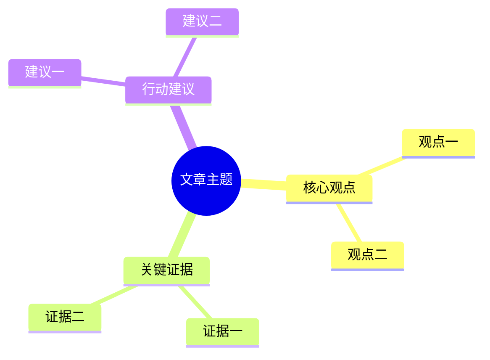

# Navia / 伴航 V1 目标验收文档

版本：V1.0 Acceptance Plan Baseline
日期：2026-05-31

---

## 1. 验收原则

V1 验收不以“功能多”为标准，而以“核心链路稳定、状态可观测、行为可监督”为标准。

审计后新增原则：

```text
Go, but contract-first.
```

在进入 V1.0-A 业务实现前，必须先通过 V1.0-0 合同冻结验收。任何能跑但没有 turn_id、EventStore、ToolResult、ErrorCode、SSE 协议和 governance hooks 的实现都视为 false green。

每个 V1 子阶段必须先按 `10-v1-stage-gate-execution-protocol.md` 形成独立阶段验收标准和预审计意见。未闭环致命或重大审计意见时，不得进入实质开发。

V1 的成功定义：

```text
当前网页 -> 悬浮球/网页内AI面板 -> PageContext -> AgentCore -> Intent -> Tool -> Response/Artifact -> Session/Trace
```

必须可跑通、可恢复、可追踪、可限制。

阶段验收新增原则：

- 每个子阶段完成后必须执行端到端验收。
- 每个子阶段必须使用真实数据或真实浏览器链路，不能只靠 mock。
- 验收失败时必须打回开发计划阶段，修正计划、审计意见和实现后重新验收。
- 每个子阶段验收通过后必须做 PRD 规格复检。
- 如果发现较大规格偏差、致命风险或虚假验收风险，必须停止并找人类确认。

---

## 2. 总体验收 Gate

### 2.1 Go 条件

全部满足才可声明 V1 complete：

- Chrome 插件可通过 unpacked extension 安装到开发者 Chrome。
- 普通网页内出现 AI 悬浮球。
- 悬浮球默认态、hover 预展开态、窄距展开态、半屏展开态、宽覆盖态、收起态全部通过。
- 网页内 AI 双轨面板可完成文字对话。
- 面板 resize、挤压网页、覆盖网页和收起恢复符合 `docs/active/project/interaction-prd/窗口交互_PRD.md`。
- 当前页面上下文可进入 Runtime。
- AgentCore 能完成单 Session 对话。
- 用户可以在当前网页上提问，并收到基于当前网页的基础回答。
- 摘要、问答、Mindmap 至少三个核心工具可用。
- Mermaid mindmap 可渲染或失败可解释。
- 状态机可输出 Mermaid。
- EventLog 可追踪一次完整 turn。
- BudgetSupervisor 生效。
- ToolPermissionSupervisor 生效。
- 默认不读取本地文件。
- Session 刷新不丢。
- API / 数据模型 / 文档同步。
- 每个 chat turn 必须有 `turn_id`。
- 每个 tool call 必须有关联 `turn_id` 和 `session_id`。
- 每个 artifact 必须有 `sourcePageId` 或明确 `source=null`。
- 每次 state transition 必须写入 EventStore。
- Runtime 默认只绑定 `127.0.0.1`，CORS / Origin allowlist 生效。

### 2.2 No-Go 条件

任一出现即不能声明 V1 complete：

- Chrome 插件不能安装。
- 只能打开 Chrome Side Panel，不能在真实网页内呈现悬浮球与 AI 面板。
- `docs/active/project/interaction-prd/窗口交互_PRD.md` 的 A-F 状态任一缺失。
- 用户无法在网页内 AI 面板完成文字对话。
- 用普通 extension page、debug page 或 Side Panel 替代网页内交互验收。
- 面板展开后网页布局无法恢复。
- Agent 状态只存在前端或 extension background worker。
- 工具调用绕过 Governance。
- 本地文件读取默认开启。
- 超预算后 Agent 继续自动执行。
- Mermaid 失败后无限重试。
- Session 无法恢复。
- 事件流无法追踪工具调用。
- 状态机非法迁移不会报错。
- PR 引入 MCP / Skill / 长期记忆 / 多 Agent 作为 V1 必需项。
- 只有实时 EventStream，没有持久化 EventStore。
- ToolExecutor 绕过 PreToolUse / PostToolUse。
- `/v1/chat/stream` 未固定为 SSE 或返回自由格式事件。
- 工具直接返回自由文本而非 ToolResult envelope。
- 任一子阶段没有 stage-gate 文档、预审计意见或真实数据验收报告。
- 任一子阶段验收失败后仍继续进入下一阶段。
- 任一子阶段只使用 mock 数据声明通过。

### 2.3 阶段验收 Gate

每个子阶段必须满足：

- [ ] 已生成 `stage-gates/v1.0-x-<stage-name>.md`。
- [ ] 已完成 PRD 规格检视。
- [ ] 已制定本阶段开发计划。
- [ ] 已制定本阶段验收标准。
- [ ] 已完成预审计。
- [ ] 所有致命和重大审计意见已闭环。
- [ ] 已执行真实数据端到端验收。
- [ ] 已记录验收证据。
- [ ] 已完成 PRD 规格复检。
- [ ] 已给出阶段放行或打回结论。

### 2.4 真实数据验收 Gate

任一阶段如果涉及 runtime、插件、页面上下文、工具或 session，必须至少使用一种真实数据来源：

- [ ] 真实 HTML fixture。
- [ ] 真实 Chrome tab PageContext。
- [ ] 真实 SSE event stream。
- [ ] 真实 EventStore / JSONL / SQLite trace。
- [ ] 真实 Mermaid 渲染结果。
- [ ] 真实 Chrome unpacked extension 安装与网页内悬浮球 / AI 面板操作。

以下验收不得通过：

- [ ] 只断言函数返回非空。
- [ ] 只用 mock PageContext。
- [ ] 只看前端有文字但不检查 turn_id / tool_call_id / trace。
- [ ] 只看 SSE 有输出但不校验 event schema。
- [ ] 使用不可渲染 Mermaid 结果通过验收。
- [ ] Runtime 未启动时插件静默失败或空白。

### 2.5 V1.2 自动化开发 Readiness Gate

进入 V1.2-A/B/C/D 实质开发前必须满足：

- [ ] 每个模块有 `docs/public-api.md`。
- [ ] 每个模块有 `docs/executable-contract.md`。
- [ ] 每个模块有 `docs/fixture-spec.md`。
- [ ] 每个模块有 `docs/test-and-evidence-plan.md`。
- [ ] `design/v1.2-prd-coverage-matrix.md` 覆盖网页读取、总结、连续问答、Mindmap、source fallback、offline/failure 和 trace。
- [ ] `design/v1.2-integration-contract-matrix.md` 明确 A→D、D→C、D→B、B→Debug 的字段所有权和调用边界。
- [ ] `design/v1.2-ai-reading-automation-gap.drawio` 可打开且包含 7 个页面。
- [ ] V1.2-0 stage-gate 已完成项目 owner review。

以下情况不得进入自动化开发：

- [ ] 模块入口仍由实现者自由决定。
- [ ] mock fixture 文件名、shape 或 evidence 路径不明确。
- [ ] drawio 图谱未体现公共 API 调用关系和关键体验路径。
- [ ] 只靠 Markdown 文字声明 PRD 覆盖，没有矩阵和证据路径。

### 2.6 A-V1.2 高质量网页感知层 Gate

A-V1.2 只能声明完成“高质量网页感知层”，不得声明完成学习产物、RAG、Notebook 或 AgenticLoop。

A-V1.2 的验收口径固定为：

```text
DOM baseline
+ extractor ensemble
+ A-owned schema normalization
+ SourceMap / jumpback
+ Quality Evaluator
+ DebugEvidenceBundle
+ 100-page corpus gate
```

其中 extractor ensemble 可以分阶段启用，但 `dom_baseline`、A-owned normalization、SourceMap、QualityReport、DebugEvidenceBundle 和 100-page corpus gate 不得省略。

必须通过：

- [ ] A-V1.2 子阶段编号统一为 `A-V1.2-0` 到 `A-V1.2-8`。
- [ ] 至少 `100` 个复杂真实网页或可复现 HTML snapshot 进入最终验收。
- [ ] 100-page corpus 覆盖新闻、博客、技术文档、GitHub README、产品文档、电商页、论坛页、表格页、代码页、图片富集页、中文页和低信号页。
- [ ] 每个最终计入验收的页面样本记录 category、complexityTags、expectedRisks、URL 和 snapshotPath；URL-only 记录只能 planning，不能计入最终通过率。
- [ ] 每个最终计入验收的页面样本必须有 `goldStatus = "reviewed"` 或 `goldStatus = "semi_auto_accepted"`；`planned` / `annotated` 不得计入最终通过率。
- [ ] 每个有效页面至少产出 `structured-page.json`、`high-signal-page.json`、`source-map.json`、`perception-digest.json`、`quality-report.json` 和 `debug-evidence.json`。
- [ ] 通过页的 `sourceCoverage >= 0.95`。
- [ ] 通过页的 `groundingCompleteness >= 0.95`。
- [ ] 通过页的 `jumpbackCoverage >= 0.90`。
- [ ] `noiseRatio <= 0.25`，或质量报告明确降级原因。
- [ ] 每个 `PerceptionDigestItem` 必须有关联 `sourceRefs`。
- [ ] 每个 `SourceRef` 必须有 `textQuote` 或 `fallbackText`，DOM selector 不得作为唯一反跳机制。
- [ ] `PagePerceptionQualityReport` 每个指标包含 numerator / denominator / method / threshold / passed。
- [ ] Debug JSON 能解释页面为什么 pass、degraded 或 fail。
- [ ] 低信号、登录墙、付费墙、空内容页面必须 fail/degrade，不得 pass。
- [ ] `HighSignalPageContext`、`PerceptionDigest`、`SourceMap / SourceRef` 和 `PagePerceptionQualityReport` 只能通过公共合同被 D/C/B 消费。
- [ ] `downstreamReadiness = pass` 时 D/C 才能把 high-signal 输出作为主上下文；`degraded` 只能 fallback / Debug；`fail` 必须回退或返回 `PAGE_CONTEXT_REQUIRED`。
- [ ] 第三方 extractor 原始输出必须映射回 A-owned block graph，不得暴露给 D/C/B。
- [ ] `trafilatura`、`readability-lxml`、`readabilipy` 或等价依赖必须先完成 dependency audit 且 decision=approved，才能安装或成为可用 candidate。

以下情况不得通过 A-V1.2：

- [ ] 少于 100 个复杂网页就声明 A-V1.2 完成。
- [ ] URL-only、`planned` 或 `annotated` gold 页面被计入最终通过率。
- [ ] A 生成最终回答、Mindmap、Flashcards、Quiz、Podcast、Notebook 或 Artifact。
- [ ] A 发 SSE、写 EventStore、写 Trace、调用 D/C/B、MCP、Skill 或外部 API。
- [ ] A 默认执行 OCR、VLM、ASR、视频或直播 engine。
- [ ] 第三方 extractor 原始输出直接暴露为 Navia 公共合同。
- [ ] `quality-report.json` 写死 pass 或放宽 A-V1.2 high-signal 兼容 SourceRef / QualityGate。

A-V1.2 子阶段打回规则：

- `A-V1.2-1` corpus 少于 100 页、类别少于 10、缺少 `snapshotPath` 或 gold review 时，打回 corpus 阶段。
- `A-V1.2-2/3` 主体识别或噪声过滤导致关键内容缺失、低信号页 pass、噪声块进入 digest 时，打回抽取 / 过滤阶段。
- `A-V1.2-4/5` digest item 缺少 sourceRefs、SourceRef 缺少 text fallback、DOM selector 成为唯一反跳机制时，打回 digest / source map 阶段。
- `A-V1.2-6/7` quality report 不能解释 pass/degraded/fail、指标缺 numerator/denominator/method、Debug JSON 不可审计时，打回 quality / debug 阶段。
- `A-V1.2-8` corpus-level report 未达到 pass rate 或类别门槛时，按失败最多的类别和指标打回对应子阶段。

### 2.7 当前阶段 AC 联动 Gate

当前阶段验收目标是证明 A 的高信号感知结果能进入 Runtime 主链路，并被 C 用于生成可反跳 Mindmap。

必须通过：

- [ ] `/v1/page/context` 或等价 Runtime 主链路返回 / 持久化 A perception bundle，至少包含 `structuredPage`、`highSignalPage`、`perceptionDigest`、`sourceMap`、`qualityReport`。
- [ ] 保持旧 `activePage` 字段兼容，既有总结和问答工具不因 A 扩展字段断裂。
- [ ] Debug 页能展示 A high-signal JSON、digest、source refs、quality metrics 和 pass / degraded / fail 原因。
- [ ] `PagePerceptionQualityReport.downstreamReadiness = "pass"` 时，C 优先使用 `PerceptionDigest.items` 生成 mindmap 节点。
- [ ] `degraded` 或 `fail` 页面必须在 Debug 和聊天区域给出可见降级/失败提示，不得生成假 high-signal mindmap。
- [ ] C 输出的 `metadata.nodeSourceMap` 至少覆盖 root 和主要节点；每个主要节点关联 A `sourceRefId` 或 paragraph/chunk fallback。
- [ ] 每个可反跳节点必须有 `textQuote` 或 `fallbackText`。
- [ ] Mermaid source 通过 validator；repair 次数 `<= 1`。
- [ ] D / Integration 创建 `ArtifactRecord(type="mindmap", metadata.format="mermaid")`，artifact 必须包含 `sourcePageId`、`turnId`、`toolCallId`。
- [ ] `/v1/chat/stream` trace 可看到 state、intent、budget、tool、artifact、response 事件。
- [ ] A 不创建 Artifact、不发 SSE、不写 EventStore；C 不读取 DOM；B 不直接调用 A/C/D。

真实数据验收：

- [ ] 至少 12 个真实网页或 snapshot 覆盖文章、技术文档、GitHub README、表格页、代码页、图片富集页、中文页和低信号页。
- [ ] 至少 3 个真实 Chrome 页面完成读取 -> Debug JSON -> Mindmap -> source fallback 验收。
- [ ] 至少 1 个中文复杂网页，A 输出的 digest 和 C 输出的 mindmap 需要人工抽样复核。
- [ ] 至少 1 个 low-signal 页面必须 degraded/fail，且不生成伪正常 mindmap。

AC 联动 No-Go：

- [ ] 只跑 A 离线 corpus，不跑 Runtime 主链路，却声明 AC 完成。
- [ ] C 仍只基于 headingTree 生成，却声明 digest-first。
- [ ] nodeSourceMap 只有 label，没有 sourceRef / paragraph / chunk / fallback。
- [ ] Debug 页只能显示不可读原始 JSON，不能解释质量和来源。
- [ ] 任一工具绕过 D Adapter Layer。
- [ ] 端到端验收只使用 mock 页面或不可复现数据。

### 2.8 V1.2-AC-Native 原生 Side Panel Gate

V1.2-AC-Native 的验收目标是证明用户能在真实网页右侧的 Chrome 原生 Side Panel 中完成 AC 功能链路。direct extension page 只能作为功能 smoke，不能作为本阶段通过依据。

必须通过：

- [ ] Chrome / Chromium 安装 unpacked extension 后，用户可通过扩展 action 或快捷键在普通网页中打开 Navia 原生 Side Panel。
- [ ] 通过截图必须同时包含真实网页主体内容和右侧 Navia Side Panel；只有全屏 `chrome-extension://.../sidepanel.html` 的截图不得计入通过证据。
- [ ] 原生 Side Panel 顶部能显示 Runtime online / offline 状态；Runtime offline 时必须有明确提示。
- [ ] 原生 Side Panel 中 `读取当前页面`、`提交上下文`、`总结`、`Mindmap`、Debug 入口必须可见或可通过稳定滚动 / tab / menu 到达。
- [ ] 点击读取当前页面后，Side Panel Debug 能展示 activePage、A perception readiness、digest/source/quality 概览或明确失败原因。
- [ ] 在同一个原生 Side Panel 中完成至少一次页面总结和一次基于页面内容的问答。
- [ ] 在同一个原生 Side Panel 中触发 Mindmap；成功时渲染 Mermaid，失败时展示 Mermaid source fallback 和错误。
- [ ] 刷新网页或重开 Side Panel 后，session / activePage 必须恢复，或以可见错误说明恢复失败原因。
- [ ] 自动化验收必须区分 `native-probe` 和 `native-ux`：probe 只能证明打开状态，UX 才能证明完整路径。
- [ ] 自动化脚本不得只依赖易碎屏幕坐标；如 Chrome 限制导致无法稳定定位 Side Panel，必须输出结构化 blocker，不得 pass。
- [ ] `native-sidepanel-probe/report.json` 和 `native-sidepanel-ux/report.json` 必须分层输出；probe 通过不得单独触发本阶段通过。
- [ ] 每张计入通过证据的截图必须有同名 `*.metadata.json`，记录 pageUrl、tabTitle、extensionId、isNativeSidePanel、containsWebPageBody、containsNaviaPanel、viewport、panelApproxWidth、runtimeStatus、stage 和 conclusion。
- [ ] 任何 structured blocker 必须包含 blockerId、stage、pageUrl、browser、reason、evidencePaths、attemptedActions、nextAction、blocksCompletion，且 `blocksCompletion=true` 时不得声明阶段完成。
- [ ] `Runtime offline`、`PageContext missing`、tool failure、Mermaid render failure 四类失败在原生 Side Panel 中可见。

真实数据验收：

- [ ] 至少 3 个真实 Chrome 页面完成原生 Side Panel 验收，必须包含 1 个中文复杂网页。
- [ ] 至少 1 个 low-signal / 空内容页面必须 degraded 或 fail，并在 Side Panel 中可见。
- [ ] 每个通过页保留 URL、截图、截图 metadata、Runtime API 证据、用户操作路径和结论。
- [ ] direct extension page 报告可作为辅助 smoke，但不得替代任一 native 页面证据。

V1.2-AC-Native No-Go：

- [ ] 截图中没有右侧 Chrome 原生 Side Panel，却声明用户体验通过。
- [ ] 只打开 `chrome-extension://.../sidepanel.html` 或全屏调试页，却声明 native Side Panel 通过。
- [ ] 原生 Side Panel 无法稳定打开，且没有结构化 blocker 和回退计划。
- [ ] 窄宽度下关键按钮不可达，或需要用户猜测隐藏入口。
- [ ] Debug 页只显示不可读大 JSON，无法解释 activePage / A quality / C source map 状态。
- [ ] Mindmap 使用假数据或 heading-only fallback，却声明 digest-first native 验收通过。
- [ ] `native-probe` 通过但 `native-ux` 未通过，仍声明本阶段体验通过。
- [ ] 缺少截图 metadata 或 blocker schema 不完整，却声明自动化证据可审计。
- [ ] 任何功能绕过 Runtime / D Adapter，由 B 前端直接生成总结、回答或 Mindmap。

### 2.9 V1.2-AC-Quality A/C 质量深化 Gate

V1.2-AC-Quality 的验收目标是证明 A 高质量网页感知和 C digest-first Mindmap 在更多真实网页中稳定、可解释、可反跳。它不替代完整 V1.2 出门验收，也不等同于 A-V1.2 100-page production gate。

必须通过：

- [ ] 本阶段有独立 stage gate、开发计划、验收计划、预审计和 PRD 复检。
- [ ] 至少 12 个真实网页或可复现 snapshot 进入本阶段矩阵，覆盖不少于 6 类页面。
- [ ] 样本矩阵必须包含 pageId、url、snapshotPath、category、complexityTags、expectedRisk、expectedReadiness、goldStatus、runtimeEvidencePath、nativeScreenshotPaths、qualityReportPath、mindmapEvidencePath 和 conclusion。
- [ ] 至少 5 个真实 Chrome 原生 Side Panel 页面完成读取 -> Debug -> Mindmap -> source fallback 验收。
- [ ] 验收页面必须包含 1 个中文复杂网页和 1 个 low-signal degraded/fail 页面。
- [ ] A Runtime 主链路返回 / 持久化 `structuredPage`、`highSignalPage`、`perceptionDigest`、`sourceMap`、`qualityReport`。
- [ ] A quality report 能解释 pass / degraded / fail，且指标包含 numerator / denominator / method / threshold / passed。
- [ ] low-signal / 空内容页不得 `downstreamReadiness=pass`。
- [ ] `sourceCoverage`、`groundingCompleteness`、`jumpbackCoverage`、`lowSignalCorrectness`、`digestFirstUsage` 必须在 `report.json` 中有页面级和聚合级结论。
- [ ] C 在 `downstreamReadiness=pass` 时优先消费 `PerceptionDigest.items + SourceRef`。
- [ ] C fallback 到 heading / paragraph 时，必须在 metadata 或 Debug 中写明 fallback reason。
- [ ] Mindmap 主要节点必须具备 `sourceRefIds` 或可展示的 `fallbackText`。
- [ ] Debug 必须展示 A quality、digest item、sourceRef、C nodeSourceMap 和失败 / 降级原因。
- [ ] HTML 验收报告必须列出页面、截图、URL、quality、mindmap、source 证据、结论。
- [ ] false-green audit 必须检查 digest-first、sourceRef、low-signal、Runtime 主链路、D adapter 边界。
- [ ] `acceptance-report.html` 必须让人类在不打开 JSON 的情况下判断每个样本通过、降级或失败的原因。

V1.2-AC-Quality No-Go：

- [ ] 只复用 A 离线 corpus，不跑 Runtime / Side Panel 主链路，却声明阶段完成。
- [ ] 只提供 URL 列表，没有 snapshot、截图、runtime evidence 或质量报告。
- [ ] C 仍只基于 headingTree / paragraph fallback，却声明 digest-first。
- [ ] Mindmap 主要节点没有 sourceRef、fallbackText 或 fallbackReason。
- [ ] Debug 页无法让人类快速判断 A/C 质量。
- [ ] low-signal 页面被标记为 pass。
- [ ] A 或 C 直接创建 Artifact、SSE、EventStore、Trace，绕过 D Adapter。
- [ ] B 前端直接生成 summary、answer 或 Mermaid。
- [ ] 借本阶段引入 RAG、长期记忆、多 Agent、浏览器自动操作、OCR/VLM/ASR/video/live engine。
- [ ] 本阶段完成声明被写成完整 V1.2 complete、完整 V1 complete 或 A-V1.2 100-page production gate complete。

### 2.10 V1.2-AC-Jumpback MVP 来源反跳 Gate

V1.2-AC-Jumpback MVP 的验收目标是证明用户能从 Mindmap 节点进入来源证据，并在可行时完成基础网页滚动 / 高亮。它不替代 Monica 级复杂精准反跳，也不等同于完整 V1.2 出门验收。

必须通过：

- [ ] 本阶段有独立 stage gate、开发计划、验收计划、预审计和 PRD 复检。
- [ ] `MindmapNodeBinding`、`SourceEvidenceCard`、`JumpbackRequest`、`JumpbackResult` 符合 `contracts/v1_2_adapter_contracts.md` 13.1。
- [ ] Mermaid 节点点击能稳定映射到 `metadata.nodeSourceMap[nodeId]`。
- [ ] 每个可点击主要节点具备 `sourceRefIds` 或 `fallbackText`。
- [ ] 点击节点后，Side Panel 展示来源证据卡片。
- [ ] 证据卡片包含 node label、sourceRefIds、`textQuote` 或 `fallbackText`、fallback reason。
- [ ] content script 只在用户触发后执行定位。
- [ ] `JumpbackRequest` 必须记录 requestId、nodeId、sourceRefIds、fallbackText 和 strategies。
- [ ] DOM 定位优先级必须为 selector -> domPath -> textQuote；失败时返回 structured failure reason。
- [ ] `JumpbackResult` 必须返回 highlighted、fallback_shown 或 blocked，并记录 attemptedStrategies。
- [ ] DOM 定位成功时网页滚动并临时高亮来源区域。
- [ ] DOM 定位失败时 Side Panel 展示 fallback evidence，不得静默失败。
- [ ] 至少 3 个真实 Chrome 页面完成点击反跳验收，包含 1 个中文复杂页和 1 个技术文档 / README / 长文页。
- [ ] 至少 1 个 low-signal / degraded 页面展示 fallback 或 unavailable 状态，不得伪 pass。
- [ ] HTML 验收报告必须列出截图、URL、点击节点、定位方式、成功 / 失败原因和最终结论。

V1.2-AC-Jumpback No-Go：

- [ ] 只展示 Mermaid，不支持节点点击证据卡片。
- [ ] `nodeSourceMap` 与实际点击节点无法稳定对应。
- [ ] DOM 定位失败时没有 fallback evidence。
- [ ] 使用坐标硬点或不可复现脚本冒充反跳成功。
- [ ] B 直接生成 Mindmap 或绕过 Runtime / D。
- [ ] C 直接读取 DOM 或调用 content script。
- [ ] Content script 执行非用户触发的浏览器自动操作。
- [ ] 借本阶段引入 RAG、Memory、Web Research、OCR/VLM、视频 / 直播理解、PPT 或深度研究。
- [ ] 本阶段完成声明被写成 Monica 级反跳、完整 V1.2 complete 或完整 V1 complete。

---

## 3. 模块验收

## 3.0 Contracts & Runtime Skeleton

### 必须通过

- [ ] API response envelope 定义完成。
- [ ] ErrorCode enum 定义完成。
- [ ] State enum 定义完成。
- [ ] Transition table schema 定义完成。
- [ ] AgentEvent envelope 定义完成。
- [ ] Session / Turn / Message schema 定义完成。
- [ ] ToolSpec / ToolCallRecord / ToolResult schema 定义完成。
- [ ] Budget schema 定义完成。
- [ ] ID 生成和关联规则定义完成。
- [ ] `/v1/chat/stream` SSE event format 定义完成。
- [ ] EventStore 与 EventStream 接口分离。
- [ ] 所有 schema 有基础 validation test。

### false-green 防线

- [ ] 没有 `turn_id` 的 chat turn 不得通过。
- [ ] 没有 EventStore 持久化的 trace 不得通过。
- [ ] 没有 ToolResult envelope 的工具实现不得通过。
- [ ] 没有 ErrorCode enum 的 error response 不得通过。
- [ ] 没有 PreToolUse / PostToolUse hook 的 ToolExecutor 不得通过。

## 3.1 Local Runtime

### 必须通过

- [ ] `GET /v1/health` 返回 ok。
- [ ] Runtime 默认只监听 `127.0.0.1`，不得监听 `0.0.0.0`。
- [ ] CORS / Origin allowlist 只允许 Chrome extension origin 和明确配置的 localhost dev origin。
- [ ] 普通日志不打印完整网页正文、选区全文或 transcript 全文。
- [ ] Runtime 可创建 session。
- [ ] Runtime 可返回 models/status。
- [ ] Runtime 在模型不可用时返回明确状态，不崩溃。
- [ ] `/v1/models/status` 能区分 `mock`、`rule_based`、`deterministic`、`local`、`remote`、`unavailable`。

### 建议测试

```text
curl http://127.0.0.1:17861/v1/health
curl http://127.0.0.1:17861/v1/models/status
POST /v1/sessions
```

---

## 3.2 Session Plane

### 必须通过

- [ ] 可创建 AgentSession。
- [ ] 每个 user message 创建 AgentTurn。
- [ ] 可写入 user message。
- [ ] 可写入 assistant message。
- [ ] 可写入 tool message。
- [ ] 可写入 event message。
- [ ] 可写入 ToolCallRecord。
- [ ] 可写入 ArtifactRecord。
- [ ] 可写入 BudgetLedger。
- [ ] 刷新前端后可恢复 active session。
- [ ] 可导出 session trace。
- [ ] trace 可按 `turn_id` 过滤。

### 验收场景

```text
Given 一个新 session
When 用户提交“总结这篇文章”
Then session 中应包含 user message、assistant message、tool call、artifact、budget ledger、event references
```

---

## 3.3 State Machine

### 必须通过

- [ ] Transition table 存在。
- [ ] Mermaid 图由 Transition table 生成。
- [ ] 非法 transition 被拒绝。
- [ ] 非法 transition 返回或抛出 `INVALID_TRANSITION`。
- [ ] 每个 transition 产生 `state.transition` event。
- [ ] 每个 `state.transition` event 写入 EventStore。
- [ ] 主路径测试通过。
- [ ] intent_unknown 路径测试通过。
- [ ] budget_exceeded 路径测试通过。
- [ ] tool_failed 路径测试通过。
- [ ] repair_failed 路径测试通过。

### 主路径

```text
idle
-> observing_page
-> waiting_user
-> detecting_intent
-> planning
-> budget_checking
-> running_tool
-> validating_result
-> streaming_response
-> persisting_turn
-> waiting_user
```

---

## 3.4 Observability Plane

### 必须通过

- [ ] `GET /v1/agent/state` 可返回当前状态。
- [ ] `GET /v1/agent/state-machine/mermaid` 可返回 Mermaid 状态图。
- [ ] `GET /v1/sessions/{session_id}/trace` 可返回 trace。
- [ ] `GET /v1/sessions/{session_id}/trace` 从 EventStore 读取。
- [ ] SSE 可输出 `/v1/chat/stream` 事件。
- [ ] `WS /v1/agent/events` 或 SSE 可输出 AgentEvent。
- [ ] 事件包含 sessionId。
- [ ] 事件包含 turnId 或可追溯 turn。
- [ ] tool.started / tool.done 可观察。
- [ ] model.started / model.done 可观察。
- [ ] artifact.created 可观察。
- [ ] EventStore 与 EventStream 分离，实时推送不能替代持久化。

---

## 3.5 Governance Plane

### Budget Supervisor

- [ ] 每轮 turn 有 TurnBudget。
- [ ] maxModelCalls 生效。
- [ ] maxToolCalls 生效。
- [ ] maxContextBytes 生效。
- [ ] maxRetries 生效。
- [ ] 超预算进入 `budget_exhausted`。
- [ ] 超预算后不继续工具调用。
- [ ] maxToolCalls=1 时第二个工具不得产生 `tool.started`。
- [ ] maxRetries=1 时不得出现第三次重试。
- [ ] BudgetLedger 被写入。

### Permission Supervisor

- [ ] read_current_page 默认 allow。
- [ ] summarize_page 默认 allow。
- [ ] answer_from_page 默认 allow。
- [ ] generate_mindmap 默认 allow。
- [ ] asr_transcribe 如进入 V1.x 增强范围，默认 allow；不进入时应为 disabled 或 unavailable，不阻塞文字对话。
- [ ] read_local_file 默认 deny。
- [ ] read_local_file deny 时不得产生 `tool.started`。
- [ ] search_local_workspace 默认 deny。
- [ ] shell 默认 deny。
- [ ] browser_automation 默认 deny。

### Approval Gate

- [ ] 高风险工具审批前不执行 side effect。
- [ ] approval_required 只产生事件和记录，不执行工具。
- [ ] 审批事件进入 EventLog。
- [ ] reject 后不执行工具。
- [ ] cancel 后 late approval 不得继续执行。
- [ ] side-effect marker 具备 CAS / lock 保护，避免并发重复执行。

---

## 3.6 Chrome Extension

### 必须通过

- [ ] 插件可通过 Chrome `Load unpacked` 安装。
- [ ] 插件可加载。
- [ ] 普通网页边缘出现 AI 悬浮球。
- [ ] 悬浮球默认贴边，不遮挡主要内容。
- [ ] 悬浮球可上下拖动。
- [ ] 悬浮球 hover 后高亮并伸出小长条。
- [ ] 点击小长条后展开网页内 AI 双轨面板。
- [ ] 网页内 AI 面板有 Chatbox 输入框和消息列表。
- [ ] 窄距展开态默认约 `440px` 并挤压网页。
- [ ] 半屏展开态约 `50vw` 并继续挤压网页。
- [ ] 超过 `52vw` 后进入覆盖态，最大不超过 `80vw`。
- [ ] 拖回 `<48vw` 后恢复挤压式。
- [ ] 点击悬浮球或收起按钮后，面板收起且网页恢复原始布局。
- [ ] 视口 `<900px` 时禁用挤压式，降级为覆盖式或全屏侧栏。
- [ ] UI 可连接 Local Runtime。
- [ ] Runtime 不可用时展示提示。
- [ ] Runtime 启动后 UI 可重新连接。
- [ ] 当前页面 title/url/domain 可显示。
- [ ] 用户输入可发送到 `/v1/chat/stream`。
- [ ] `/v1/chat/stream` 使用 SSE，Response Content-Type 为 `text/event-stream`。
- [ ] 响应可流式展示或分段展示。
- [ ] 用户可以在网页内 AI 面板输入“总结这篇文章”并看到回答。
- [ ] 用户可以在网页内 AI 面板输入一个基于当前网页的问题并看到回答。
- [ ] Agent 状态可展示。
- [ ] 预算使用可展示。

Chrome Side Panel 可保留为调试或兼容入口，但不能替代以上验收。

---

## 3.7 PageContext

### 必须通过

- [ ] 可抽取 title。
- [ ] 可抽取 url。
- [ ] 可抽取 domain。
- [ ] 可抽取 headings。
- [ ] 可抽取 selectedText。
- [ ] 可抽取 visibleText 或 cleanedText。
- [ ] 可生成 contentHash。
- [ ] 可提交 `/v1/page/context`。
- [ ] Runtime 写入 `page.context.received` event。
- [ ] Session activePage 更新。

### 页面类型 Smoke

至少覆盖：

- [ ] 普通文章页。
- [ ] 技术文档页。
- [ ] GitHub README 类页面。
- [ ] 产品介绍页。

---

## 3.8 Intent Router

### 必须通过

- [ ] “总结这篇文章” -> `summarize_page`。
- [ ] “这篇文章讲了什么？” -> `ask_page` 或 `summarize_page`。
- [ ] “解释我选中的这段” -> `explain_selection`。
- [ ] “生成思维导图” -> `generate_mindmap`。
- [ ] 低置信度输入 -> `unknown` 或 fallback。
- [ ] 输出满足 JSON schema。
- [ ] confidence 低时不盲目调用高成本工具。

---

## 3.9 Summary Tool

### 必须通过

- [ ] 可生成 TL;DR。
- [ ] 可生成结构化摘要。
- [ ] 可生成要点式摘要。
- [ ] 可生成 ArtifactRecord。
- [ ] Artifact 可追踪 sourcePageId。
- [ ] 长页面不会无脑全文塞入模型。

---

## 3.10 Page QA Tool

### 必须通过

- [ ] 能基于当前 PageContext 回答。
- [ ] 能使用 chunk 相关上下文。
- [ ] 当前网页没有足够信息时说明不足。
- [ ] 不默认联网搜索。
- [ ] 不默认访问本地文件。
- [ ] 回答可追踪 pageRef / chunkRef。

---

## 3.11 Selection Explain Tool

### 必须通过

- [ ] selectedText 可进入工具。
- [ ] 工具优先解释选区。
- [ ] 可结合附近上下文。
- [ ] 没有选区时提示用户选择内容或改用整页问答。

---

## 3.12 Mindmap Tool

### 必须通过

- [ ] 可生成 Mermaid mindmap。
- [ ] Mermaid 可在前端渲染。
- [ ] 节点层级默认不超过 4。
- [ ] 节点数量默认不超过 40。
- [ ] Mermaid validator 生效。
- [ ] 校验失败自动 repair once。
- [ ] 修复失败返回可读错误。
- [ ] ArtifactRecord 记录 mermaid 源码。

### 示例输出要求



---

## 3.13 语音输入增强，可选

### 必须通过

以下项目只在 V1.x 启用语音输入时验收，不阻塞 V1 complete 的文字对话主链路：

- [ ] 浏览器可录音。
- [ ] 音频可发送本地 Runtime。
- [ ] Runtime 可调用 FunASR。
- [ ] transcript 返回前端。
- [ ] transcript 写入 user message。
- [ ] AgentCore 按文本处理。
- [ ] FunASR 不可用时 UI 明确提示或禁用语音入口。

---

## 4. 端到端验收场景

### E2E-0：Chrome 插件安装、悬浮球与基础对话

```text
Given 开发者已启动 Local Runtime
And 已在 Chrome 中通过 Load unpacked 安装 Navia 插件
And 用户打开一篇普通文章
When 页面边缘出现 AI 悬浮球
And 用户 hover 悬浮球
And 点击小长条展开网页内 AI 面板
And 输入“这篇文章主要讲什么？”
Then 插件提交当前 PageContext
And Runtime 创建或复用 active session
And AgentCore 创建 turn_id
And 工具基于当前网页生成回答
And 前端展示 assistant response
And Trace 可看到 state.transition、intent.detected、tool.started、tool.done、response.done
```

### E2E-1：网页摘要

```text
Given 用户打开一篇普通文章
And 网页内 AI 面板已连接 Runtime
When 用户点击“总结”
Then Runtime 收到 PageContext
And AgentCore 进入 detecting_intent
And intent=summarize_page
And tool=summarize_page 执行
And 前端展示摘要
And Session 写入 SummaryArtifact
And Trace 可看到完整事件流
```

### E2E-2：网页问答

```text
Given 当前 session 已有 activePage
When 用户输入“作者的核心观点是什么？”
Then intent=ask_page
And 工具基于当前页面相关 chunk 回答
And 不访问本地文件
And 不联网搜索
```

### E2E-3：思维导图

```text
Given 当前页面内容已抽取
When 用户输入“生成思维导图”
Then intent=generate_mindmap
And Mermaid 结果可渲染
And Artifact 记录源码
And 失败时最多 repair once
```

### E2E-4：语音提问，可选增强

```text
Given FunASR 可用
When 用户录音说“总结这篇文章”
Then transcript 写入 user message
And 后续流程与 typed message 一致
```

### E2E-7：PRD A-F 页面交互状态

```text
Given 用户在真实 Chrome 打开普通文章页
And 插件已加载
Then 页面边缘出现悬浮球默认态
When 用户 hover 悬浮球
Then 出现高亮和伸出小长条
When 用户点击小长条
Then 网页内 AI 面板以约 440px 窄距展开并挤压网页
When 用户拖拽 resize handle 至约 50vw
Then 面板进入半屏展开态并继续挤压网页
When 用户继续拖拽超过 52vw
Then 面板进入覆盖态
When 用户拖回 48vw 以下
Then 面板恢复挤压式
When 用户点击悬浮球或收起按钮
Then 面板收起且网页恢复原始布局
```

### E2E-5：预算限制

```text
Given TurnBudget maxToolCalls=1
When Agent 试图调用第二个工具
Then 进入 budget_exhausted
And 不执行第二个工具
And 返回部分结果和继续确认提示
```

### E2E-6：本地文件访问拒绝

```text
Given read_local_file 默认 deny
When 用户或模型请求读取本地文件
Then PermissionSupervisor 拒绝
And 不执行文件读取
And 事件记录 tool.denied 或 approval.required
```

---

## 5. 回归测试清单

每个阶段完成后至少复跑：

- [ ] Health check。
- [ ] Session create / restore。
- [ ] State machine main path。
- [ ] State machine illegal transition。
- [ ] Budget exceeded。
- [ ] Permission denied。
- [ ] PageContext submit。
- [ ] Summary tool。
- [ ] QA tool。
- [ ] Mindmap validator。
- [ ] Event trace export。

---

## 6. V1.1 前端高保真验收归档说明

V1.1 前端高保真验收计划已完成阶段用途，当前不再作为激活开发入口。相关文档、Figma baseline、截图和 stage gate 已归档到：

```text
docs/history/V1.1/
```

当前开发验收以 V1.2 / A-V1.2 为准。若需要重新启用 V1.1 视觉验收，必须先把对应文档从 history 中升级为当前阶段文档，并重新完成 PRD、目标架构、开发计划、验收标准和外部审计。

---

## 7. V1 最终声明模板

当前 V1-HR/CC 阶段不得使用本节模板作为当前完成声明。本节只保留为未来候选审计模板；只有人工产品体验核查 `passed`、重新生成的自动化总报告通过、PRD review 与 false-green audit 无 fatal / major，且旧 failed / superseded evidence 已解释、废止或重跑后，才允许进入是否使用该模板的候选审计。

允许声明：

```text
V1 complete: Navia can be installed as a Chrome unpacked extension and supports PRD-aligned in-page interaction: floating ball, hover strip, embedded dual-track AI panel, push layout, overlay layout, resize, and collapse recovery. Users can complete basic text chat against the current page through Local Headless Runtime. The single-session AgentCore is observable, state-machine based, and guarded by budget/permission/context supervision. Current-page summary, Q&A, and Mermaid mindmap are ready for MVP validation.
```

禁止声明：

```text
Navia personal knowledge base is ready.
Navia long-term memory is ready.
Navia RAG is ready.
Navia deep research is ready.
Navia PPT generation is ready.
Navia browser automation is ready.
Navia desktop pet is ready.
Navia cloud sync is ready.
V2/V3/V4/V5 is ready.
```

---

## 8. V1.2 AI 伴读四模块验收

V1.2 验收目标不是新增更多智能能力，而是确认 AI 伴读主链路被拆成可审计、可测试、可独立演进的四个模块：

```text
网页数据抓取与结构化总结
基于网页内容的流式渲染
基于网页内容的思维导图生成
CoreProvider + Adapter Layer 实现可替换 Core 接入和 ChatBox turn 编排边界
```

V1.2 扩展还必须冻结工作区边界，使 A/B/C/D 四个 Codex 终端可以独立开发。A/C/D 集中到 service 层独立文件夹，B 集中到 app 层前端渲染文件夹。轻量 MCP / Skill / API Adapter 只能通过 D 模块接入，不得由前端或其他模块直连。

V1.2-0R readiness closure 是实质开发前的审计入口。只有 `design/v1.2-readiness-closure-audit.md` 所列 ChatGPT 审计包无致命或重大规格偏差后，才能进入 staged mock-first implementation。V1.2 complete 只能由 V1.2-E Integration / E2E / PRD Review 阶段声明。

### 8.1 总体验收链路

必须使用真实 Chrome 页面或真实 HTML fixture：

```text
打开真实网页
-> 点击读取网页
-> Runtime 接收 PageContext
-> session.activePage 写入真实 page_id / url / title / content_hash
-> 用户发送“总结当前网页”
-> /v1/chat/stream 返回 SSE
-> 前端流式渲染 assistant response
-> Runtime 创建 summary artifact
-> 用户发送“生成思维导图”
-> Runtime 创建 mindmap artifact
-> 前端渲染 Mermaid 或展示 source fallback
-> trace?turn_id 可还原 state / intent / budget / tool / artifact / response events
```

### 8.2 A Page Perception / AgentCore Eyes

必须通过：

- [ ] A 模块只修改 `services/local-runtime/navia_runtime/modules/page_reading/` 和自己的 stage-gate。
- [ ] A 模块新增任务使用 `A-V1.x-*` 编号，当前阶段继续使用 `A-V1.2`，编号规则见 `MODULE_VERSIONING.md`。
- [ ] A 只输出可追踪感知事实，不生成最终回答、不创建 artifact、不发 SSE。
- [ ] PageContext 来自真实网页或真实 HTML fixture。
- [ ] PageContext 包含 `pageId`、`url`、`title`、`domain`、`contentHash`、`headings`、`chunks`。
- [ ] 结构化输出包含 paragraphs、paragraph annotations、heading path 和 chunk 关联。
- [ ] `summarize_page` 只读取 `session.activePage`，不得使用前端传入的自由摘要结果。
- [ ] 缺少 activePage 时返回 `PAGE_CONTEXT_REQUIRED`。
- [ ] 缺少 activePage 时不得产生 `tool.started`。
- [ ] 缺少 activePage 时不得创建 summary / answer / mindmap artifact。
- [ ] A 模块不得创建 `ArtifactRecord`、最终回答、Mindmap、SSE、EventStore 或 Trace；成功总结创建 `ArtifactRecord(type="summary", source="page", metadata.format="markdown")` 是 D / Integration / Summary Tool 验收项，不属于 A-V1.2 页面感知验收。

### 8.2.1 A 模块内部能力验收矩阵

| 编号 | 能力 | V1.2 验收口径 |
|---|---|---|
| `A-V1.0-0` | 感知合同冻结 | `StructuredPageContext`、source map、field ownership 和 No-Go 已登记 |
| `A-V1.0-1` | 文本 / DOM 结构识别 | headings、paragraphs、chunks、annotations、summaryDraft 可由真实 HTML fixture 生成 |
| `A-V1.0-2` | 图文网页识别 | 文档阶段需完成 image/figure/caption/alt/nearby text 合同；实现阶段不得幻想图片内容 |
| `A-V1.0-3` | OCR 识别规划 | 只规划 `OcrTextBlock[]`、confidence、source、区域/时间信息；不默认接 OCR engine |
| `A-V1.0-4` | 表格 / 列表 / 代码块识别 | 规划 table/list/code/block source map 和 fixture 验收 |
| `A-V1.0-5` | 页面区域与信息密度识别 | 规划 main/article/aside/nav/footer/ad-like block 识别与过滤 |
| `A-V1.12+` | 视频 / 直播等未来媒体感知规划 | 只登记 video metadata、subtitle、key frames、frame OCR、timeline、rolling transcript、latency/budget 等合同方向 |

### 8.2.2 OCR / 视频 / 直播 false-green 防线

以下情况不得通过验收：

- [ ] A 模块直接调用 OCR、视觉模型、视频流分析、直播流分析、MCP、Skill 或外部 API。
- [ ] 没有 OCR 结果却声称已理解图片文字。
- [ ] 没有 alt/caption/nearby text 却描述图片语义。
- [ ] OCR 结果没有 confidence、sourceImageId 或区域/时间来源。
- [ ] 视频/直播实时识别只存在实时 EventStream，没有 EventStore 或 session trace。
- [ ] 未定义采样策略、延迟预算、隐私边界和用户授权就声明视频/直播识别 ready。
- [ ] 把 `A-V1.12+` 媒体感知规划当成 A-V1.2 已完成能力。

### 8.3 基于网页内容的流式渲染

必须通过：

- [ ] B 模块只修改 `apps/chrome-extension/src/modules/*_renderer/` 和自己的 stage-gate。
- [ ] 前端消费 `/v1/chat/stream` SSE。
- [ ] `response.delta` 能逐步追加到 ChatBox。
- [ ] `artifact.created` 能渲染为 artifact 卡片或内容块。
- [ ] B 不直接调用 A/C/MCP/Skill/API。
- [ ] 未知 SSE event 不导致 UI 崩溃。
- [ ] Runtime offline 可见。
- [ ] PageContext missing 可见。
- [ ] tool failure 可见。
- [ ] 前端不得保存 AgentCore 状态作为事实源。

### 8.4 基于网页内容的思维导图生成

必须通过：

- [ ] C 模块只修改 `services/local-runtime/navia_runtime/modules/mindmap/` 和自己的 stage-gate。
- [ ] `generate_mindmap` 从真实 `session.activePage` 生成 Mermaid source。
- [ ] Mindmap 生成优先消费 A 输出的结构化网页 JSON。
- [ ] Mermaid validation 结果写入 `tool.done.data` 或 artifact metadata。
- [ ] repair 次数最多 1 次。
- [ ] 成功时创建 `ArtifactRecord(type="mindmap", metadata.format="mermaid")`。
- [ ] artifact 包含 `sourcePageId`、`turnId`、`toolCallId`。
- [ ] Mindmap 节点 metadata 包含 source chunk / paragraph source map，可用于反跳或 source excerpt fallback。
- [ ] 前端 Mermaid 渲染失败时展示 source fallback。
- [ ] 不新增未登记的 `mermaid.*` ad-hoc event。

### 8.5 CoreProvider + Adapter Layer

必须通过：

- [ ] D 模块只修改 `services/local-runtime/navia_runtime/modules/agent_loop/`、`services/local-runtime/navia_runtime/modules/adapters/` 和自己的 stage-gate。
- [ ] D 定义 `CoreProvider.run_turn(CoreTurnInput) -> CoreTurnResult`。
- [ ] `MockCoreProvider` 可用于合同测试和自动化 fallback。
- [ ] `piAgentProvider` 真实接入前已锁定仓库、版本或 commit、license、运行时和工具调用模型。
- [ ] piAgent 或其他 CoreProvider 不直接写 ArtifactRecord、SSE、EventStore、Trace 或 UI。
- [ ] 每个 user message 创建一个 `turn_id`。
- [ ] 每个 turn 经过 StateMachine transition。
- [ ] 每个 state transition 写入 EventStore。
- [ ] 每个 tool call 经过 budget check 和 permission check。
- [ ] Adapter Layer 必须执行 PreToolUse / PostToolUse hook。
- [ ] 每个 adapter/tool 返回 ToolResult envelope。
- [ ] MCP / Skill / API Adapter 必须注册为 AdapterSpec 并映射到 ToolResult。
- [ ] D 只支持单 Session 连续上下文和 checkpoint，不实现长期记忆或 RAG。
- [ ] trace 可按 `turn_id` 过滤。
- [ ] trace 中可见 state、intent、budget、tool、artifact、response、error 事件。

### 8.5.1 工作区隔离验收

必须通过：

- [ ] A/C/D 在 service 层有独立文件夹，B 在 app 层有独立 renderer 文件夹。
- [ ] Integration Codex 只负责 wiring、E2E、trace 和 PRD 复检。
- [ ] 既有 `apps/` 与 `services/` 入口文件只由 Integration Codex 接入模块实现。
- [ ] 任一模块需要修改公共合同或其他模块目录时，必须回到 V1.2-0 文档阶段。
- [ ] 后续模块 stage-gate 必须引用 `design/v1.2-ai-reading-workspace-partition.md`。

### 8.6 V1.2 false-green 防线

以下情况不得通过验收：

- [ ] 只检查前端有文字，不检查 trace。
- [ ] 只使用 mock PageContext。
- [ ] 直接在前端生成 summary、answer 或 Mermaid。
- [ ] A/B/C/D 任一模块跨工作区修改且没有 V1.2-0 合同审批。
- [ ] MCP / Skill / API 绕过 D 模块。
- [ ] CoreProvider 绕过 D Adapter Layer 直接写 ArtifactRecord、SSE、EventStore、Trace 或 UI。
- [ ] piAgent 具体依赖未锁定就声明真实 provider 接入完成。
- [ ] Runtime 缺少 activePage 仍返回成功。
- [ ] 工具返回自由文本而非 ToolResult。
- [ ] 成功工具未创建 ArtifactRecord。
- [ ] artifact 缺少来源链路。
- [ ] 只有 EventStream，没有 EventStore。
- [ ] 新增事件类型但合同、schema、测试未更新。
- [ ] 借 V1.2 引入 RAG、长期记忆、多 Agent、未受控 MCP/Skill 直连或浏览器自动操作。
- [ ] A/B/C/D 单模块验收通过后直接声明 V1.2 complete。
- [ ] `design/v1.2-prd-coverage-matrix.md` 仍未填真实 evidence 路径。
- [ ] 真实 piAgentProvider 未完成依赖锁定却进入实质接入。

### 8.7 V1.2-E 最终出门条件

V1.2-E 必须补齐：

- [ ] Runtime test log。
- [ ] Extension test / typecheck log。
- [ ] Chrome E2E log。
- [ ] 真实 Chrome 手工验收记录。
- [ ] page read evidence。
- [ ] summary stream evidence。
- [ ] follow-up QA evidence。
- [ ] mindmap artifact evidence。
- [ ] source fallback evidence。
- [ ] trace export evidence。
- [ ] PRD A-F regression evidence。

### 8.8 V1.2-Closeout 收关验收

V1.2-Closeout 是 V1.2 完成声明前的最终验收门槛。它建立在 V1.2-AC、AC-Native、AC-Quality、AC-Jumpback MVP 均已通过的基础上。

必须通过：

- [ ] 至少 20 个真实网页或可复现 snapshot 完成收关矩阵。
- [ ] 计入最终 `pagesTotal` 的页面必须有 `snapshotPath`，或 `evidenceMode="live_chrome"` 且包含完整 before/after 截图和 metadata；URL-only planned 页面不得计入。
- [ ] 至少 5 类页面：中文复杂页、技术文档页、GitHub / README 页、长文页、low-signal / degraded 页。
- [ ] 至少 5 个真实 Chrome 原生 Side Panel 截图级 Jumpback 样本。
- [ ] 每个 Jumpback 样本必须记录 before / after 截图、URL、tab title、nodeId、nodeLabel、sourceRefIds、attemptedStrategies、result、failureReason optional。
- [ ] 至少 3 个样本证明 DOM scroll/highlight 成功。
- [ ] 至少 2 个样本证明 fallback evidence 可读且未伪装为 DOM success。
- [ ] A SourceRef 质量报告必须统计 selector availability、textQuote availability、fallback availability、jumpbackCoverage。
- [ ] C `nodeBindings` 与 `nodeSourceMap` 必须一一对应；同名节点必须可 disambiguate。
- [ ] B Mindmap 交互必须包含可见选中态、来源证据面板、定位中状态、成功状态和失败状态。
- [ ] Runtime trace 仍可还原 read -> mindmap artifact -> UI evidence path；B/content script 的用户触发定位不得伪造 Artifact/Event。
- [ ] HTML 验收报告必须让人类快速看到目标架构、当前实现、真实截图、每页结果和 No-Go 结论。
- [ ] `report.json` 必须通过 `contracts/v1_2_closeout_report.schema.json` 校验。
- [ ] 必须执行并记录 `npm run e2e:chrome:jumpback-closeout` 与 `npm run e2e:chrome:jumpback-closeout:report`；若使用替代命令，必须先在 `V1.2-Closeout-0` 审计中冻结替代口径。
- [ ] PRD 复检必须明确本阶段只能声明 V1.2 mock-first product path complete，不能声明完整 V1 complete。

No-Go：

- [ ] 没有真实 Chrome 截图级证据，只用 jsdom / 组件测试声明 Jumpback 通过。
- [ ] source fallback 被当作 DOM 高亮成功。
- [ ] 通过坐标硬点或不可复现点击声明节点反跳成功。
- [ ] 低信号页面被标记为普通 pass。
- [ ] 同名节点映射到错误来源仍通过。
- [ ] B 直接生成摘要、回答、Mindmap 或 Artifact。
- [ ] A/C 直接调用 content script、CoreProvider、MCP、Skill 或外部 API。
- [ ] 借 V1.2-Closeout 引入 RAG、长期记忆、Web Research、浏览器自动操作、OCR/VLM/ASR、视频 / 直播理解、PPT 或深度研究。

允许声明：

```text
V1.2 AI Reading mock-first product path complete.
```

不得声明：

```text
完整 V1 complete。
Monica 级全网页精确反跳 complete。
V2 Memory / RAG ready。
V4 Web Research / PPT / deep research ready。
```

### 8.9 V1.3 Evidence Card Mindmap 验收

V1.3 的验收目标是证明 Mindmap 主体验已从 Mermaid 默认图升级为 Evidence Card Mindmap，并且没有破坏 V1.2 已完成的 A/C/D/B 事实链路和 source jumpback 能力。

本阶段验收按 `V1.3-0` 到 `V1.3-5` 分层执行。任一层出现 blocker 或证据不一致，不得声明 V1.3 complete。

| 子阶段 | 验收内容 | 必须产出 |
|---|---|---|
| `V1.3-0` | PRD、目标架构、开发计划、验收计划、gap drawio、schema 和 No-Go 口径一致 | 文档 diff、stage gate 审计结论、无 fatal / major |
| `V1.3-1` | Artifact + metadata 派生 EvidenceCardViewModel | fixture validation、`$defs.EvidenceCardViewModel` schema validation、B 边界检查 |
| `V1.3-2` | Evidence Card 卡片树视觉和窄 Side Panel 可读性 | 截图、文本溢出检查、布局回归证据 |
| `V1.3-3` | hover、focus、selected、neighbor highlight、source evidence panel | 组件测试、交互截图、source panel 可读性证据 |
| `V1.3-4` | DOM jumpback success、fallback shown、blocked 状态一致 | content script result、UI 状态、report.json、截图 metadata 一致 |
| `V1.3-5` | 真实网页 / snapshot 出门矩阵 | 8 页矩阵、3 个 native Side Panel 截图级样本、HTML 报告、PRD review、false-green audit |

必须通过：

- [ ] Evidence Card Mindmap 是主视图，Mermaid visual/source 是 fallback 或 debug，不得只改 Mermaid CSS 声明完成。
- [ ] B 从 `ArtifactRecord(type="mindmap")` 和 `metadata.nodeSourceMap` 派生 `EvidenceCardViewModel`，不得要求 C 直接输出 React / SVG 组件结构。
- [ ] V1.3-1 fixture 必须单独使用 `contracts/v1_3_evidence_card_mindmap.schema.json#/$defs/EvidenceCardViewModel` 验证；只验证最终 `report.json` 不足以通过 ViewModel 阶段。
- [ ] 每个主要节点展示标题、摘要或 note、source count、quality / confidence 提示、标签或节点类型。
- [ ] 每个主要节点必须能关联 `sourceRefIds`、`textQuote` 或 `fallbackText`；缺失时必须显示 degraded reason。
- [ ] 节点 hover、focus、selected、neighbor highlight 状态可见。
- [ ] 点击节点后 source evidence panel 可读，且在 Chrome Side Panel 窄宽度下不遮挡关键操作。
- [ ] DOM jumpback success、fallback shown、blocked 三类状态在 UI、report.json 和截图 metadata 中严格区分。
- [ ] `report.json` 必须符合 `docs/active/project/contracts/v1_3_evidence_card_mindmap.schema.json`。
- [ ] Mermaid 渲染失败时仍可查看 Mermaid source 和 source fallback。
- [ ] 长标题、重复标题、缺 sourceRef、low-signal / degraded 页面都有 fixture 或真实样本覆盖。
- [ ] 至少 8 个真实网页或可复现 snapshot 进入 V1.3 验收矩阵。
- [ ] 至少 3 个真实 Chrome 原生 Side Panel 截图级样本证明 Evidence Card Mindmap 用户路径。
- [ ] HTML 验收报告展示目标架构、当前实现、交互截图、每页结果、false-green audit 和允许声明边界。
- [ ] V1.3 report semantic validation 通过，不能只依赖 JSON Schema 字段校验。

样本矩阵最低覆盖：

- [ ] 中文复杂页至少 1 个。
- [ ] 技术文档页至少 1 个。
- [ ] GitHub / README 页至少 1 个。
- [ ] 长文或深层 heading 页至少 1 个。
- [ ] low-signal / degraded 页至少 1 个。
- [ ] 至少 1 个样本证明 DOM highlight success。
- [ ] 至少 1 个样本证明 fallback evidence 可读且未伪装为 DOM success。
- [ ] 至少 1 个样本覆盖长标题或重复标题 disambiguation。

`report.json` 与截图 metadata 必须至少能回答：

- 当前页面 URL、title、category、evidenceMode。
- Mindmap artifact id、node id、node label、node type。
- sourceRefIds、textQuote 或 fallbackText 是否存在。
- 用户点击后的 UI 状态：selected / neighbor / dimmed。
- jumpback 结果：highlighted、fallback_shown 或 blocked。
- 失败原因、attemptedStrategies 和 nextAction。
- 该样本是否计入 V1.3 出门矩阵。

Semantic validation 规则：

- [ ] `passed=true` 时 `fatalIssues` 必须为空。
- [ ] `passed=true` 时 `majorIssues` 必须为空。
- [ ] `pagesPassed` 必须满足出门门槛，且不得大于 `pagesTotal`。
- [ ] `nativeSidePanelSamples` 必须能对应到 `screenshots[]` 中 `isNativeSidePanel=true`、`containsWebPageBody=true`、`containsNaviaPanel=true`、`containsEvidenceCardMindmap=true` 的截图。
- [ ] `visualEvidenceStatus="not_sampled"` 的页面不得计入 native Side Panel visual sample。
- [ ] fallback 样本必须在 UI、metadata、report 中标记为 fallback / fallback_shown，不得计入 DOM highlight success。

固定验证命令：

```bash
python3 scripts/validate_v1_3_evidence_card_mindmap.py
```

No-Go：

- [ ] 只调整 Mermaid 主题或 CSS，未实现 Evidence Card 节点。
- [ ] 只用全屏 extension page 截图冒充原生 Side Panel 体验。
- [ ] source fallback 被标记为 DOM highlight success。
- [ ] 节点缺少来源仍显示为正常成功状态。
- [ ] B 直接生成摘要、回答、Mindmap 或 Artifact。
- [ ] C 输出前端组件结构，或读取 DOM / content script。
- [ ] A/C/B 绕过 D 写 Artifact、Event、Trace。
- [ ] 借 V1.3 引入 RAG、Memory、Web Research、PPT、Deep Research、多 Agent、浏览器自动操作、OCR/VLM/ASR 或默认本地文件访问。

允许声明：

```text
V1.3 Evidence Card Mindmap experience complete.
```

不得声明：

```text
完整 V1 complete。
Canvas Knowledge Map complete。
V2 Memory / RAG ready。
Web Research / PPT / Deep Research ready。
```

### 8.10 V1.4 Reading Map Side Panel Navigation Gate

V1.4 的验收目标是证明用户可以在 Side Panel 中把 Mindmap 当作阅读地图使用，而不是只看到一张静态导图。

必须通过：

- [ ] `docs/active/project/stage-gates/v1.4-reading-map.md` 和设计验收计划已完成 V1.4-0 审计，无 fatal / major。
- [ ] Reading Map 从 V1.3 `EvidenceCardViewModel` 派生，不改变 Runtime public contract。
- [ ] B 不直接调用 A/C/D 服务，不生成事实内容。
- [ ] Side Panel 中可见左侧主题 / 节点导航和右侧节点详情 / 来源证据。
- [ ] 选择节点后，selected、neighbor、dimmed 或等价状态可见。
- [ ] 右侧详情展示标题、摘要或 quote、source count、quality state、textQuote 或 fallbackText。
- [ ] missing source / degraded 节点显示明确原因，不得显示为正常成功。
- [ ] source jumpback 的 located、fallback shown、blocked 状态在 UI 和报告中严格区分。
- [ ] Mermaid 只作为 debug / fallback，不作为 V1.4 主导航体验。
- [ ] 单元 / 组件测试覆盖 normal、missing source、duplicate label、long text、dense theme。
- [ ] 验收证据产出 report、acceptance report、PRD review 和 false-green audit。

No-Go：

- [ ] 只改 Mermaid 样式或卡片 CSS 却声明 Reading Map 完成。
- [ ] 要求 C 输出 React / SVG / CSS 前端组件结构。
- [ ] fallback evidence 被标记为 DOM highlight success。
- [ ] 使用非 Side Panel 全屏页面截图冒充原生 Side Panel 体验。
- [ ] 借 V1.4 引入 Canvas、RAG、Memory、Web Research、PPT、Deep Research、多 Agent、浏览器自动操作、语音、桌宠或默认本地文件读取。

### 8.11 V1 Gemini Style Pass 验收

本阶段验收目标是证明 Gemini 视觉和按钮设计已落到当前真实 sidepanel，同时没有扩大产品范围或丢失既有体验。

必须通过：

- [ ] `docs/active/project/stage-gates/v1-gemini-style-pass.md` 已完成文档门禁。
- [ ] Gemini sandbox 和 UX review HTML 已落盘到 active docs。
- [ ] 真实 sidepanel 仍只有 `Chat / Agent / Debug / Settings` 顶层视图。
- [ ] 没有新增真实 Map / Sources 顶层页面。
- [ ] 没有实现真实 floating ball、hover strip、collapse handle、drag resize、overlay breakpoint。
- [ ] Chat 中历史会话入口、新会话、消息流、composer、读取当前页面、提交上下文、总结、Mindmap、解释选区仍可用。
- [ ] Agent 仍为当前能力边界视图，不误导为多 Agent 完成。
- [ ] Debug 仍展示 Runtime、Page、Stream、Provider 相关诊断。
- [ ] Settings 仍展示 Provider 保存、测试、删除、Chat Provider 配置。
- [ ] Evidence Card Mindmap、Reading Map、Mermaid fallback/source、Source Evidence 仍在 Chat artifact 内可见。
- [ ] Source Evidence 的 `located`、`fallback_shown`、`blocked` 状态视觉可区分。
- [ ] Runtime public API、Artifact 合同、EvidenceCardViewModel、ReadingMapViewModel 不变。
- [ ] `data-testid` 和现有自动化观测字段不被破坏。
- [ ] 真实 Chrome 截图覆盖 Chat、Mindmap artifact、Debug、Settings、Source Evidence。

固定验证命令：

```bash
npm --prefix apps/chrome-extension run typecheck
npm --prefix apps/chrome-extension test -- contentBridge mindmap_renderer ArtifactInlineCard
npm --prefix apps/chrome-extension run build
```

出门证据：

```text
docs/active/project/evidence/v1_gemini_style_pass/acceptance-report.md
docs/active/project/evidence/v1_gemini_style_pass/prd-review.md
docs/active/project/evidence/v1_gemini_style_pass/false-green-audit.md
docs/active/project/evidence/v1_gemini_style_pass/screenshots/
```

No-Go：

- [ ] 只更新 Gemini sandbox 或文档，真实 sidepanel 没有变化。
- [ ] 样式升级删除或遮挡已实现功能。
- [ ] 新增真实 launcher、折叠、resize 或新顶层页面。
- [ ] fallback evidence 被标记成 DOM highlight success。
- [ ] Debug / Settings 被隐藏到不可发现状态。
- [ ] 借本阶段声明完整 V1 complete 或最终 Monica-like UX complete。

允许声明：

```text
V1 Gemini style pass for current sidebar baseline complete.
```

不得声明：

```text
完整 V1 complete。
最终 floating ball / collapse / resize complete。
V2 Memory / RAG ready。
Web Research / PPT / Deep Research ready。
```

### 8.12 V1 Launcher / Collapse / Resize 验收

必须通过：

- [ ] 默认打开普通网页时 Navia 只显示贴边 launcher，不展开 sidebar，不挤压正文。
- [ ] Floating launcher 默认贴边，hover / focus 后弹出为完整悬浮球，视觉符合 Navia 品牌。
- [ ] 点击 launcher 可展开 sidebar；展开后再次点击可收起 sidebar。
- [ ] sidebar 外侧不得出现与 floating launcher 重复的 bar / edge toggle 控件。
- [ ] 折叠后页面 margin 恢复。
- [ ] 展开 push 状态下页面内容为 sidebar 预留宽度。
- [ ] 宽工作区或窄视口进入 overlay，不继续挤压正文。
- [ ] resize handle 可改变 sidebar 宽度且不低于最小宽度。
- [ ] launcher 可拖拽调整垂直位置和贴边方向。
- [ ] Chat / Agent / Debug / Settings、Mindmap、Reading Map、Source Evidence 不回归。
- [ ] page context extraction 和 source jumpback 仍通过。

固定验证命令：

```bash
npm --prefix apps/chrome-extension run typecheck
npm --prefix apps/chrome-extension test -- contentBridge mindmap_renderer ArtifactInlineCard
npm --prefix apps/chrome-extension run build
```

### 8.13 V1 Mainline Closeout Candidate 验收

本阶段验收目标是证明当前 V1 主线体验已经具备进入人工产品核查和完整 V1 complete 候选审计的条件。它整合 V1.3、V1.4、复杂站点 hardening、Gemini 样式和 Launcher / Collapse / Resize，但不自动继承任何单阶段完成声明为完整 V1 complete。

当前 active evidence 基线显示 `v1_real_site_complex_pages` 已为 `passed=true`，6 个真实复杂站点样本全部通过、0 degraded、0 blocked、6 highlighted；`v1_mainline_closeout` 当前也为 `passed=true`，claim 为 `V1 mainline closeout candidate passed automated acceptance.`。本轮真实站点复验使用临时 Chrome profile 注入授权 cookie，不能冒充用户主 profile logged-in 全站质量。人工产品体验核查、截图级视觉质量确认和 fallback coverage 说明仍是完整 V1 complete 之前的硬门槛。

必须通过：

- [ ] `docs/active/project/stage-gates/v1-mainline-closeout.md` 已完成文档门禁。
- [ ] `docs/active/project/design/v1-mainline-closeout-gap.drawio` 可打开，分页不超过 8 页，中文书写。
- [ ] drawio `02 当前架构与目标架构差异` 必须能看出真实实现实体、分层结构和交互方向，包括 `contentBridge.ts`、注入 DOM、`sidepanel/main.tsx`、B Renderer、`runtimeClient.ts`、background proxy、Local Runtime A/C/D/C Mindmap 和 source jumpback。
- [ ] PRD、架构、开发计划、验收计划、stage gate、drawio 的阶段目标和 No-Go 不冲突。
- [ ] 普通网页中默认可见贴边 Navia floating launcher，右侧 Navia sidebar 在用户点击后展开。
- [ ] launcher default docked、hover / focus peek、click expand、collapse、drag、resize、push / overlay 至少有真实 Chrome 截图或自动化 evidence。
- [ ] Chat / Agent / Debug / Settings 顶层体验仍可访问。
- [ ] 用户可完成读取当前网页、提交上下文、总结、页面问答、Mindmap。
- [ ] Evidence Card Mindmap 和 Reading Map 作为 Chat artifact 主体验可见。
- [ ] Source Evidence 的 `located`、`fallback_shown`、`blocked` 在 UI、截图 metadata 和 report 中严格区分。
- [ ] B站 / 小红书 / 观察者网等复杂站点验收必须标注 public no-login 或 logged-in；public no-login 不得冒充登录态高质量通过。
- [ ] B站指定详情页 fresh evidence 必须证明摘要和 Mindmap 主节点来自视频标题、简介、UP主 / 发布信息、播放 / 弹幕等主内容；推荐列表、弹幕设置、活动横幅、QQ群 / 微信、自动连播、订阅合集、版权提示等不得主导输出。
- [ ] 小红书首页 fresh evidence 不得仅 `fallback_shown`；source evidence 应优先定位到 feed card、标题、作者、链接或卡片文本。若页面风控或虚拟列表导致无法定位，必须保留 degraded / blocked，不能声明复杂站点矩阵通过。
- [ ] 观察者网详情页 fresh evidence 不得默认反跳到评论、推荐、最新视频、头条侧栏或站点壳；正文标题、作者、发布时间和正文段落必须优先进入 source card 和 Mindmap 主节点。
- [ ] E2E source jumpback 不得固定点击第 0 张 source card；必须记录 `selectedSourceCardIndex`、选择理由和最终 `highlighted / fallback_shown / blocked` 结果。
- [ ] Mindmap / Reading Map / 状态卡截图不得出现文本虚影、节点重叠、聊天输入框遮挡、当前页面状态卡截断或目录浮层遮挡主要内容。
- [ ] Chrome 自动化环境失败必须显式记录为 blocked / degraded；真实登录态 profile 被锁定、unpacked extension 未加载或只能使用 public no-login 临时配置时，不得产出登录态通过声明。
- [ ] 自动化测试优先使用 headless；必须给 Chrome 启动参数加入 `--mute-audio`，除 launcher 行为截图等必须可见 Chrome 的验收外，不得抢占用户焦点。
- [ ] 旧 `v1_2_closeout` failed / superseded 证据必须被解释、废止或重新生成，不能与新的 V1 主线完成声明并存。
- [ ] 总报告必须列出 V1.3、V1.4、complex-site、launcher、Gemini style 的证据路径和结论。
- [ ] 总报告必须记录固定验证命令 `testCommands`，并逐个校验上游 evidence 路径存在、`passed = true`、`fatalIssues = []`、`majorIssues = []`、claim 在允许范围内。
- [ ] 如果当前 V1-MC real-site / external 样本 `fallbackSamples = 0`，总报告必须引用 V1.3 / V1.4 或其他 active 阶段 fallback evidence；否则不得声明 fallback path 已被当前总体验收覆盖。
- [ ] 人工产品体验核查清单已生成，等待 V1 结束后人工审查。
- [ ] 人工产品体验核查清单必须包含 `reviewStatus: pending | passed | failed`、`reviewer`、`reviewedAt`、`blockingIssues` 字段；自动化阶段只能生成 `pending`。

固定验证命令：

```bash
npm --prefix apps/chrome-extension run typecheck
npm --prefix apps/chrome-extension test -- contentBridge mindmap_renderer ArtifactInlineCard
npm --prefix apps/chrome-extension run build
npm --prefix apps/chrome-extension run e2e:chrome:launcher-resize-closeout
npm --prefix apps/chrome-extension run e2e:chrome:external-visual-acceptance
npm --prefix apps/chrome-extension run e2e:chrome:v1-mainline-closeout
```

Source Jumpback Hardening 固定复验命令：

```bash
NAVIA_REAL_SITE_HEADLESS=1 npm --prefix apps/chrome-extension run e2e:chrome:real-site-diagnostics
NAVIA_REAL_SITE_HEADLESS=1 npm --prefix apps/chrome-extension run e2e:chrome:external-visual-acceptance
node apps/chrome-extension/e2e/generate-v1-mainline-closeout-report.mjs
```

出门证据：

```text
docs/active/project/evidence/v1_mainline_closeout/acceptance-report.html
docs/active/project/evidence/v1_mainline_closeout/report.json
docs/active/project/evidence/v1_mainline_closeout/prd-review.md
docs/active/project/evidence/v1_mainline_closeout/false-green-audit.md
docs/active/project/evidence/v1_mainline_closeout/human-review-checklist.md
docs/active/project/evidence/v1_mainline_closeout/screenshots/
```

No-Go：

- [ ] 用 V1.3 或 V1.4 单阶段 report 直接声明完整 V1 complete。
- [ ] 用 launcher 视觉截图替代折叠、展开、拖拽、resize、push / overlay 行为验收。
- [ ] 用 public no-login 复杂站点样本冒充登录态体验通过。
- [ ] 用 Chrome 自动化环境 blocked 的运行结果冒充真实登录态验收通过。
- [ ] B站详情页输出被推荐、弹幕设置、活动广告或站点壳文本主导，却声明复杂站点高质量通过。
- [ ] Mindmap 截图存在文本虚影、节点覆盖或输入框遮挡，却只用单元测试 / build 结果声明视觉验收通过。
- [ ] 用自动化候选态报告替代人工产品体验核查。
- [ ] fallback evidence 被标记成 DOM highlight success。
- [ ] E2E 通过选择更容易定位的卡片掩盖产品 UI 排序错误，且报告没有记录选择原因。
- [ ] 小红书首页或观察者详情页仍为 `fallback_shown`，却声明复杂站点矩阵通过。
- [ ] 当前 V1-MC 样本没有 fallback sample，且没有引用上游 fallback evidence，却声明 fallback path 已覆盖。
- [ ] Debug、Settings、Agent boundary 被样式或交互改动遮挡到不可发现。
- [ ] 旧 failed closeout 证据未处理，却输出新的完整 V1 complete 声明。
- [ ] 借本阶段引入 RAG、Memory、Web Research、PPT、Deep Research、多 Agent、语音、桌宠、浏览器自动操作产品能力或默认本地文件读取。

### 8.14 V1-HR/CC 人工产品核查与 Complete Candidate 准备验收

本阶段只验收文档和人工核查准备质量，不验收新的产品代码实现。通过后只能说明“可进入人工产品体验核查”，不能说明完整 V1 complete。

必须通过：

- [ ] PRD、目标架构、开发计划、验收计划、stage gate、gap companion、drawio 均使用同一阶段目标：人工产品核查与 complete candidate 准备。
- [ ] drawio 不超过 8 页，中文书写，包含目标架构与当前架构差异、开发及验收计划、项目里程碑、验收门槛和出门条件。
- [ ] drawio 架构页必须出现具体实现实体：`contentBridge.ts`、注入 DOM、`sidepanel.html` / `main.tsx`、B Renderer、`runtimeClient.ts`、background proxy、Local Runtime A/C/D/C Mindmap、source jumpback、evidence report、human review checklist。
- [ ] 当前允许声明仍为 `V1 mainline closeout candidate passed automated acceptance.`，下一步只能写成 ready for human product review / complete-candidate audit preparation。
- [ ] 人工核查路径覆盖 launcher 默认贴边、hover / focus、展开、折叠、拖拽、resize、push / overlay、Chat、Agent、Debug、Settings。
- [ ] 人工核查路径覆盖读取当前页、总结、问答、Evidence Card Mindmap、Reading Map、Source Evidence。
- [ ] 人工核查路径覆盖 source evidence 三态：`located`、`fallback_shown`、`blocked`，不得把 fallback 写成 DOM success。
- [ ] 人工核查路径覆盖 B站、小红书、观察者网首页和详情页，并明确 temporary cookie profile、public no-login、用户主 Profile logged-in 的差异。
- [ ] `fallbackSamples = 0` 的当前 V1-MC fresh 样本必须继续引用 V1.3 / V1.4 或其他 active fallback evidence，不能声明本轮 fresh fallback 已覆盖。
- [ ] `human-review-checklist.md` 保持 `reviewStatus: pending`，除非人类明确完成核查并给出结论。
- [ ] 文档不得承诺新增 Runtime public API、RAG、Memory、Web Research、PPT、Deep Research、多 Agent、语音、桌宠、浏览器自动操作产品能力或默认本地文件读取。

出门条件：

```text
Ready for V1 human product review and complete-candidate audit preparation.
```

不得作为出门条件：

```text
完整 V1 complete。
最终 Monica-like UX complete。
用户主 Profile 登录态全站高质量通过。
V2 Memory / RAG ready。
Web Research / PPT / Deep Research ready。
```

文档验收命令：

```bash
git diff --check
rg -n "完整 V1 complete|Final Monica-like|logged-in high-quality|RAG ready|Memory ready" docs/active/project
node -e "const fs=require('fs'); const s=fs.readFileSync('docs/active/project/design/v1-mainline-closeout-gap.drawio','utf8'); const n=(s.match(/<diagram\\b/g)||[]).length; if(n>8) process.exit(1); console.log(n)"
```

### 8.15 V1-MVP-QH 质量硬化验收

本阶段验收目标是证明基础 MVP 体验确认后，复杂站点、国内外主流图文网页和门户网站的主内容抽取、Mindmap 可读性和 Source Jumpback 准确性完成 expanded hardening。当前 `v1_mvp_quality_hardening` 6 样本报告只能作为 prior baseline；通过下一轮 48 页矩阵后，最多声明 expanded real-site acceptance passed，不能声明完整 V1 complete。

必须通过：

- [ ] PRD、目标架构、开发计划、验收计划、stage gate、gap companion、drawio 均使用同一阶段目标：`V1-MVP-QH 基础 MVP 确认后的质量硬化`。
- [ ] drawio 不超过 8 页，中文书写，且包含当前架构与目标架构差异、Source Jumpback 链路、Mindmap Quality 链路、开发及验收计划、项目里程碑、验收门槛和出门条件。
- [ ] 基础 MVP 人工确认只被写成 `baseline accepted`，不得写成完整 V1 complete。
- [ ] 当前 6 样本 QH evidence 只能写成 prior baseline；不得替代 48 页扩展矩阵，也不得作为国内外主流网页高质量通过证据。
- [ ] `docs/active/project/evidence/v1_mvp_quality_hardening/sample-manifest.json` 必须冻结 48 页 URL、站点、类别、国内 / 国外分布、登录态策略、替代样本规则和同站点计数限制。
- [ ] B站详情页摘要和 Mindmap 高层节点来自视频标题、简介、UP主 / 发布信息、播放 / 弹幕等主内容。
- [ ] B站详情页推荐列表、弹幕设置、活动横幅、QQ群 / 微信、自动连播、订阅合集、版权提示不得主导摘要或 Mindmap。
- [ ] 小红书首页 / 详情页 source evidence 优先可定位 feed card、标题、作者、正文或稳定链接；如果只能 fallback 或 blocked，必须保留 degraded / blocked。
- [ ] 观察者网首页 / 详情页 source evidence 优先正文标题、作者、发布时间和正文段落；不得默认反跳到评论、推荐、最新视频、头条侧栏或站点壳。
- [ ] 国内新闻 / 门户首页至少 8 页完成读取、总结、Mindmap 和 source evidence；主新闻卡片和频道主题优先，导航 / 热榜 / 推荐流不得主导。
- [ ] 国内新闻 / 图文详情页至少 8 页完成读取、总结、Mindmap 和 source evidence；正文段落、作者 / 来源、发布时间、图片 caption / alt 优先。
- [ ] 国内图文社区 / 内容平台至少 8 页完成读取、总结、Mindmap 和 source evidence；正文、作者、互动计数、可见评论或图文说明可作为补充，推荐流不得主导。
- [ ] 国外新闻 / 门户首页至少 8 页完成读取、总结、Mindmap 和 source evidence；cookie banner、订阅提示、广告和导航必须降权或过滤。
- [ ] 国外新闻 / 图文详情页至少 8 页完成读取、总结、Mindmap 和 source evidence；paywall / 地区限制 / cookie wall 必须标记 degraded / blocked 并补同类别替代样本。
- [ ] 国外百科 / 博客 / 文档型图文页至少 8 页完成读取、总结、Mindmap 和 source evidence；长正文、分节标题、列表、表格或代码文本必须能进入主内容理解。
- [ ] Mindmap / Reading Map 真实截图无文本虚影、节点重叠、卡片截断、输入框遮挡或目录浮层遮挡主要内容。
- [ ] Mindmap 高层节点短标签可读，主题归并稳定，主要节点绑定 `sourceRefIds` 或明确 fallback reason。
- [ ] Source Evidence 必须严格区分 `located`、`fallback_shown`、`blocked`，UI、JSON、HTML 报告和截图 metadata 结论一致。
- [ ] located 成功时网页必须有明确 Navia source marker 或等价高亮样式；反跳不准不得计为 pass。
- [ ] E2E source card 选择必须记录 `selectedSourceCardIndex`、`selectionReason` 和 `jumpbackResult`，不能用测试选择策略掩盖产品 UI 排序错误。
- [ ] 每页必须记录 `mainContentSignals`、`noiseFindings`、`summaryGrounding`、`mindmapTopNodes`、`sourceCardOrder`、`jumpbackResult` 和截图证据；这些字段不能只由聚合报告摘要替代。
- [ ] 每页必须记录 qualityMetrics：`groundedClaimRate >= 0.8`、`topNodeGroundingRate >= 0.9`、`noisyTopNodeRate <= 0.1`、`duplicateTopNodeRate <= 0.05`、`overlongTopNodeRate <= 0.15`、`jumpbackSemanticConsistency = true`。
- [ ] 每个 quality metric 必须记录 numerator / denominator / threshold / passed；不得只写最终 pass。
- [ ] `sample-manifest.json` 必须通过 `docs/active/project/contracts/v1_mvp_quality_hardening_sample_manifest.schema.json`。
- [ ] 独立 QH `report.json` 必须通过 `docs/active/project/contracts/v1_mvp_quality_hardening_report.schema.json`；schema validation 不能只跑在 `v1_mainline_closeout` 聚合报告上。
- [ ] `解释选中内容` 必须在 B站、小红书、观察者网样本中至少各覆盖 1 次；解释内容不得被网站壳、图片序号、时间戳、重复文本、推荐列表或评论区主导。
- [ ] 如 Mindmap 或 Source Evidence 展示图片证据，只能使用当前页已有图片 URL、alt、caption 或媒体 metadata；不得引入 OCR/VLM、Web Research 或默认本地文件读取。
- [ ] 自动化优先 headless，并使用 `--mute-audio`；需要可见 Chrome 截图时必须提前告知并关闭实例。
- [ ] `freshFallbackSamples = 0` 时，报告必须引用 V1.3 / V1.4 或其他 active fallback evidence，并分别记录 `freshFallbackSamples`、`referencedFallbackSamples`、`blockedSamples`、`locatedSamples` 和 `referencedFallbackEvidencePaths`；不得声称本轮 fresh fallback 已覆盖。
- [ ] V1 complete 候选前，扩展网页矩阵总样本不少于 48 页，国内不少于 24 页，国外不少于 24 页；至少 44/48 页 pass，且每个类别至少 7/8 页 pass。
- [ ] 每个类别至少覆盖 4 个不同站点；同一站点在同一类别最多计入 2 页。
- [ ] 仅提取标题、站点导航、首页卡片标题或登录 / cookie / 订阅提示的页面必须记为 low-signal degraded，不得计入内容理解 pass。
- [ ] 视频 / 直播 / 音频页面只验收页面 DOM 可见文本、简介、字幕文本、评论、弹幕统计或 metadata；不得声称理解画面、音频或未出现在页面文本中的视频内容。
- [ ] PRD review 和 false-green audit 无 fatal / major。

真实数据矩阵最小字段：

```text
pageId
url
site
countryRegion
pageType
contentCategory
loginStatePolicy
mainContentSignals
noiseFindings
summaryGrounding
mindmapTopNodes
qualityMetrics
sourceCardOrder
selectedSourceCardIndex
selectionReason
jumpbackResult
screenshotPaths
reportConclusion
selectionExplainResult
optionalImageEvidenceSource
```

`sample-manifest.json` 最小结构：

```text
schemaVersion
generatedAt
acceptanceMode = v1_mvp_quality_hardening_expanded
categories[]
  categoryId
  displayName
  minSamples = 8
  minPassed = 7
  minDistinctSites = 4
  maxSamplesPerSite = 2
samples[]
  pageId
  url
  site
  countryRegion = domestic | international
  contentCategory
  pageType
  loginStatePolicy = public_no_login | temp_cookie_profile | user_profile_cdp | blocked_expected
  expectedMainContentSignals[]
  prohibitedNoiseSignals[]
  replacementFor
  replacementReason
  validationNotes
```

替代样本规则：

- 只有登录墙、地区限制、付费墙、cookie wall、反爬、页面模板失效或站点不可访问时，才允许使用同类别替代样本。
- 替代样本必须保持同一 `contentCategory`、同一 `countryRegion`，并继续满足每类至少 4 个不同站点、同站点最多 2 页。
- 被替代样本不能从 manifest 中删除，必须保留 `replacementReason` 和最终 `blocked / degraded` 结论，防止样本选择偏差。

固定验证命令：

```bash
npm --prefix apps/chrome-extension run typecheck
npm --prefix apps/chrome-extension test -- contentBridge mindmap_renderer ArtifactInlineCard
npm --prefix apps/chrome-extension run build
NAVIA_REAL_SITE_HEADLESS=1 npm --prefix apps/chrome-extension run e2e:chrome:v1-mvp-quality-hardening
NAVIA_REAL_SITE_HEADLESS=1 npm --prefix apps/chrome-extension run e2e:chrome:external-visual-acceptance
node apps/chrome-extension/e2e/generate-v1-mvp-quality-hardening-report.mjs
node apps/chrome-extension/e2e/generate-v1-mainline-closeout-report.mjs
```

`generate-v1-mvp-quality-hardening-report.mjs` 是 QH-6 必须提供的目标验收命令；若该脚本不存在、不能生成独立 QH `report.json`，或未执行 manifest / report schema validation，验收必须失败。`generate-v1-mainline-closeout-report.mjs` 只能在独立 QH report 通过后做聚合。

独立 QH 出门证据：

```text
docs/active/project/evidence/v1_mvp_quality_hardening/acceptance-report.html
docs/active/project/evidence/v1_mvp_quality_hardening/report.json
docs/active/project/evidence/v1_mvp_quality_hardening/sample-manifest.json
docs/active/project/evidence/v1_mvp_quality_hardening/prd-review.md
docs/active/project/evidence/v1_mvp_quality_hardening/false-green-audit.md
docs/active/project/evidence/v1_mvp_quality_hardening/evidence-manifest.json
docs/active/project/evidence/v1_mvp_quality_hardening/screenshots/
docs/active/project/contracts/v1_mvp_quality_hardening_sample_manifest.schema.json
docs/active/project/contracts/v1_mvp_quality_hardening_report.schema.json
```

`docs/active/project/evidence/v1_mainline_closeout/` 只能作为重新聚合后的总报告路径；不得替代上述独立 QH expanded evidence。

允许声明：

```text
V1 MVP quality hardening passed expanded real-site acceptance.
```

No-Go：

- [ ] 完整 V1 complete。
- [ ] 最终 Monica-like UX complete。
- [ ] 复杂站点全量高质量通过。
- [ ] 国内外主流网站全量高质量通过。
- [ ] 用户主 Profile 登录态全站高质量通过。
- [ ] 只用标题、导航或首页卡片标题生成摘要 / Mindmap，却声明完成网页内容理解。
- [ ] fallback 或 blocked 被写成 located / highlighted。
- [ ] Mindmap 仍被站点壳、推荐、评论、活动广告或低价值重复文本主导。
- [ ] `解释选中内容` 仍被图片序号、时间戳、站点壳、重复文本或评论 / 推荐主导。
- [ ] 只用单元测试 / build 结果替代真实截图级视觉验收。
- [ ] 用 mainline closeout 聚合报告替代独立 QH expanded evidence。
- [ ] 借本阶段引入 RAG、Memory、Web Research、PPT、Deep Research、多 Agent、语音、桌宠、浏览器自动操作产品能力或默认本地文件读取。

### 8.16 V1-MVP-CQ 内容理解质量增强验收

本阶段验收目标是证明 Navia 不只完成基础交互和 QH 矩阵达标，而是在严格样本上体现用户可感知的主内容理解质量。通过后只能声明 strict content quality prove-out passed，不能声明完整 V1 complete。

必须通过：

- [ ] PRD、目标架构、开发计划、验收计划、stage gate、gap companion 使用同一阶段名：`V1-MVP-CQ 内容理解质量增强`。
- [ ] `docs/active/project/design/v1-mvp-content-quality-gap.drawio` 不超过 8 页，中文书写，并包含目标架构与当前架构差异、开发及验收计划、项目里程碑、验收门槛和出门条件。
- [ ] drawio 架构页必须出现具体代码实体和状态：`pageContext.ts`、A Page Reading、D Adapter / Agent Loop、C Mindmap、B Renderer、`contentBridge.ts`、CQ evidence；不得只写“前端 / 后端 / AI”。
- [ ] 明确当前事实：QH 48 页 expanded acceptance 已通过，但内容理解质量仍不足；CQ 是新阶段，不覆盖或篡改 QH 证据。
- [ ] `docs/active/project/evidence/v1_mvp_content_quality/sample-manifest.json` 至少包含 36 页 strict 样本，其中 24 页来自 QH 核心回归，12 页为高风险真实样本。
- [ ] `sample-manifest.json` 必须通过 `docs/active/project/contracts/v1_mvp_content_quality_sample_manifest.schema.json`。
- [ ] 每个 `gold-notes/*.json` 必须通过 `docs/active/project/contracts/v1_mvp_content_quality_gold_notes.schema.json`。
- [ ] 每个计入最终 strict pass 的 gold note 必须为 `finalStrictEligible=true`。
- [ ] 每个类别至少 6 页，至少 5/6 strict pass；总计至少 34/36 strict pass。
- [ ] 每个样本必须有 gold notes，至少包含 `expectedMainClaims`、`expectedMindmapThemes`、`prohibitedNoiseThemes`、`requiredEvidenceTargets`。
- [ ] 每页必须记录 `contentUnderstandingScore >= 0.82`、`summaryGroundingRate >= 0.88`、`qaGroundingRate >= 0.85`、`mindmapSemanticCoverageRate >= 0.85`、`noiseLeakageRate <= 0.08`、`evidenceExplainabilityScore >= 0.8`、`jumpbackSemanticMatch = true`。
- [ ] 每个 metric 必须记录 `value`、`threshold`、`operator = gte | lte | eq`、`passed`、`numerator`、`denominator`；`noiseLeakageRate` 使用 `lte`，分数型通过率使用 `gte`，布尔一致性使用 `eq`。
- [ ] 独立 CQ report 必须记录 `summary.categoryResults[]`，每类 `samples >= 6`、`strictPassedSamples >= 5`、`passed=true`。
- [ ] 总结必须表达正文 / 简介 / 分节 / 结论 / 图文说明 / 可见互动补充；不得只复述标题、导航、首页卡片或站点壳。
- [ ] 问答必须引用当前页 SourceRef / fallbackText；无法回答时必须承认页面低信号或证据不足。
- [ ] `解释选中内容` 不得被网站壳、图片序号、时间戳、重复文本、推荐列表或评论区主导。
- [ ] Mindmap 高层节点必须表达主题、论点、事实、步骤或结论；不得是导航词、推荐标题堆叠或重复卡片标题。
- [ ] Source Evidence 必须说明证据如何支撑节点 / 答案；located marker 必须可见且语义匹配。
- [ ] `located`、`fallback_shown`、`blocked` 在 UI、JSON、HTML 报告和截图 metadata 中一致。
- [ ] 低信号页、登录墙、cookie wall、地区限制、付费墙、反爬或无正文页面必须 degraded / blocked，不得伪装 pass。
- [ ] 视频 / 直播 / 音频页面只验收 DOM 可见文本、简介、字幕文本、评论、弹幕统计或 metadata；不得声明理解画面或声音。
- [ ] 图片证据只能使用当前页已有图片 URL、alt、caption 或媒体 metadata；不得引入 OCR/VLM。
- [ ] 自动化优先 headless 和 `--mute-audio`；如必须打开可见 Chrome，需提前告知并测试后关闭实例。
- [ ] 独立 CQ `report.json`、HTML 报告、PRD review、false-green audit 和截图证据结论一致，无 fatal / major。

独立 CQ 出门证据：

```text
docs/active/project/evidence/v1_mvp_content_quality/acceptance-report.html
docs/active/project/evidence/v1_mvp_content_quality/report.json
docs/active/project/evidence/v1_mvp_content_quality/sample-manifest.json
docs/active/project/evidence/v1_mvp_content_quality/gold-notes/
docs/active/project/evidence/v1_mvp_content_quality/prd-review.md
docs/active/project/evidence/v1_mvp_content_quality/false-green-audit.md
docs/active/project/evidence/v1_mvp_content_quality/evidence-manifest.json
docs/active/project/evidence/v1_mvp_content_quality/screenshots/
docs/active/project/contracts/v1_mvp_content_quality_sample_manifest.schema.json
docs/active/project/contracts/v1_mvp_content_quality_gold_notes.schema.json
docs/active/project/contracts/v1_mvp_content_quality_report.schema.json
```

独立 CQ `report.json` 必须通过 `v1_mvp_content_quality_report.schema.json`。schema validation 不能只跑在 `v1_mainline_closeout` 聚合报告上；如果 CQ report、manifest 或 gold notes 任一未通过 schema，本阶段不能声明 strict pass。

允许声明：

```text
V1 MVP content quality prove-out passed strict real-site acceptance.
```

No-Go：

- [ ] 完整 V1 complete。
- [ ] 最终 Monica-like UX complete。
- [ ] QH passed 被写成 CQ strict passed。
- [ ] 只提取标题、导航、首页卡片或站点壳，却声明内容理解通过。
- [ ] 视频 / 音频 / 图片内容被声明为已理解。
- [ ] 用 mainline closeout 聚合报告替代独立 CQ evidence。
- [ ] 借本阶段引入 RAG、Memory、Web Research、PPT、Deep Research、多 Agent、语音、桌宠、浏览器自动操作产品能力、OCR/VLM/ASR 或默认本地文件读取。
