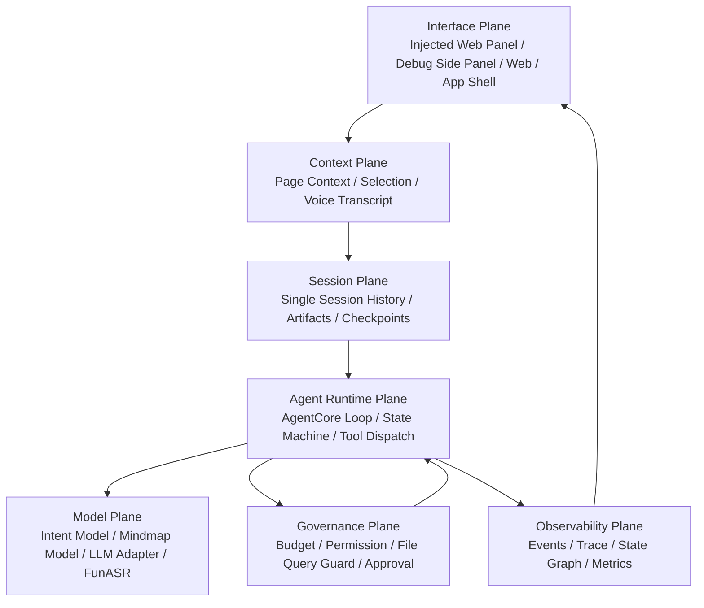
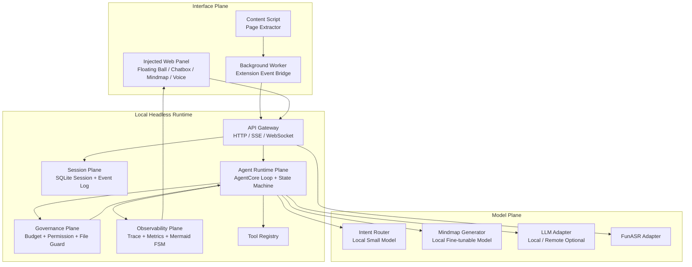
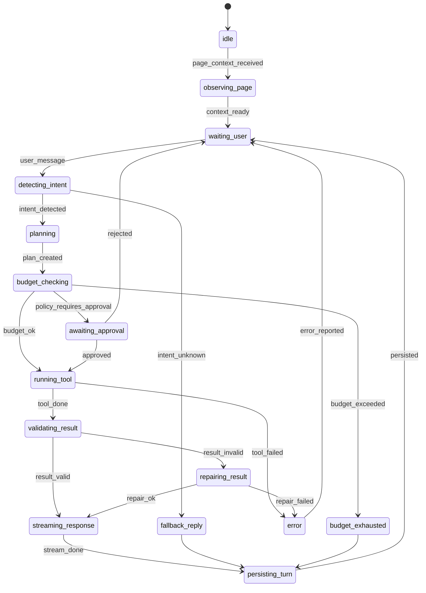

# Navia / 伴航 V1 架构设计文档

版本：V1.0 Architecture Baseline
日期：2026-05-31

---

## 1. 架构目标

Navia V1 架构的目标是搭建一个可以长期演进的本地 Headless AI Runtime，而不是一次性网页插件。

V1 架构必须支持：

- Chrome 插件通过 Content Script 注入网页内悬浮球与 AI 双轨面板，作为 V1 优先前端。
- Web / App 未来复用同一 Runtime API。
- 本地小参数模型做意图识别。
- 已部署 FunASR 做语音转写。
- 本地可微调模型生成 Mermaid mindmap。
- AgentCore 借鉴 openHarness / PiAgent 的源码结构，但收缩到单 Session、无 MCP、无 Skill、无长期记忆。
- 状态机可视化、可验证、可观测。
- 工具调用、上下文读取、token 使用、本地文件访问受监督。

### 1.1 V1 实现基线

V1 规划阶段已决定：

- Local Runtime 使用 Python 快速原型实现，建议采用 FastAPI 风格的 HTTP / SSE / WebSocket API Gateway。
- AgentCore、Session、Governance、Observability、ModelAdapter 必须保持清晰模块边界，便于后端团队按子系统分工。
- Chrome 插件采用 WXT + React + TypeScript；插件通过 Content Script 注入页面内交互层，只作为 Interface Plane，通过 Runtime API 访问后端能力。
- V1.0-0/A/B/C 不实现 Chrome UI，只先冻结合同并打通 Runtime、AgentCore、状态机、事件追踪和治理底座。
- V1 结束后进入 V2 研讨时，必须重新评估 Python Runtime 是否继续作为长期主栈，或是否需要引入 TypeScript / sidecar / 服务拆分。

### 1.2 Contract-first 决策

审计后 V1 采用 `Go, but contract-first` 策略。任何 AgentCore 实现前必须先冻结：

- API response envelope。
- ErrorCode enum。
- State enum 与 Transition table schema。
- AgentEvent envelope。
- Session / Turn / Message / ToolCall / ToolResult / Artifact / Budget schema。
- ID 生成和关联规则。
- `/v1/chat/stream` SSE 协议。
- EventStore 与 EventStream 接口边界。

V1.0-A 不能先写 ad-hoc AgentLoop、ad-hoc events 或直接工具执行。每个 turn 必须有 `session_id` / `turn_id`，每个工具调用必须经过 governance hooks，每个状态迁移必须被验证并持久化。

---

## 2. 架构原则

```text
1. UI 是壳，Runtime 是核心。
2. AgentCore 是状态机，不是散乱 prompt。
3. 本地模型是 Adapter，不进入业务层。
4. V1 做单 Session，不做长期记忆。
5. 所有工具调用必须被监督。
6. 所有状态变化必须可观测。
7. 所有 Artifact 必须可追踪来源。
8. 所有预算消耗必须可计量。
9. 默认不读取本地文件。
10. 默认不自动保存所有网页。
11. 合同先于实现，禁止临时 loop / 临时事件 / 自由形态工具返回。
12. EventStore 负责持久化，EventStream 负责实时推送，二者必须分离。
```

---

## 3. 设计平面

V1 按设计平面拆分，而不是按 UI 功能堆模块。



### 3.1 Interface Plane

职责：

- 网页内贴边悬浮球。
- hover 小长条。
- 网页内 AI 双轨聊天面板。
- Chatbox。
- 当前网页信息展示。
- 摘要 / Mindmap Artifact 展示。
- 语音输入按钮。
- Agent 状态展示。
- Trace / Debug 面板。

V1 必须支持的页面内交互：

- 悬浮球默认态。
- 悬浮球 hover 预展开态。
- 窄距展开态：默认约 `440px`，挤压网页。
- 半屏展开态：约 `50vw`，继续挤压网页。
- 宽工作区覆盖态：超过 `52vw` 覆盖网页，最大 `80vw`。
- 收起态：点击悬浮球或收起按钮后恢复网页布局。
- resize handle。
- 小视口 `<900px` 时禁用挤压式，降级为覆盖式或全屏侧栏。

说明：上述交互来自仓库根目录 `PRD/窗口交互_PRD.md`，该文件是 V1 前端页面体验的 P0 权威来源。Chrome Side Panel 可保留为调试入口或兼容承载，但不得替代 V1 页面内交互验收。

禁止：

- 不直接调用模型。
- 不保存 Agent 核心状态。
- 不直接读取本地文件。

#### V1.1 前端高保真目标架构

V1.0 的页面内实现以 `Content Script -> Shadow DOM injectedPanel -> Runtime API -> AgentCore` 为主线，优先证明交互骨架和功能闭环。V1.1 在不改变 Runtime / AgentCore / API 合同的前提下，把 Interface Plane 细化为可设计验收的前端体验架构：

```text
Figma Prototype Semantics
  MainLayout / MockPage / FloatingBall / Sidebar / ChatArea
        |
        v
Injected Interface Plane
  Floating Entry
  Panel Shell
  Left Rail
  Chat Workspace
  Tool Dock
  Artifact Viewer
  Visual Tokens
        |
        v
Runtime API / PageContext / SSE / Session Restore
```

V1.1 当前架构与目标架构差异：

| 维度 | V1.0 当前架构 | V1.1 目标架构 |
|---|---|---|
| 实现形态 | Shadow DOM 字符串模板与内联 CSS | 组件语义清晰的注入面板结构，可映射到 Figma `MainLayout / FloatingBall / Sidebar / ChatArea` |
| 视觉系统 | 工程可用样式，token 分散 | 集中化视觉 token：颜色、阴影、圆角、间距、轨道宽度、动画 |
| 原型语义 | 主要按功能区域命名 | 按 Figma 原型语义拆解并保留测试锚点 |
| 验收方式 | DOM 状态、真实 Chrome 交互、E2E 功能 | 增加 Playwright 截图基线、Figma 对照、状态截图矩阵 |
| Side Panel | 调试 / 兼容入口 | 仍为调试入口，不参与 V1.1 高保真验收 |

V1.1 不新增设计平面，不改变 Runtime 依赖方向。所有模型、工具、治理、Session 与 Trace 仍由 Runtime 负责，前端只呈现状态并消费合同化事件。

### 3.2 Context Plane

职责：

- 页面 title / url / domain。
- DOM headings。
- cleaned text。
- visible text。
- selected text。
- content hash。
- voice transcript。

约束：

- 只处理当前网页上下文。
- 不做全局本地文件索引。
- 长页面必须 chunk，不得无脑整页塞入模型。

#### A-V1.2 高质量网页感知层目标架构

A 模块在 V1.2 中是 `Page Perception / AgentCore Eyes`，属于 Context Plane 的感知子系统。A-V1.2 的目标不是生成学习产物，而是把真实复杂网页转换成高密度、可验证、可反跳的结构化页面事实。

目标流水线：

```text
Chrome PageContext / HTML snapshot
  -> PageReadingInput
  -> DOM baseline candidate
  -> optional candidate extractor ensemble
  -> A-owned block graph
  -> noise filter and density ranking
  -> StructuredPageContext
  -> HighSignalPageContext
  -> PerceptionDigest
  -> SourceMap / SourceRef
  -> PagePerceptionQualityReport
  -> DebugEvidenceBundle
```

模块调用关系：

```text
A -> D：仅输出 quality-ready 页面上下文，供连续对话和工具编排使用
A -> C：仅输出 source-grounded 结构化上下文，供 Mindmap 生成和节点反跳使用
A -> B：仅输出 Debug JSON、source fallback 和质量状态，供前端展示
```

公共合同消费门槛：

- A 的 `StructuredPageContext` 始终是基础事实源。
- `HighSignalPageContext`、`PerceptionDigest`、`SourceMap / SourceRef` 和 `PagePerceptionQualityReport` 是 A-V1.2 公共合同。
- D/C 只有在 `PagePerceptionQualityReport.downstreamReadiness = "pass"` 时才能把 high-signal 输出作为主上下文。
- `degraded` 输出只能进入 fallback 或 Debug evidence；`fail` 输出不得作为 D/C 主输入。
- B 只能渲染 A 的 Debug JSON、source fallback 和 quality state，不拥有 AgentCore state，也不直接调用 A/C/D 服务。

A-V1.2 目标架构与当前架构差异：

| 维度 | 当前基线 | A-V1.2 目标 |
|---|---|---|
| 内容抽取 | DOM baseline 与有限 fixture | DOM baseline + 审计后的 candidate extractor ensemble |
| 数据模型 | StructuredPageContext / high-signal 合同雏形 | A-owned block graph 归一化后输出公共 high-signal / digest / source map / quality 合同 |
| 质量判断 | 小规模 fixture 与人工判断 | 100-page corpus、gold review、可计算 metric、DebugEvidenceBundle |
| 来源反跳 | paragraph/sourceRange fallback | SourceRef 必须包含 textQuote 或 fallbackText，selector/domPath 仅为增强 |
| 下游消费 | D/C/B 容易依赖临时 shape | 只通过公共合同和 readiness gate 消费 |

A-V1.2 边界：

- A 不生成最终 assistant answer。
- A 不生成 Mindmap、Flashcards、Quiz、Podcast 或 Notebook 产物。
- A 不创建 `ArtifactRecord`。
- A 不发 SSE。
- A 不写 EventStore、Trace 或 Session state。
- A 不直接调用 D/C/B、MCP、Skill、外部 API、OCR、VLM、ASR、视频或直播 engine。
- 第三方正文抽取库只允许作为 candidate extractor，输出必须映射回 A-owned block graph 后才能进入 Navia 公共合同。

### 3.3 Session Plane

职责：

- 单 Session message history。
- active page。
- tool call records。
- artifacts。
- checkpoints。
- budget ledger。
- event log reference。

目标：

- 单 Session 可恢复。
- 单 Turn 可回放。
- Artifact 可追踪。

### 3.4 Agent Runtime Plane

职责：

- Agentic Loop。
- 状态机。
- Intent routing。
- One-step planning。
- Tool dispatch。
- Result validation。
- Response streaming。
- Persist turn。

V1 约束：

- 单 Agent。
- 单 Session。
- 每轮有限工具调用。
- 不做自主跨页面任务。
- 最小状态机从 V1.0-A 开始接入。
- Agent loop 必须通过 `StateMachine.transition()` 推进状态。
- ToolExecutor 必须从 V1.0-A 起经过 `PreToolUse` / `PostToolUse` hook。

### 3.5 Model Plane

职责：

- IntentModelAdapter。
- MindmapModelAdapter。
- LLMAdapter。
- ASRAdapter / FunASRAdapter。

约束：

- AgentCore 不感知具体模型实现。
- 所有模型调用通过 Adapter。
- 每次模型调用记录 model.started / model.done event。

### 3.6 Governance Plane

职责：

- Budget Supervisor。
- Tool Permission Supervisor。
- Context Supervisor。
- File Query Supervisor。
- Approval Gate。

目标：

- 防止 Agent 对本地文件进行过量查询。
- 防止 token 意外消耗。
- 防止失败重试失控。
- 高风险工具必须审批。

### 3.7 Observability Plane

职责：

- AgentEvent。
- State transition log。
- Session trace。
- State machine Mermaid rendering。
- Budget metrics。
- Tool call metrics。

---

## 4. 总体组件架构



---

## 5. 推荐目录结构

```text
navia/
  apps/
    chrome-extension/
      src/
        sidepanel/
        content-script/
        background/
        shared/
    web-demo/
      src/

  services/
    local-runtime/
      app/
        api/
        agent_core/
          runtime/
          state_machine/
          event_bus/
          planning/
          execution/
        session/
        governance/
        tools/
        models/
        page_context/
        mindmap/
        asr/
        observability/
        storage/
      tests/

  packages/
    contracts/
      events/
      session/
      tools/
      artifacts/
    shared-types/
    prompts/

  docs/
    prd/
    architecture/
    acceptance/
    adr/
```

V1.0-0/A/B/C 的首轮文档级实现边界：

- 先规划 `services/local-runtime`，不在首轮规划中创建 Chrome 插件工程。
- Runtime 内部模块按 API、AgentCore、Session、Governance、Observability、ToolRegistry、ModelAdapter 拆分。
- 存储接口先面向 SQLite / JSONL EventLog 设计，但允许首轮原型使用内存实现验证合同。
- 所有模型、FunASR、Mindmap 生成能力都通过 Adapter 边界接入，不写死到 AgentCore。

---

## 6. AgentCore 架构

### 6.1 AgentCore 实现策略

V1 建议使用 openHarness / PiAgent 的源码思想进行裁剪：

保留：

- Agent loop。
- Tool registry。
- Message history。
- State management。
- Event stream。
- PreToolUse / PostToolUse hook。
- Budget / permission gate。
- Trace。

删除 / 暂不接入：

- MCP。
- Skill。
- Long-term memory。
- Multi-agent。
- Shell execution。
- Full workspace search。
- Browser automation。

### 6.2 Agentic Loop

```text
Observe
  -> Detect Intent
  -> Plan One Step
  -> Budget Check
  -> Policy Check
  -> Execute Tool
  -> Validate Result
  -> Stream Response
  -> Persist Turn
  -> Wait
```

### 6.3 AgentCore 内部模块

```text
agent_core/
  runtime/
    AgentRuntime
    AgentLoop
    TurnRunner
  state_machine/
    StateMachine
    TransitionTable
    StateRenderer
  event_bus/
    EventBus
    EventSchema
    EventStore
  planning/
    IntentRouter
    OneStepPlanner
  execution/
    ToolExecutor
    ResultValidator
    ResponseStreamer
  supervision/
    BudgetSupervisor
    PermissionSupervisor
    ContextSupervisor
    FileQuerySupervisor
    ApprovalGate
```

---

## 7. Agent 状态机

状态机必须作为代码中的正式 contract，不得只存在于文档。



工程要求：

- Transition table 是唯一真实来源。
- Mermaid 图由 transition table 自动生成。
- 非法 transition 直接拒绝。
- 每次 transition 产生 `state.transition` event。
- 测试验证状态图和 transition table 一致。
- 每个状态必须定义 allowed_events。
- 每个 recoverable error 必须定义恢复路径。

---

## 8. Governance 设计

### 8.1 Budget Supervisor

默认 TurnBudget：

```ts
type TurnBudget = {
  maxModelCalls: number
  maxToolCalls: number
  maxInputTokens: number
  maxOutputTokens: number
  maxContextBytes: number
  maxRuntimeMs: number
  maxRetries: number
}
```

建议默认：

```text
maxModelCalls = 3
maxToolCalls = 5
maxInputTokens = 12000
maxOutputTokens = 3000
maxContextBytes = 256KB
maxRuntimeMs = 60000
maxRetries = 1
```

预算耗尽行为：

- 停止继续工具调用。
- 写入 `budget_exhausted` event。
- 返回基于已读取上下文的部分结果。
- 提示用户手动确认是否继续。

### 8.2 Permission Supervisor

| 工具 | 默认权限 | 是否需要审批 |
|---|---:|---:|
| read_current_page | allow | 否 |
| summarize_page | allow | 否 |
| answer_from_page | allow | 否 |
| explain_selection | allow | 否 |
| generate_mindmap | allow | 否 |
| asr_transcribe | allow | 否 |
| read_local_file | deny | 是 |
| search_local_workspace | deny | 是 |
| shell | deny | 是 |
| browser_click | deny | 是 |
| browser_automation | deny | 是 |

### 8.3 Context Supervisor

策略：

- 不把整篇网页默认塞入模型。
- 先做正文清洗和结构提取。
- 长页面按 heading / paragraph chunk。
- 根据 intent 选择相关上下文。
- 每次模型调用记录 context bytes 和 token estimate。
- 超过上下文预算时先压缩再调用模型。

### 8.4 File Query Supervisor

V1 默认关闭本地文件查询。

```ts
type FileQueryPolicy = {
  enabled: boolean
  allowedRoots: string[]
  deniedGlobs: string[]
  maxFilesPerTurn: number
  maxBytesPerFile: number
  maxTotalBytesPerTurn: number
  requireUserApproval: boolean
}
```

默认：

```text
enabled = false
allowedRoots = []
maxFilesPerTurn = 0
requireUserApproval = true
```

### 8.5 Approval Gate

V1 是轻量 Approval Gate，不做复杂 Workflow Approval。

触发场景：

- 访问本地文件。
- 查询本地目录。
- 调用高成本模型。
- 超过当前 turn budget。
- 重试次数超过限制。
- 未来执行浏览器操作。

设计原则：

- 审批前不执行 side effect。
- 审批结果必须幂等。
- 审批状态必须可观测。
- 审批取消后 late approval 不得继续执行。
- 审批事件必须进入 EventLog。
- 对 side effect marker 使用 CAS / lock 防止并发重复执行。

---

## 9. Observability 设计

### 9.1 AgentEvent

```ts
type AgentEvent = {
  eventId: string
  sessionId: string
  turnId?: string
  type:
    | "state.transition"
    | "page.context.received"
    | "intent.detected"
    | "budget.checked"
    | "approval.required"
    | "approval.approved"
    | "approval.rejected"
    | "tool.requested"
    | "tool.started"
    | "tool.done"
    | "tool.failed"
    | "model.started"
    | "model.done"
    | "response.delta"
    | "response.done"
    | "artifact.created"
    | "error"
  timestamp: string
  data: Record<string, unknown>
}
```

### 9.2 EventStore 与 EventStream 分离

必须区分：

- `EventStore`：持久化事件，用于 trace、replay、审计和 V2 异步蒸馏。
- `EventStream`：实时推送事件，用于网页内 AI 面板、Debug 面板和 streaming response。

约束：

- 不允许只有实时事件而没有持久化事件。
- `GET /v1/sessions/{session_id}/trace` 必须从 EventStore 读取。
- `/v1/chat/stream` 可以复用 AgentEvent envelope，但不能替代 EventStore。
- 每次 `state.transition` 必须同时进入 EventStore，并可被 trace API 查询。

### 9.3 必须提供的观测接口

```text
GET /v1/agent/state
GET /v1/sessions/{session_id}/trace
GET /v1/agent/state-machine/mermaid
SSE /v1/chat/stream
SSE /v1/agent/events 或后续 WS /v1/agent/events
```

前端状态展示：

- 当前状态。
- 当前工具。
- 本轮 token 使用。
- 本轮工具调用次数。
- 最近事件。
- 预算是否接近上限。

---

## 10. 数据存储建议

### 10.1 SQLite

用于：

- Session。
- Messages。
- PageContext metadata。
- ToolCallRecord。
- ArtifactRecord。
- BudgetLedger。

### 10.2 JSONL EventLog

用于：

- AgentEvent。
- State transition。
- Debug trace。
- Session replay。

### 10.3 Cache

用于：

- 页面抽取结果。
- chunk 结果。
- mindmap 中间结果。

---

## 11. API 网关

本地 Runtime 只监听 `127.0.0.1`：

```text
http://127.0.0.1:17861
ws://127.0.0.1:17861
```

所有 UI 必须通过 API Gateway 访问 Runtime，不得绕过 API 直接写存储或调用模型。

### 11.1 本地 Runtime 安全约束

localhost Runtime 仍然是攻击面，V1 必须具备最小安全边界：

- 默认只绑定 `127.0.0.1`，不得监听 `0.0.0.0`。
- CORS / Origin allowlist 只允许 Chrome extension origin 和明确配置的 localhost dev origin。
- 高风险 API 不允许任意网页调用。
- 可选 dev pairing token，用于本地调试阶段降低误调用风险。
- 普通日志不得打印完整网页正文、选区全文或音频 transcript 全文。
- 外部模型调用必须显式配置，UI 必须展示当前模型模式。

---

## 12. V1 架构结论

Navia V1 的架构不是“插件 + 模型调用”，而是：

```text
Chrome Extension = Companion UI
Local Runtime = Headless AI OS
AgentCore = 单 Session 可观测状态机
Model Plane = 本地模型能力插件
Governance Plane = 预算、权限、上下文和文件访问监督
Observability Plane = 事件流、Trace、状态图
```

最重要的架构边界：

```text
V1 先做可控 Agent。
V2 再做长期记忆。
V3 再做伴随式直播/观影。
V4 再做任务执行和个人秘书。
V5 再做多端、云化和桌宠。
```
