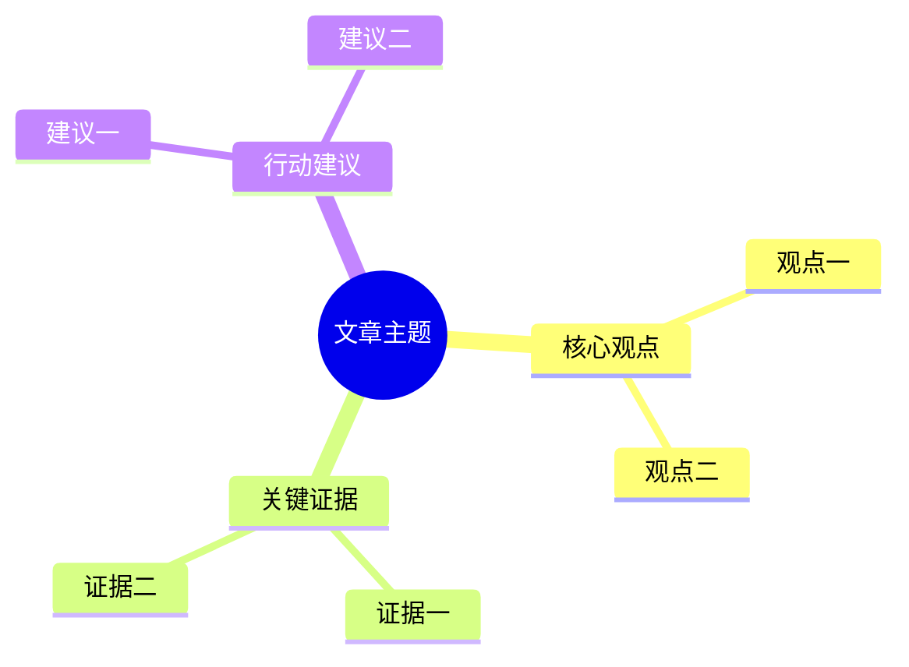

# Navia / 伴航 V1 目标验收文档

版本：V1.0 Acceptance Plan Baseline
日期：2026-05-31

---

## 1. 验收原则

V1 验收不以“功能多”为标准，而以“核心链路稳定、状态可观测、行为可监督”为标准。

审计后新增原则：

```text
Go, but contract-first.
```

在进入 V1.0-A 业务实现前，必须先通过 V1.0-0 合同冻结验收。任何能跑但没有 turn_id、EventStore、ToolResult、ErrorCode、SSE 协议和 governance hooks 的实现都视为 false green。

每个 V1 子阶段必须先按 `10-v1-stage-gate-execution-protocol.md` 形成独立阶段验收标准和预审计意见。未闭环致命或重大审计意见时，不得进入实质开发。

V1 的成功定义：

```text
当前网页 -> 悬浮球/网页内AI面板 -> PageContext -> AgentCore -> Intent -> Tool -> Response/Artifact -> Session/Trace
```

必须可跑通、可恢复、可追踪、可限制。

阶段验收新增原则：

- 每个子阶段完成后必须执行端到端验收。
- 每个子阶段必须使用真实数据或真实浏览器链路，不能只靠 mock。
- 验收失败时必须打回开发计划阶段，修正计划、审计意见和实现后重新验收。
- 每个子阶段验收通过后必须做 PRD 规格复检。
- 如果发现较大规格偏差、致命风险或虚假验收风险，必须停止并找人类确认。

---

## 2. 总体验收 Gate

### 2.1 Go 条件

全部满足才可声明 V1 complete：

- Chrome 插件可通过 unpacked extension 安装到开发者 Chrome。
- 普通网页内出现 AI 悬浮球。
- 悬浮球默认态、hover 预展开态、窄距展开态、半屏展开态、宽覆盖态、收起态全部通过。
- 网页内 AI 双轨面板可完成文字对话。
- 面板 resize、挤压网页、覆盖网页和收起恢复符合 `PRD/窗口交互_PRD.md`。
- 当前页面上下文可进入 Runtime。
- AgentCore 能完成单 Session 对话。
- 用户可以在当前网页上提问，并收到基于当前网页的基础回答。
- 摘要、问答、Mindmap 至少三个核心工具可用。
- Mermaid mindmap 可渲染或失败可解释。
- 状态机可输出 Mermaid。
- EventLog 可追踪一次完整 turn。
- BudgetSupervisor 生效。
- ToolPermissionSupervisor 生效。
- 默认不读取本地文件。
- Session 刷新不丢。
- API / 数据模型 / 文档同步。
- 每个 chat turn 必须有 `turn_id`。
- 每个 tool call 必须有关联 `turn_id` 和 `session_id`。
- 每个 artifact 必须有 `sourcePageId` 或明确 `source=null`。
- 每次 state transition 必须写入 EventStore。
- Runtime 默认只绑定 `127.0.0.1`，CORS / Origin allowlist 生效。

### 2.2 No-Go 条件

任一出现即不能声明 V1 complete：

- Chrome 插件不能安装。
- 只能打开 Chrome Side Panel，不能在真实网页内呈现悬浮球与 AI 面板。
- `PRD/窗口交互_PRD.md` 的 A-F 状态任一缺失。
- 用户无法在网页内 AI 面板完成文字对话。
- 用普通 extension page、debug page 或 Side Panel 替代网页内交互验收。
- 面板展开后网页布局无法恢复。
- Agent 状态只存在前端或 extension background worker。
- 工具调用绕过 Governance。
- 本地文件读取默认开启。
- 超预算后 Agent 继续自动执行。
- Mermaid 失败后无限重试。
- Session 无法恢复。
- 事件流无法追踪工具调用。
- 状态机非法迁移不会报错。
- PR 引入 MCP / Skill / 长期记忆 / 多 Agent 作为 V1 必需项。
- 只有实时 EventStream，没有持久化 EventStore。
- ToolExecutor 绕过 PreToolUse / PostToolUse。
- `/v1/chat/stream` 未固定为 SSE 或返回自由格式事件。
- 工具直接返回自由文本而非 ToolResult envelope。
- 任一子阶段没有 stage-gate 文档、预审计意见或真实数据验收报告。
- 任一子阶段验收失败后仍继续进入下一阶段。
- 任一子阶段只使用 mock 数据声明通过。

### 2.3 阶段验收 Gate

每个子阶段必须满足：

- [ ] 已生成 `stage-gates/v1.0-x-<stage-name>.md`。
- [ ] 已完成 PRD 规格检视。
- [ ] 已制定本阶段开发计划。
- [ ] 已制定本阶段验收标准。
- [ ] 已完成预审计。
- [ ] 所有致命和重大审计意见已闭环。
- [ ] 已执行真实数据端到端验收。
- [ ] 已记录验收证据。
- [ ] 已完成 PRD 规格复检。
- [ ] 已给出阶段放行或打回结论。

### 2.4 真实数据验收 Gate

任一阶段如果涉及 runtime、插件、页面上下文、工具或 session，必须至少使用一种真实数据来源：

- [ ] 真实 HTML fixture。
- [ ] 真实 Chrome tab PageContext。
- [ ] 真实 SSE event stream。
- [ ] 真实 EventStore / JSONL / SQLite trace。
- [ ] 真实 Mermaid 渲染结果。
- [ ] 真实 Chrome unpacked extension 安装与网页内悬浮球 / AI 面板操作。

以下验收不得通过：

- [ ] 只断言函数返回非空。
- [ ] 只用 mock PageContext。
- [ ] 只看前端有文字但不检查 turn_id / tool_call_id / trace。
- [ ] 只看 SSE 有输出但不校验 event schema。
- [ ] 使用不可渲染 Mermaid 结果通过验收。
- [ ] Runtime 未启动时插件静默失败或空白。

### 2.5 V1.2 自动化开发 Readiness Gate

进入 V1.2-A/B/C/D 实质开发前必须满足：

- [ ] 每个模块有 `docs/public-api.md`。
- [ ] 每个模块有 `docs/executable-contract.md`。
- [ ] 每个模块有 `docs/fixture-spec.md`。
- [ ] 每个模块有 `docs/test-and-evidence-plan.md`。
- [ ] `design/v1.2-prd-coverage-matrix.md` 覆盖网页读取、总结、连续问答、Mindmap、source fallback、offline/failure 和 trace。
- [ ] `design/v1.2-integration-contract-matrix.md` 明确 A→D、D→C、D→B、B→Debug 的字段所有权和调用边界。
- [ ] `design/v1.2-ai-reading-automation-gap.drawio` 可打开且包含 7 个页面。
- [ ] V1.2-0 stage-gate 已完成项目 owner review。

以下情况不得进入自动化开发：

- [ ] 模块入口仍由实现者自由决定。
- [ ] mock fixture 文件名、shape 或 evidence 路径不明确。
- [ ] drawio 图谱未体现公共 API 调用关系和关键体验路径。
- [ ] 只靠 Markdown 文字声明 PRD 覆盖，没有矩阵和证据路径。

---

## 3. 模块验收

## 3.0 Contracts & Runtime Skeleton

### 必须通过

- [ ] API response envelope 定义完成。
- [ ] ErrorCode enum 定义完成。
- [ ] State enum 定义完成。
- [ ] Transition table schema 定义完成。
- [ ] AgentEvent envelope 定义完成。
- [ ] Session / Turn / Message schema 定义完成。
- [ ] ToolSpec / ToolCallRecord / ToolResult schema 定义完成。
- [ ] Budget schema 定义完成。
- [ ] ID 生成和关联规则定义完成。
- [ ] `/v1/chat/stream` SSE event format 定义完成。
- [ ] EventStore 与 EventStream 接口分离。
- [ ] 所有 schema 有基础 validation test。

### false-green 防线

- [ ] 没有 `turn_id` 的 chat turn 不得通过。
- [ ] 没有 EventStore 持久化的 trace 不得通过。
- [ ] 没有 ToolResult envelope 的工具实现不得通过。
- [ ] 没有 ErrorCode enum 的 error response 不得通过。
- [ ] 没有 PreToolUse / PostToolUse hook 的 ToolExecutor 不得通过。

## 3.1 Local Runtime

### 必须通过

- [ ] `GET /v1/health` 返回 ok。
- [ ] Runtime 默认只监听 `127.0.0.1`，不得监听 `0.0.0.0`。
- [ ] CORS / Origin allowlist 只允许 Chrome extension origin 和明确配置的 localhost dev origin。
- [ ] 普通日志不打印完整网页正文、选区全文或 transcript 全文。
- [ ] Runtime 可创建 session。
- [ ] Runtime 可返回 models/status。
- [ ] Runtime 在模型不可用时返回明确状态，不崩溃。
- [ ] `/v1/models/status` 能区分 `mock`、`rule_based`、`deterministic`、`local`、`remote`、`unavailable`。

### 建议测试

```text
curl http://127.0.0.1:17861/v1/health
curl http://127.0.0.1:17861/v1/models/status
POST /v1/sessions
```

---

## 3.2 Session Plane

### 必须通过

- [ ] 可创建 AgentSession。
- [ ] 每个 user message 创建 AgentTurn。
- [ ] 可写入 user message。
- [ ] 可写入 assistant message。
- [ ] 可写入 tool message。
- [ ] 可写入 event message。
- [ ] 可写入 ToolCallRecord。
- [ ] 可写入 ArtifactRecord。
- [ ] 可写入 BudgetLedger。
- [ ] 刷新前端后可恢复 active session。
- [ ] 可导出 session trace。
- [ ] trace 可按 `turn_id` 过滤。

### 验收场景

```text
Given 一个新 session
When 用户提交“总结这篇文章”
Then session 中应包含 user message、assistant message、tool call、artifact、budget ledger、event references
```

---

## 3.3 State Machine

### 必须通过

- [ ] Transition table 存在。
- [ ] Mermaid 图由 Transition table 生成。
- [ ] 非法 transition 被拒绝。
- [ ] 非法 transition 返回或抛出 `INVALID_TRANSITION`。
- [ ] 每个 transition 产生 `state.transition` event。
- [ ] 每个 `state.transition` event 写入 EventStore。
- [ ] 主路径测试通过。
- [ ] intent_unknown 路径测试通过。
- [ ] budget_exceeded 路径测试通过。
- [ ] tool_failed 路径测试通过。
- [ ] repair_failed 路径测试通过。

### 主路径

```text
idle
-> observing_page
-> waiting_user
-> detecting_intent
-> planning
-> budget_checking
-> running_tool
-> validating_result
-> streaming_response
-> persisting_turn
-> waiting_user
```

---

## 3.4 Observability Plane

### 必须通过

- [ ] `GET /v1/agent/state` 可返回当前状态。
- [ ] `GET /v1/agent/state-machine/mermaid` 可返回 Mermaid 状态图。
- [ ] `GET /v1/sessions/{session_id}/trace` 可返回 trace。
- [ ] `GET /v1/sessions/{session_id}/trace` 从 EventStore 读取。
- [ ] SSE 可输出 `/v1/chat/stream` 事件。
- [ ] `WS /v1/agent/events` 或 SSE 可输出 AgentEvent。
- [ ] 事件包含 sessionId。
- [ ] 事件包含 turnId 或可追溯 turn。
- [ ] tool.started / tool.done 可观察。
- [ ] model.started / model.done 可观察。
- [ ] artifact.created 可观察。
- [ ] EventStore 与 EventStream 分离，实时推送不能替代持久化。

---

## 3.5 Governance Plane

### Budget Supervisor

- [ ] 每轮 turn 有 TurnBudget。
- [ ] maxModelCalls 生效。
- [ ] maxToolCalls 生效。
- [ ] maxContextBytes 生效。
- [ ] maxRetries 生效。
- [ ] 超预算进入 `budget_exhausted`。
- [ ] 超预算后不继续工具调用。
- [ ] maxToolCalls=1 时第二个工具不得产生 `tool.started`。
- [ ] maxRetries=1 时不得出现第三次重试。
- [ ] BudgetLedger 被写入。

### Permission Supervisor

- [ ] read_current_page 默认 allow。
- [ ] summarize_page 默认 allow。
- [ ] answer_from_page 默认 allow。
- [ ] generate_mindmap 默认 allow。
- [ ] asr_transcribe 如进入 V1.x 增强范围，默认 allow；不进入时应为 disabled 或 unavailable，不阻塞文字对话。
- [ ] read_local_file 默认 deny。
- [ ] read_local_file deny 时不得产生 `tool.started`。
- [ ] search_local_workspace 默认 deny。
- [ ] shell 默认 deny。
- [ ] browser_automation 默认 deny。

### Approval Gate

- [ ] 高风险工具审批前不执行 side effect。
- [ ] approval_required 只产生事件和记录，不执行工具。
- [ ] 审批事件进入 EventLog。
- [ ] reject 后不执行工具。
- [ ] cancel 后 late approval 不得继续执行。
- [ ] side-effect marker 具备 CAS / lock 保护，避免并发重复执行。

---

## 3.6 Chrome Extension

### 必须通过

- [ ] 插件可通过 Chrome `Load unpacked` 安装。
- [ ] 插件可加载。
- [ ] 普通网页边缘出现 AI 悬浮球。
- [ ] 悬浮球默认贴边，不遮挡主要内容。
- [ ] 悬浮球可上下拖动。
- [ ] 悬浮球 hover 后高亮并伸出小长条。
- [ ] 点击小长条后展开网页内 AI 双轨面板。
- [ ] 网页内 AI 面板有 Chatbox 输入框和消息列表。
- [ ] 窄距展开态默认约 `440px` 并挤压网页。
- [ ] 半屏展开态约 `50vw` 并继续挤压网页。
- [ ] 超过 `52vw` 后进入覆盖态，最大不超过 `80vw`。
- [ ] 拖回 `<48vw` 后恢复挤压式。
- [ ] 点击悬浮球或收起按钮后，面板收起且网页恢复原始布局。
- [ ] 视口 `<900px` 时禁用挤压式，降级为覆盖式或全屏侧栏。
- [ ] UI 可连接 Local Runtime。
- [ ] Runtime 不可用时展示提示。
- [ ] Runtime 启动后 UI 可重新连接。
- [ ] 当前页面 title/url/domain 可显示。
- [ ] 用户输入可发送到 `/v1/chat/stream`。
- [ ] `/v1/chat/stream` 使用 SSE，Response Content-Type 为 `text/event-stream`。
- [ ] 响应可流式展示或分段展示。
- [ ] 用户可以在网页内 AI 面板输入“总结这篇文章”并看到回答。
- [ ] 用户可以在网页内 AI 面板输入一个基于当前网页的问题并看到回答。
- [ ] Agent 状态可展示。
- [ ] 预算使用可展示。

Chrome Side Panel 可保留为调试或兼容入口，但不能替代以上验收。

---

## 3.7 PageContext

### 必须通过

- [ ] 可抽取 title。
- [ ] 可抽取 url。
- [ ] 可抽取 domain。
- [ ] 可抽取 headings。
- [ ] 可抽取 selectedText。
- [ ] 可抽取 visibleText 或 cleanedText。
- [ ] 可生成 contentHash。
- [ ] 可提交 `/v1/page/context`。
- [ ] Runtime 写入 `page.context.received` event。
- [ ] Session activePage 更新。

### 页面类型 Smoke

至少覆盖：

- [ ] 普通文章页。
- [ ] 技术文档页。
- [ ] GitHub README 类页面。
- [ ] 产品介绍页。

---

## 3.8 Intent Router

### 必须通过

- [ ] “总结这篇文章” -> `summarize_page`。
- [ ] “这篇文章讲了什么？” -> `ask_page` 或 `summarize_page`。
- [ ] “解释我选中的这段” -> `explain_selection`。
- [ ] “生成思维导图” -> `generate_mindmap`。
- [ ] 低置信度输入 -> `unknown` 或 fallback。
- [ ] 输出满足 JSON schema。
- [ ] confidence 低时不盲目调用高成本工具。

---

## 3.9 Summary Tool

### 必须通过

- [ ] 可生成 TL;DR。
- [ ] 可生成结构化摘要。
- [ ] 可生成要点式摘要。
- [ ] 可生成 ArtifactRecord。
- [ ] Artifact 可追踪 sourcePageId。
- [ ] 长页面不会无脑全文塞入模型。

---

## 3.10 Page QA Tool

### 必须通过

- [ ] 能基于当前 PageContext 回答。
- [ ] 能使用 chunk 相关上下文。
- [ ] 当前网页没有足够信息时说明不足。
- [ ] 不默认联网搜索。
- [ ] 不默认访问本地文件。
- [ ] 回答可追踪 pageRef / chunkRef。

---

## 3.11 Selection Explain Tool

### 必须通过

- [ ] selectedText 可进入工具。
- [ ] 工具优先解释选区。
- [ ] 可结合附近上下文。
- [ ] 没有选区时提示用户选择内容或改用整页问答。

---

## 3.12 Mindmap Tool

### 必须通过

- [ ] 可生成 Mermaid mindmap。
- [ ] Mermaid 可在前端渲染。
- [ ] 节点层级默认不超过 4。
- [ ] 节点数量默认不超过 40。
- [ ] Mermaid validator 生效。
- [ ] 校验失败自动 repair once。
- [ ] 修复失败返回可读错误。
- [ ] ArtifactRecord 记录 mermaid 源码。

### 示例输出要求



---

## 3.13 语音输入增强，可选

### 必须通过

以下项目只在 V1.x 启用语音输入时验收，不阻塞 V1 complete 的文字对话主链路：

- [ ] 浏览器可录音。
- [ ] 音频可发送本地 Runtime。
- [ ] Runtime 可调用 FunASR。
- [ ] transcript 返回前端。
- [ ] transcript 写入 user message。
- [ ] AgentCore 按文本处理。
- [ ] FunASR 不可用时 UI 明确提示或禁用语音入口。

---

## 4. 端到端验收场景

### E2E-0：Chrome 插件安装、悬浮球与基础对话

```text
Given 开发者已启动 Local Runtime
And 已在 Chrome 中通过 Load unpacked 安装 Navia 插件
And 用户打开一篇普通文章
When 页面边缘出现 AI 悬浮球
And 用户 hover 悬浮球
And 点击小长条展开网页内 AI 面板
And 输入“这篇文章主要讲什么？”
Then 插件提交当前 PageContext
And Runtime 创建或复用 active session
And AgentCore 创建 turn_id
And 工具基于当前网页生成回答
And 前端展示 assistant response
And Trace 可看到 state.transition、intent.detected、tool.started、tool.done、response.done
```

### E2E-1：网页摘要

```text
Given 用户打开一篇普通文章
And 网页内 AI 面板已连接 Runtime
When 用户点击“总结”
Then Runtime 收到 PageContext
And AgentCore 进入 detecting_intent
And intent=summarize_page
And tool=summarize_page 执行
And 前端展示摘要
And Session 写入 SummaryArtifact
And Trace 可看到完整事件流
```

### E2E-2：网页问答

```text
Given 当前 session 已有 activePage
When 用户输入“作者的核心观点是什么？”
Then intent=ask_page
And 工具基于当前页面相关 chunk 回答
And 不访问本地文件
And 不联网搜索
```

### E2E-3：思维导图

```text
Given 当前页面内容已抽取
When 用户输入“生成思维导图”
Then intent=generate_mindmap
And Mermaid 结果可渲染
And Artifact 记录源码
And 失败时最多 repair once
```

### E2E-4：语音提问，可选增强

```text
Given FunASR 可用
When 用户录音说“总结这篇文章”
Then transcript 写入 user message
And 后续流程与 typed message 一致
```

### E2E-7：PRD A-F 页面交互状态

```text
Given 用户在真实 Chrome 打开普通文章页
And 插件已加载
Then 页面边缘出现悬浮球默认态
When 用户 hover 悬浮球
Then 出现高亮和伸出小长条
When 用户点击小长条
Then 网页内 AI 面板以约 440px 窄距展开并挤压网页
When 用户拖拽 resize handle 至约 50vw
Then 面板进入半屏展开态并继续挤压网页
When 用户继续拖拽超过 52vw
Then 面板进入覆盖态
When 用户拖回 48vw 以下
Then 面板恢复挤压式
When 用户点击悬浮球或收起按钮
Then 面板收起且网页恢复原始布局
```

### E2E-5：预算限制

```text
Given TurnBudget maxToolCalls=1
When Agent 试图调用第二个工具
Then 进入 budget_exhausted
And 不执行第二个工具
And 返回部分结果和继续确认提示
```

### E2E-6：本地文件访问拒绝

```text
Given read_local_file 默认 deny
When 用户或模型请求读取本地文件
Then PermissionSupervisor 拒绝
And 不执行文件读取
And 事件记录 tool.denied 或 approval.required
```

---

## 5. 回归测试清单

每个阶段完成后至少复跑：

- [ ] Health check。
- [ ] Session create / restore。
- [ ] State machine main path。
- [ ] State machine illegal transition。
- [ ] Budget exceeded。
- [ ] Permission denied。
- [ ] PageContext submit。
- [ ] Summary tool。
- [ ] QA tool。
- [ ] Mindmap validator。
- [ ] Event trace export。

---

## 6. V1.1 前端高保真验收计划

V1.1 不重新定义 V1 complete。V1.1 只验收前端体验是否从“功能闭环 + 页面内交互骨架”升级为可对照 Figma 原型的高保真产品界面。

### 6.1 Go 条件

全部满足才可声明 V1.1 frontend fidelity ready：

- [ ] V1.1 证据策略已登记到 `docs/navia_v1_project_docs/design/v1.1-figma-baseline/capture-manifest.json`。
- [ ] `floating-default` 使用用户提供 Image #2 作为视觉参考。
- [ ] `floating-hover` 使用用户提供 Image #1 作为视觉参考。
- [ ] `panel-440-push`、`panel-50vw-push`、`panel-overlay`、`mobile-overlay` 按 PRD 硬约束验收，不要求实际 Figma 截图。
- [ ] `runtime-offline` 单独进行设计验收，无标准原型审计。
- [ ] `artifact-mindmap` 已明确后续专项，不阻塞 V1.1-B/C。
- [ ] `PRD/窗口交互_PRD.md` A-F 状态全部在真实 Chrome 普通网页中通过。
- [ ] Playwright 截图覆盖默认态、hover 态、`440px` 展开态、`50vw` 半屏态、`>52vw` 覆盖态、小视口态。
- [ ] 截图验收记录包含基线路径、当前截图路径、差异结论。
- [ ] Runtime offline、PageContext missing、tool failure 均有高保真状态呈现；Mermaid / mindmap 后续专项。
- [ ] PageContext、Runtime、SSE Chat、Mermaid、Session restore 链路不回退。
- [ ] Side Panel 仍只作为调试入口，不参与高保真通过声明。
- [ ] `design/v1.1-frontend-fidelity-gap.drawio` 可打开，且页面名与 Markdown 文档一致。

### 6.2 No-Go 条件

任一出现即不能声明 V1.1 frontend fidelity ready：

- [ ] 没有 Figma 截图或普通 Figma `/design` 节点，却声明视觉高保真完成。
- [ ] Chrome CLI 捕获的是登录页、权限页、空白页或错误页，却被当作视觉基线。
- [ ] 用户提供 Image #1/#2 未被登记，却声明浮动球视觉基线完成。
- [ ] 3-6 状态偏离 PRD 硬约束。
- [ ] Runtime offline 没有独立设计验收。
- [ ] Mindmap artifact 被误纳入 V1.1-B/C 必做项。
- [ ] 只能 Chrome Side Panel 或普通 extension page 通过。
- [ ] 页面内悬浮球、hover 小长条、双轨面板、resize、push、overlay、collapse 任一断裂。
- [ ] 面板收起后网页布局无法恢复。
- [ ] 截图明显偏离目标布局比例、轨道宽度、消息密度或输入区位置。
- [ ] Runtime / Trace / Session 因前端重构断链。
- [ ] 修改 Runtime API、AgentEvent、ToolResult 或 PageContext 合同但没有独立合同审计。

### 6.3 V1.1 验收矩阵

| 场景 | 必须验证 |
|---|---|
| 默认态 | 页面边缘浮动球位置、贴边、阴影、未遮挡主内容 |
| Hover 态 | 高亮、伸出小长条、快捷提示、收回动画 |
| 窄距展开 | `440px` 面板、左轨、聊天主区、右工具区、网页挤压 |
| 半屏展开 | `50vw` 附近布局稳定、聊天区独立滚动、输入区固定 |
| 覆盖态 | `>52vw` 后不继续挤压网页，最大 `80vw` |
| 小视口 | `<900px` 覆盖式或全屏侧栏降级 |
| 错误态 | offline、missing context、tool failure 可见且不空白；Mermaid / mindmap 后续专项 |

### 6.4 Figma Make 截图硬切验收

V1.1 进入实质前端开发前，必须完成：

- [ ] 执行 `node scripts/capture_figma_make_baseline.mjs`。
- [ ] 生成 `docs/navia_v1_project_docs/design/v1.1-figma-baseline/current/capture-report.json`。
- [ ] 人工确认截图不是 Figma 登录页、权限页、空白页或错误页。
- [ ] 将可作为视觉目标的截图登记到 `docs/navia_v1_project_docs/design/v1.1-figma-baseline/capture-manifest.json`。
- [ ] 将已复核截图沉淀到 `docs/navia_v1_project_docs/design/v1.1-figma-baseline/reviewed/`。
- [ ] 若自动捕获失败，使用已登录 Chrome 手工补采到 `manual-auth/`，再复核进入 `reviewed/`。

验收结论：

```text
证据策略已登记且机器校验通过：Go for V1.1-B.
用户图片或 PRD 硬约束未登记：No-Go.
Mindmap 被误设为 V1.1-B/C 阻塞：No-Go.
```

当前记录：

```text
2026-06-03：已执行 Chrome CLI 自动捕获。
结果：current/ 中 4 张截图均为 Figma WebGL unsupported error page。
历史结论：自动捕获本身 No-Go；已被后续用户证据策略覆盖，不再阻塞 V1.1-B。

2026-06-03：用户补充 Image #1 / Image #2，并确认 3-6 采用 PRD 硬约束、7 独立设计、8 后续专项。
结果：V1.1-B 可进入；mindmap artifact 不纳入本轮阻塞。
结论：Go for V1.1-B；Mindmap artifact deferred。
```

### 6.5 V1.1 子阶段验收入口

V1.1 必须按以下顺序推进：

| 阶段 | 文档 | 当前默认结论 |
|---|---|---|
| V1.1-A | `stage-gates/v1.1-a-visual-baseline-freeze.md` | Go for V1.1-B |
| V1.1-B | `stage-gates/v1.1-b-ui-structure-token-refactor.md` | Ready after machine check passes |
| V1.1-C | `stage-gates/v1.1-c-high-fidelity-states.md` | Blocked by V1.1-B |
| V1.1-D | `stage-gates/v1.1-d-visual-e2e-regression.md` | Blocked by V1.1-C |
| V1.1-E | `stage-gates/v1.1-e-exit-review.md` | Blocked by V1.1-D |

不得跳过机器校验直接进入前端高保真实现。

### 6.6 V1.1 文档就绪度机器检查

V1.1-B 开工前必须执行：

```bash
node scripts/validate_v1_1_doc_readiness.mjs
```

通过条件：

```text
status=go
canStartV11B=true
blocking=[]
missingFiles=[]
```

当前预期：

```text
status=go
canStartV11B=true
```

只要该脚本失败，就必须先修复 manifest / evidence policy / 文档一致性，不得进入 V1.1-B/C/D/E。

---

## 7. V1 最终声明模板

允许声明：

```text
V1 complete: Navia can be installed as a Chrome unpacked extension and supports PRD-aligned in-page interaction: floating ball, hover strip, embedded dual-track AI panel, push layout, overlay layout, resize, and collapse recovery. Users can complete basic text chat against the current page through Local Headless Runtime. The single-session AgentCore is observable, state-machine based, and guarded by budget/permission/context supervision. Current-page summary, Q&A, and Mermaid mindmap are ready for MVP validation.
```

禁止声明：

```text
Navia personal knowledge base is ready.
Navia long-term memory is ready.
Navia RAG is ready.
Navia deep research is ready.
Navia PPT generation is ready.
Navia browser automation is ready.
Navia desktop pet is ready.
Navia cloud sync is ready.
V2/V3/V4/V5 is ready.
```

---

## 8. V1.2 AI 伴读四模块验收

V1.2 验收目标不是新增更多智能能力，而是确认 AI 伴读主链路被拆成可审计、可测试、可独立演进的四个模块：

```text
网页数据抓取与结构化总结
基于网页内容的流式渲染
基于网页内容的思维导图生成
CoreProvider + Adapter Layer 实现可替换 Core 接入和 ChatBox turn 编排边界
```

V1.2 扩展还必须冻结工作区边界，使 A/B/C/D 四个 Codex 终端可以独立开发。A/C/D 集中到 service 层独立文件夹，B 集中到 app 层前端渲染文件夹。轻量 MCP / Skill / API Adapter 只能通过 D 模块接入，不得由前端或其他模块直连。

V1.2-0R readiness closure 是实质开发前的审计入口。只有 `design/v1.2-readiness-closure-audit.md` 所列 ChatGPT 审计包无致命或重大规格偏差后，才能进入 staged mock-first implementation。V1.2 complete 只能由 V1.2-E Integration / E2E / PRD Review 阶段声明。

### 8.1 总体验收链路

必须使用真实 Chrome 页面或真实 HTML fixture：

```text
打开真实网页
-> 点击读取网页
-> Runtime 接收 PageContext
-> session.activePage 写入真实 page_id / url / title / content_hash
-> 用户发送“总结当前网页”
-> /v1/chat/stream 返回 SSE
-> 前端流式渲染 assistant response
-> Runtime 创建 summary artifact
-> 用户发送“生成思维导图”
-> Runtime 创建 mindmap artifact
-> 前端渲染 Mermaid 或展示 source fallback
-> trace?turn_id 可还原 state / intent / budget / tool / artifact / response events
```

### 8.2 A Page Perception / AgentCore Eyes

必须通过：

- [ ] A 模块只修改 `services/local-runtime/navia_runtime/modules/page_reading/` 和自己的 stage-gate。
- [ ] A 模块新增任务使用 `A-V1.0-*` 编号，编号规则见 `MODULE_VERSIONING.md`。
- [ ] A 只输出可追踪感知事实，不生成最终回答、不创建 artifact、不发 SSE。
- [ ] PageContext 来自真实网页或真实 HTML fixture。
- [ ] PageContext 包含 `pageId`、`url`、`title`、`domain`、`contentHash`、`headings`、`chunks`。
- [ ] 结构化输出包含 paragraphs、paragraph annotations、heading path 和 chunk 关联。
- [ ] `summarize_page` 只读取 `session.activePage`，不得使用前端传入的自由摘要结果。
- [ ] 缺少 activePage 时返回 `PAGE_CONTEXT_REQUIRED`。
- [ ] 缺少 activePage 时不得产生 `tool.started`。
- [ ] 缺少 activePage 时不得创建 summary / answer / mindmap artifact。
- [ ] 成功总结必须创建 `ArtifactRecord(type="summary", source="page", metadata.format="markdown")`。

### 8.2.1 A 模块内部能力验收矩阵

| 编号 | 能力 | V1.2 验收口径 |
|---|---|---|
| `A-V1.0-0` | 感知合同冻结 | `StructuredPageContext`、source map、field ownership 和 No-Go 已登记 |
| `A-V1.0-1` | 文本 / DOM 结构识别 | headings、paragraphs、chunks、annotations、summaryDraft 可由真实 HTML fixture 生成 |
| `A-V1.0-2` | 图文网页识别 | 文档阶段需完成 image/figure/caption/alt/nearby text 合同；实现阶段不得幻想图片内容 |
| `A-V1.0-3` | OCR 识别规划 | 只规划 `OcrTextBlock[]`、confidence、source、区域/时间信息；不默认接 OCR engine |
| `A-V1.0-4` | 表格 / 列表 / 代码块识别 | 规划 table/list/code/block source map 和 fixture 验收 |
| `A-V1.0-5` | 页面区域与信息密度识别 | 规划 main/article/aside/nav/footer/ad-like block 识别与过滤 |
| `A-V2.0-1` | 视频感知规划 | 只登记 video metadata、subtitle、key frames、frame OCR、timeline 合同方向 |
| `A-V2.0-2` | 直播实时感知规划 | 只登记 rolling transcript、sampled frames、live OCR、event detection、latency/budget 策略 |

### 8.2.2 OCR / 视频 / 直播 false-green 防线

以下情况不得通过验收：

- [ ] A 模块直接调用 OCR、视觉模型、视频流分析、直播流分析、MCP、Skill 或外部 API。
- [ ] 没有 OCR 结果却声称已理解图片文字。
- [ ] 没有 alt/caption/nearby text 却描述图片语义。
- [ ] OCR 结果没有 confidence、sourceImageId 或区域/时间来源。
- [ ] 视频/直播实时识别只存在实时 EventStream，没有 EventStore 或 session trace。
- [ ] 未定义采样策略、延迟预算、隐私边界和用户授权就声明视频/直播识别 ready。
- [ ] 把 `A-V2.0-*` 媒体感知规划当成 V1.2 已完成能力。

### 8.3 基于网页内容的流式渲染

必须通过：

- [ ] B 模块只修改 `apps/chrome-extension/src/modules/*_renderer/` 和自己的 stage-gate。
- [ ] 前端消费 `/v1/chat/stream` SSE。
- [ ] `response.delta` 能逐步追加到 ChatBox。
- [ ] `artifact.created` 能渲染为 artifact 卡片或内容块。
- [ ] B 不直接调用 A/C/MCP/Skill/API。
- [ ] 未知 SSE event 不导致 UI 崩溃。
- [ ] Runtime offline 可见。
- [ ] PageContext missing 可见。
- [ ] tool failure 可见。
- [ ] 前端不得保存 AgentCore 状态作为事实源。

### 8.4 基于网页内容的思维导图生成

必须通过：

- [ ] C 模块只修改 `services/local-runtime/navia_runtime/modules/mindmap/` 和自己的 stage-gate。
- [ ] `generate_mindmap` 从真实 `session.activePage` 生成 Mermaid source。
- [ ] Mindmap 生成优先消费 A 输出的结构化网页 JSON。
- [ ] Mermaid validation 结果写入 `tool.done.data` 或 artifact metadata。
- [ ] repair 次数最多 1 次。
- [ ] 成功时创建 `ArtifactRecord(type="mindmap", metadata.format="mermaid")`。
- [ ] artifact 包含 `sourcePageId`、`turnId`、`toolCallId`。
- [ ] Mindmap 节点 metadata 包含 source chunk / paragraph source map，可用于反跳或 source excerpt fallback。
- [ ] 前端 Mermaid 渲染失败时展示 source fallback。
- [ ] 不新增未登记的 `mermaid.*` ad-hoc event。

### 8.5 CoreProvider + Adapter Layer

必须通过：

- [ ] D 模块只修改 `services/local-runtime/navia_runtime/modules/agent_loop/`、`services/local-runtime/navia_runtime/modules/adapters/` 和自己的 stage-gate。
- [ ] D 定义 `CoreProvider.run_turn(CoreTurnInput) -> CoreTurnResult`。
- [ ] `MockCoreProvider` 可用于合同测试和自动化 fallback。
- [ ] `piAgentProvider` 真实接入前已锁定仓库、版本或 commit、license、运行时和工具调用模型。
- [ ] piAgent 或其他 CoreProvider 不直接写 ArtifactRecord、SSE、EventStore、Trace 或 UI。
- [ ] 每个 user message 创建一个 `turn_id`。
- [ ] 每个 turn 经过 StateMachine transition。
- [ ] 每个 state transition 写入 EventStore。
- [ ] 每个 tool call 经过 budget check 和 permission check。
- [ ] Adapter Layer 必须执行 PreToolUse / PostToolUse hook。
- [ ] 每个 adapter/tool 返回 ToolResult envelope。
- [ ] MCP / Skill / API Adapter 必须注册为 AdapterSpec 并映射到 ToolResult。
- [ ] D 只支持单 Session 连续上下文和 checkpoint，不实现长期记忆或 RAG。
- [ ] trace 可按 `turn_id` 过滤。
- [ ] trace 中可见 state、intent、budget、tool、artifact、response、error 事件。

### 8.5.1 工作区隔离验收

必须通过：

- [ ] A/C/D 在 service 层有独立文件夹，B 在 app 层有独立 renderer 文件夹。
- [ ] Integration Codex 只负责 wiring、E2E、trace 和 PRD 复检。
- [ ] 既有 `apps/` 与 `services/` 入口文件只由 Integration Codex 接入模块实现。
- [ ] 任一模块需要修改公共合同或其他模块目录时，必须回到 V1.2-0 文档阶段。
- [ ] 后续模块 stage-gate 必须引用 `design/v1.2-ai-reading-workspace-partition.md`。

### 8.6 V1.2 false-green 防线

以下情况不得通过验收：

- [ ] 只检查前端有文字，不检查 trace。
- [ ] 只使用 mock PageContext。
- [ ] 直接在前端生成 summary、answer 或 Mermaid。
- [ ] A/B/C/D 任一模块跨工作区修改且没有 V1.2-0 合同审批。
- [ ] MCP / Skill / API 绕过 D 模块。
- [ ] CoreProvider 绕过 D Adapter Layer 直接写 ArtifactRecord、SSE、EventStore、Trace 或 UI。
- [ ] piAgent 具体依赖未锁定就声明真实 provider 接入完成。
- [ ] Runtime 缺少 activePage 仍返回成功。
- [ ] 工具返回自由文本而非 ToolResult。
- [ ] 成功工具未创建 ArtifactRecord。
- [ ] artifact 缺少来源链路。
- [ ] 只有 EventStream，没有 EventStore。
- [ ] 新增事件类型但合同、schema、测试未更新。
- [ ] 借 V1.2 引入 RAG、长期记忆、多 Agent、未受控 MCP/Skill 直连或浏览器自动操作。
- [ ] A/B/C/D 单模块验收通过后直接声明 V1.2 complete。
- [ ] `design/v1.2-prd-coverage-matrix.md` 仍未填真实 evidence 路径。
- [ ] 真实 piAgentProvider 未完成依赖锁定却进入实质接入。

### 8.7 V1.2-E 最终出门条件

V1.2-E 必须补齐：

- [ ] Runtime test log。
- [ ] Extension test / typecheck log。
- [ ] Chrome E2E log。
- [ ] 真实 Chrome 手工验收记录。
- [ ] page read evidence。
- [ ] summary stream evidence。
- [ ] follow-up QA evidence。
- [ ] mindmap artifact evidence。
- [ ] source fallback evidence。
- [ ] trace export evidence。
- [ ] PRD A-F regression evidence。
